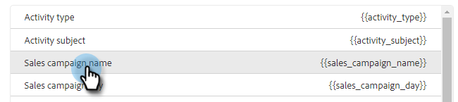

# Konfigurieren der Anpassung der Salesforce-Aktivitätsdetails {#configure-salesforce-activity-detail-customization}

>[!PREREQUISITES]
>
>* Salesforce- und Sales Insight-Aktionen [müssen verbunden sein](/help/marketo/product-docs/marketo-sales-insight/actions/crm/salesforce-integration/connect-your-sales-insight-actions-account-to-salesforce.md)
>* Die Protokollierung der E-Mail-Aktivität über die API [muss aktiviert sein](/help/marketo/product-docs/marketo-sales-insight/actions/crm/salesforce-integration/sync-sales-activities-to-salesforce.md)

Die Anpassung der Aktivitätsdetails ermöglicht es Administratoren, die Informationen zu konfigurieren, die beim Feld Salesforce-Aufgabe - Betreff protokolliert werden, wenn eine Aktivität bzw. Erinnerung mit Salesforce synchronisiert wird.

>[!NOTE]
>
>* Aktualisierungen am Betrefffeld in Sales Insight-Aktionen einer Erinnerungsaufgabe werden im Betrefffeld der entsprechenden Salesforce-Aufgabe angezeigt, wenn Sie das dynamische Feld `{{activity_subject}}` in Ihrer Aktivitätsdetailanpassung verwenden.
>* Zeilenumbrüche werden bei der Protokollierung von Informationen in das Salesforce-Betrefffeld nicht unterstützt. Zeilenumbrüche im Editor zur Anpassung von Aktivitätsdetails werden entfernt, wenn ein Betreff einer Verkaufsaufgabe aktualisiert wird.

<table>
 <tr>
  <td><strong>1</td>
  <td>InMail-Erinnerungsaufgabe</td>
 </tr>
 <tr>
  <td><strong>2</td>
  <td>E-Mail-Aktivität</td>
 </tr>
 <tr>
  <td><strong>3</td>
  <td>Aufrufaktivität</td>
 </tr>
</table>

Mit der Funktion können die folgenden Vorteile freigeschaltet werden:

* Durch die Anpassung der sichtbaren Informationen im Betrefffeld können Aktivitätsdetails in Salesforce problemlos für den Verkauf durchsucht werden.
* Administratoren können das Betrefffeld mit einer eindeutigen Kennung wie &quot;Mkto_sales&quot;taggen, damit Aktivitäten aus Sales Insight-Aktionen einfach identifiziert und von anderen E-Mail-Aktivitäten, Aufrufaktivitäten und Aufgaben unterschieden werden können.
* Reduzieren Sie den Bedarf an benutzerdefinierten Aktivitätsfeldern. Salesforce erzwingt Einschränkungen bei der Anzahl der benutzerdefinierten Aktivitätsfelder, wodurch eingeschränkt werden kann, welche Daten in Berichten verwendet werden können. Durch die Verwendung dynamischer Aktivitätsfelder zum Hinzufügen von Schlüsseldaten zur Betreffzeile können Sie die Anzahl der benutzerdefinierten Aktivitätsfelder reduzieren, die Sie in Ihrer Salesforce-Instanz erstellen müssen.
* Das Themenfeld der Aktivitäten und Aufgaben folgt einem einheitlichen Muster, das vom Admin für Sales Insight-Aktionen definiert wird.

>[!NOTE]
>
>Wenn Sie E-Mail-Antworten als Aktivitäten an Salesforce protokollieren, werden sie nicht die Einstellungen für die Anpassung der Salesforce-Aktivitätsdetails verwenden. Stattdessen melden sie sich als &quot;Antwort: E-Mail-Betreff&quot;an.

## Unterstützte dynamische Aktivitätsfelder {#activity-dynamic-fields-supported}

Dynamische Felder der Aktivität Referenzinformationen zu Ihren Verkaufsaktivitäten zum Ausfüllen von Daten. Heute können sie mit der Anpassung von Salesforce-Aktivitätsdetails verwendet werden.

>[!NOTE]
>
>Wenn das dynamische Feld für eine bestimmte Aktivität/Aufgabe nicht mit Werten gefüllt werden soll, werden bei der Aktualisierung des Felds Salesforce Task - Subject keine Daten für dieses dynamische Feld ausgefüllt.

<table>
 <tr>
  <th>Feld</th>
  <th>Beschreibung</th>
 </tr>
 <tr>
  <td>{{activity_type}}</td>
  <td>Fügt den Aufgabentyp als E-Mail, Aufruf, InMail oder Benutzerdefiniert ein.</td>
 </tr>
 <tr>
  <td>{{activity_subject}}</td>
  <td>
Füllt den Betreff der Aufgabe.

      
Im Fall einer E-Mail wird die Betreffzeile der E-Mail ausgefüllt.

      
Im Falle eines Aufrufs, inMail oder custom wird ein Wert aufgefüllt, wenn eine Erinnerungsaufgabe mit einem Wert im Feld "Aufgabenname/Betreff"erstellt wurde.
</td>
 </tr>
 <tr>
  <td>{{sales_campaign_name}}</td>
  <td>Wenn die Aktivität über eine Verkaufskampagne gestartet wurde, wird der Name der Verkaufskampagne ausgefüllt.</td>
 </tr>
 <tr>
  <td>{{sales_campaign_day}}</td>
  <td>Wenn die Aktivität über eine Verkaufskampagne gestartet wurde, wird die Anzahl der Tage der Verkaufskampagne ausgefüllt, an denen diese Aktivität stattgefunden hat.</td>
 </tr>
 <tr>
  <td>{{sales_campaign_step}}</td>
  <td>Wenn die Aktivität von einer Verkaufskampagne aus initiiert wurde, wird die Schrittnummer innerhalb der Verkaufskampagne aufgefüllt, an der diese Aktivität stattfand.</td>
 </tr>
 <tr>
  <td>{{call_outcome}}</td>
  <td>Wenn es sich bei der Aktivität um einen Aufruf handelt und ein Aufrufergebnis ausgewählt ist, wird der Ergebniswert des Aufrufs ausgefüllt.</td>
 </tr>
 <tr>
  <td>{{call_reason}}</td>
  <td>Wenn es sich bei der Aktivität um einen Aufruf handelt und ein Anrufgrund ausgewählt ist, wird der Wert des Anrufergrunds ausgefüllt.</td>
 </tr>
</table>

## Konfigurieren der Anpassung der Salesforce-Aktivitätsdetails {#configuring-salesforce-activity-detail-customization}

>[!NOTE]
>
>**Erforderliche Administratorberechtigungen.**

Überlegen Sie bei der Konfiguration Ihrer Aktivitätsdetails, welche Daten bei der Überprüfung des Aufgabenverlaufs in Salesforce am relevantesten für den Vertrieb sind.

1. Klicken Sie auf das Zahnradsymbol und wählen Sie **Einstellungen** aus.

   

1. Klicken Sie auf **Salesforce**.

   

1. Klicken Sie auf **Einstellungen synchronisieren**.

   

1. Fügen Sie im Editor für die Anpassung der Aktivitätsdetails den gewünschten freien Text hinzu. Text, den Sie hinzufügen, ist nicht dynamisch und bleibt für das Betrefffeld aller mit Salesforce synchronisierten Aufgaben unverändert.

   

   >[!TIP]
   >
   >Obwohl dies nicht erforderlich ist, kann es für einige Personen einfacher sein, zwischen den Daten zu unterscheiden, wenn sie in ein Subjektfeld in Salesforce eingefügt werden. Beispiel: `[Sales Insight Actions] - {{Activity_type}}`

1. Fügen Sie beliebige weitere dynamische Felder hinzu, indem Sie auf die Schaltfläche **Dynamisches Feld hinzufügen** klicken.

   

1. Wählen Sie die gewünschten dynamischen Felder aus.

   

1. Klicken Sie auf **Speichern**.

   

>[!NOTE]
>
>Salesforce erzwingt eine Beschränkung von 255 Zeichen. Wenn Ihre Aktivitätsdetails diese Zahl überschreiten, werden sie abgeschnitten, um sicherzustellen, dass die Informationen im Betrefffeld Salesforce gespeichert werden.

>[!MORELIKETHIS]
>
>* [Vertriebsaktivitäten mit Salesforce synchronisieren](/help/marketo/product-docs/marketo-sales-insight/actions/crm/salesforce-integration/sync-sales-activities-to-salesforce.md)
>* [Erinnern der Aufgabensynchronisierung mit Salesforce](/help/marketo/product-docs/marketo-sales-insight/actions/tasks/reminder-task-sync-with-salesforce.md)
