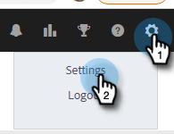

# Verbinden Ihres [!DNL Sales Insight Actions]-Kontos mit [!DNL Salesforce] {#connect-your-sales-insight-actions-account-to-salesforce}

Führen Sie diese einfachen Schritte aus, um [!DNL Sales Insight Actions] Konto mit [!DNL Salesforce] zu verbinden.

## Verbinden von als Admin {#how-to-connect-as-an-admin}

1. Klicken Sie auf das Zahnradsymbol und wählen Sie **[!UICONTROL Einstellungen]** aus.

   

1. Klicken [!UICONTROL &#x200B; unter „Admin-]&quot; auf **[!UICONTROL Salesforce]**.

   

1. Klicken Sie auf [!UICONTROL &#x200B; Registerkarte &#x200B;]Verbindungen und Anpassungen“ auf **[!UICONTROL Salesforce]** und dann auf **[!UICONTROL Verbinden]**.

   

1. Klicken Sie auf **[!UICONTROL OK]**.

   

1. Wenn Sie bereits bei Salesforce angemeldet sind, sind Sie angemeldet. Wenn nicht, werden Sie aufgefordert, sich anzumelden.

## Verbinden von als Benutzer ohne Administratorrechte {#how-to-connect-as-a-non-admin}

1. Klicken Sie auf das Zahnradsymbol und wählen Sie **[!UICONTROL Einstellungen]** aus.

   

1. Wählen [!UICONTROL &#x200B; unter „Mein &#x200B;]&quot; die Option **[!UICONTROL Salesforce]**.

1. Klicken Sie auf der [!UICONTROL Verbindungen und Anpassungen] auf **[!UICONTROL Salesforce]** und dann auf **[!UICONTROL Verbinden]**.

   

1. Klicken Sie auf **[!UICONTROL OK]**.

   

1. Wenn Sie bereits bei Salesforce angemeldet sind, sind Sie angemeldet. Wenn nicht, werden Sie aufgefordert, sich anzumelden.
