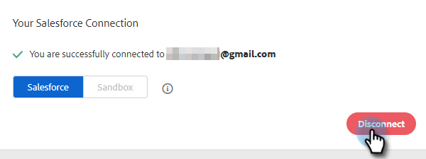

# Trennen von Salesforce von Sales Insight-Aktionen {#disconnect-salesforce-from-sales-insight-actions}

Manchmal müssen Sie möglicherweise Ihr Salesforce-Konto von Ihrem Sales Insight Actions-Konto trennen. So geht&#39;s.

## Trennen der Verbindung zu Salesforce als Admin {#how-to-disconnect-from-salesforce-as-an-admin}

1. Klicken Sie in „Sales Insight-Aktionen“ oben rechts auf das Zahnradsymbol und wählen Sie **Einstellungen** aus.

   

1. Klicken Sie unter „Admin Settings“ auf **Salesforce**.

   

1. Klicken Sie auf der Registerkarte Verbindungen und Anpassungen auf **Verbindung trennen**.

   

## Trennen der Verbindung zu Salesforce als Benutzer ohne Administratorrechte {#how-to-disconnect-from-salesforce-as-a-non-admin}

1. Klicken Sie in „Sales Insight-Aktionen“ oben rechts auf das Zahnradsymbol und wählen Sie **Einstellungen** aus.

   

1. Wählen Sie unter Mein Konto die Option **Salesforce**.

PICC

1. Klicken Sie auf der Registerkarte Verbindungen und Anpassungen auf **Verbindung trennen**.

PICC
