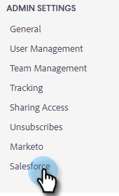

# Salesforce-Synchronisationseinstellungen {#salesforce-sync-settings}

## Protokollieren von E-Mail-Aktivitäten bei Salesforce über API {#logging-email-activity-to-salesforce-via-api}

Für diese Funktion müssen Sie die Salesforce-Edition (Enterprise/Unlimited Edition) oder die Professional Edition verwenden, wenn Sie die Integration über Web Services API erworben haben.

>[!PREREQUISITES]
>
>Salesforce- und Sales Insight-Aktionen müssen verknüpft sein.

1. Klicken Sie in &quot;Sales Insight-Aktionen&quot;auf das Zahnradsymbol und wählen Sie **Einstellungen**.

   

1. Klicken Sie unter &quot;Admin Settings&quot;(oder &quot;My Account&quot;, wenn Sie kein Administrator sind) auf **Salesforce**.

   

1. Klicken Sie auf **Einstellungen synchronisieren** Registerkarte.

   

1. Klicken Sie auf den Pfeil neben Protokoll-E-Mail-Aktivität zu Salesforce.

   

1. Klicken Sie auf **Salesforce-API** Registerkarte. Auf dieser Karte können Sie Ihre Voreinstellung für die Protokollierung von Informationen in Salesforce einrichten. Klicken **Speichern** wann geschehen.

   

## Protokollieren von E-Mail-Aktivitäten bei Salesforce per E-Mail an Salesforce (BCC) {#logging-email-activity-to-salesforce-via-email-to-salesforce-bcc}

Sobald Sie &quot;E-Mail an Salesforce (BCC)&quot; aktivieren, erhalten Sie einen BCC Ihrer E-Mails, und Ihre E-Mails werden als Aktivitäten zu Chancen, Leads und Kontakten protokolliert.

>[!PREREQUISITES]
>
>Salesforce- und Sales Insight-Aktionen müssen verknüpft sein.

**So melden Sie Ihre E-Mails in Salesforce per E-Mail (BCC) an**

1. Klicken Sie in Marketo Sales auf das Zahnradsymbol und wählen Sie **Einstellungen**.

   

1. Klicken Sie unter &quot;Admin Settings&quot;(oder &quot;My Account&quot;, wenn Sie kein Administrator sind) auf **Salesforce**.

   

1. Klicken Sie auf **Einstellungen synchronisieren** Registerkarte.

   

1. Klicken Sie auf **E-Mail an Salesforce (BCC)** Registerkarte und klicken Sie auf **Aktivieren**.

   

Wenn Ihre E-Mail-an-Salesforce-Adresse aus irgendeinem Grund nicht erfasst wird, führen Sie die folgenden Schritte aus, um die BCC-Funktion in Ihrem Salesforce-Konto zu aktivieren:

1. Melden Sie sich bei Ihrer Salesforce-Instanz an.
1. Suchen Sie Ihren Benutzernamen in der oberen rechten Ecke und wählen Sie die Dropdown-Leiste aus.
1. Auswählen **Meine Einstellungen**.
1. Auswählen **Email**.
1. Auswählen **Meine E-Mail an Salesforce**.
1. Auf dieser Seite sehen Sie ein Feld mit der Bezeichnung &quot;E-Mail an Salesforce-Adresse&quot;. Wenn daneben nichts eingetragen ist, scrollen Sie nach unten zu &quot;Meine akzeptablen E-Mail-Adressen&quot;.
1. Geben Sie die E-Mail-Adresse(n) ein, die BCC verwenden soll.
1. Klicken **Änderungen speichern**.

**Meine E-Mail an Salesforce kann in den Einstellungen nicht gefunden werden.**

Wenn Sie Meine E-Mail an Salesforce unter Ihren Einstellungen nicht sehen, hat Ihr Administrator sie möglicherweise nicht aktiviert. Dies kann passieren, wenn Ihr Team neu bei Salesforce ist oder Ihr Team noch nie die BCC-Adresse verwendet hat, die Salesforce bereitstellt.

>[!NOTE]
>
>Für die Einrichtung benötigen Sie Administratorrechte.

1. Klicken **Einrichtung**.
1. Klicken **E-Mail-Administration**.
1. Klicken **E-Mail an Salesforce**.
1. Klicken **Bearbeiten**.
1. Aktivieren Sie das Kästchen neben &quot;Aktiv&quot;.
1. Klicken **Speichern**.

## Synchronisieren von Sales Insight-Aktionsaufgaben/-Erinnerungen mit Salesforce-Aufgaben {#sync-sales-insight-actions-tasks-reminders-to-salesforce-tasks}

1. Klicken Sie in &quot;Sales Insight-Aktionen&quot;auf das Zahnradsymbol und wählen Sie **Einstellungen**.

   

1. Klicken Sie unter &quot;Admin Settings&quot;(oder &quot;My Account&quot;, wenn Sie kein Administrator sind) auf **Salesforce**.

   

1. Klicken Sie auf **Einstellungen synchronisieren** Registerkarte.

   

1. Klicken Sie auf den Pfeil neben Synchronisieren von Marketo Sales Tasks/Erinnerungen mit Salesforce-Aufgaben.

   

1. Wählen Sie die gewünschte Option aus (&quot;Synchronisieren Sie nicht mit Salesforce-Aufgaben&quot; ist standardmäßig ausgewählt).

   
