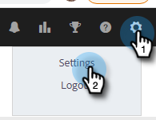

# Verkaufsaktivitäten mit Salesforce synchronisieren {#sync-sales-activities-to-salesforce}

Sie können die Aktionen Salesforce-Synchronisierungseinstellungen konfigurieren, um E-Mail- und Aufrufaktivitäten in Salesforce zu protokollieren. Dies bietet Teams, die aus Ihrem CRM heraus arbeiten, eine bessere Sichtbarkeit und ermöglicht es Managern, diese Aktivitäten zum Erstellen benutzerdefinierter Salesforce-Berichte zu verwenden, um die Leistung Ihrer Teams zu verfolgen.

## Protokollieren von E-Mail-Aktivitäten in Salesforce über API {#logging-email-activity-to-salesforce-via-api}

Für diese Funktion müssen Sie die Enterprise/Unlimited Edition von Salesforce oder die Professional Edition verwenden, wenn Sie die Integration über die Web Services-API erworben haben.

>[!PREREQUISITES]
>
>Salesforce- und Sales Insight-Aktionen müssen verbunden sein.

1. Klicken Sie in „Sales Insights-Aktionen“ auf das Zahnradsymbol und wählen Sie **Einstellungen** aus.

   

1. Klicken Sie unter „Admin-Einstellungen“ (oder „Mein Konto“, wenn Sie kein Administrator sind) auf **Salesforce**.

   

1. Klicken Sie auf die **Synchronisierungseinstellungen**.

   

1. Klicken Sie auf den Pfeil neben E-Mail-Aktivität in Salesforce protokollieren .

   

1. Klicken Sie auf die Registerkarte **Salesforce** API. Auf dieser Karte können Sie Ihre Voreinstellungen für die Protokollierung von Informationen in Salesforce festlegen. Klicken Sie auf **Speichern**, wenn Sie fertig sind.

   

## Protokollieren von E-Mail-Aktivitäten in Salesforce per E-Mail an Salesforce (BCC) {#logging-email-activity-to-salesforce-via-email-to-salesforce-bcc}

Sobald Sie „E-Mail an Salesforce (BCC)“ aktiviert haben, erhalten Sie eine BCC Ihrer Verkaufs-E-Mails und Ihre E-Mails werden als Aktivitäten zu Opportunitys, Leads und Kontakten protokolliert.

>[!PREREQUISITES]
>
>Salesforce- und Sales Insight-Aktionen müssen verbunden sein.

**So protokollieren Sie Ihre E-Mails in Salesforce per E-Mail (BCC)**

1. Klicken Sie in Marketo Sales auf das Zahnradsymbol und wählen Sie **Einstellungen** aus.

   

1. Klicken Sie unter „Admin-Einstellungen“ (oder „Mein Konto“, wenn Sie kein Administrator sind) auf **Salesforce**.

   

1. Klicken Sie auf die **Synchronisierungseinstellungen**.

   

1. Klicken Sie auf **Registerkarte E-Mail an Salesforce (BCC** und klicken Sie auf **Aktivieren**.

   

Wenn Ihre E-Mail-Adresse an Salesforce aus irgendeinem Grund nicht abgerufen werden kann, führen Sie die folgenden Schritte aus, um die BCC-Funktion in Ihrem Salesforce-Konto zu aktivieren:

1. Melden Sie sich bei Ihrer Salesforce-Instanz an.
1. Suchen Sie Ihren Benutzernamen in der oberen rechten Ecke und wählen Sie die Dropdown-Leiste aus.
1. Wählen Sie **Meine Einstellungen** aus.
1. Wählen Sie **E-Mail** aus.
1. Wählen Sie **Meine E-Mail an Salesforce** aus.
1. Auf dieser Seite wird ein Feld mit der Bezeichnung „E-Mail an Salesforce-Adresse“ angezeigt. Wenn daneben nichts ausgefüllt ist, scrollen Sie nach unten zu „Meine akzeptablen E-Mail-Adressen“.
1. Geben Sie die E-Mail-Adresse(n) ein, die BCC speichern soll(en).
1. Klicken Sie **Änderungen speichern**.

**Meine E-Mail an Salesforce kann in meinen Einstellungen nicht gefunden werden**

Wenn Meine E-Mail an Salesforce in Ihren Einstellungen nicht angezeigt wird, hat Ihr Administrator sie möglicherweise nicht aktiviert. Dies kann vorkommen, wenn Ihr Team mit Salesforce noch nicht vertraut ist oder die von Salesforce bereitgestellte BCC-Adresse noch nie verwendet hat.

>[!NOTE]
>
>Sie benötigen Administratorrechte, um dies einzurichten.

1. Klicken Sie **Setup**.
1. Klicken Sie auf **E-Mail-Administration**.
1. Klicken Sie **E-Mail an Salesforce**.
1. Klicken Sie auf **Bearbeiten**.
1. Aktivieren Sie das Kontrollkästchen neben „Aktiv“.
1. Klicken Sie auf **Speichern**.

## Aufgaben/Erinnerungen für Sales Insight-Aktionen mit Salesforce-Aufgaben synchronisieren {#sync-sales-insight-actions-tasks-reminders-to-salesforce-tasks}

1. Klicken Sie in „Sales Insights-Aktionen“ auf das Zahnradsymbol und wählen Sie **Einstellungen** aus.

   

1. Klicken Sie unter „Admin-Einstellungen“ (oder „Mein Konto“, wenn Sie kein Administrator sind) auf **Salesforce**.

   

1. Klicken Sie auf die **Synchronisierungseinstellungen**.

   

1. Klicken Sie auf den Pfeil neben Marketo-Verkaufsaufgaben/-erinnerungen mit Salesforce-Aufgaben synchronisieren .

   

1. Wählen Sie die gewünschte Option aus (standardmäßig „Mit Salesforce-Aufgaben nicht synchronisieren“ ausgewählt).

   

## Erstmaliges Synchronisieren von Sales Insight-Aktionsaufgaben mit Salesforce {#syncing-sales-insight-ations-tasks-with-salesforce-for-the-first-time}

Wenn Sie die Synchronisierung zwischen Sales Insight-Aktionen und Salesforce-Aufgaben zum ersten Mal aktivieren, importieren wir Ihre Salesforce-Aufgaben. Wir werden keine aktuellen Aufgaben, die Sie bei Sales Insight-Aktionen haben, an Salesforce weiterleiten. Um Übersichtlichkeit und Duplikate zu vermeiden, werden nur Aufgaben von Sales Insight-Aktionen in Salesforce synchronisiert, nachdem Sie Sales Insight-Aktionen mit SFDC synchronisiert haben.

Folgendes passiert, wenn Sie Sales Insight-Aktionen und SFDC-Aufgaben synchronisieren:

* Sobald Sie bei der Synchronisierung von Aufgaben auf Speichern klicken, beginnen sie mit der Synchronisierung. Dies wird zunächst einige Zeit in Anspruch nehmen.

* Alle Erinnerungen, die in den letzten 24 Stunden aktualisiert oder erstellt wurden, werden von SFDC zu Sales Insight-Aktionen abgerufen. Die Synchronisierung basiert auf dem Fälligkeitsdatum, und alle diese Aufgaben werden im Backend synchronisiert. Im Command Center werden jedoch nur Aufgaben angezeigt, die heute und morgen fällig sind.

* Wenn die Synchronisierung zuvor aktiviert wurde und Sie alle Aufgaben in SFDC löschen, werden alle in den letzten 15 Tagen gelöschten Elemente aus dem Command Center gelöscht.

* Solange die Synchronisierung aktiviert ist, synchronisieren wir Aufgaben zwischen Sales Insight-Aktionen und SFDC kontinuierlich.

* Nach der ersten Synchronisierung werden alle Aufgaben, die Sie in Sales Insight-Aktionen erstellen, bearbeiten, abschließen oder löschen, mit Ihrer Aufgabenliste in Salesforce synchronisiert. Und alles, was in Salesforce erstellt, bearbeitet, abgeschlossen oder gelöscht wird, aktualisiert Ihre Aufgabenliste in Sales Insight-Aktionen.

* Um diese Synchronisierung zu aktivieren, aktivieren Sie einfach das Kontrollkästchen Synchronisieren auf der Seite Einstellungen in der Web-Anwendung.
