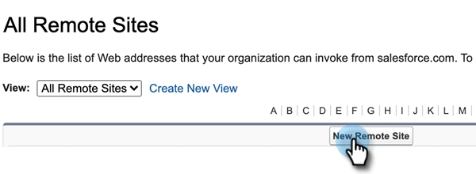

# [!DNL Sales Insight Actions] in [!DNL Salesforce] {#sales-insight-actions-configuration-in-salesforce}

>[!PREREQUISITES]
>
>* [Installieren](/help/marketo/product-docs/marketo-sales-insight/msi-for-salesforce/installation/install-marketo-sales-insight-package-in-salesforce-appexchange.md) oder [Aktualisieren](/help/marketo/product-docs/marketo-sales-insight/msi-for-salesforce/upgrading/upgrading-your-msi-package.md) des Sales Insight-Pakets in Ihrer [!DNL Salesforce]
>* [Konfigurieren von Marketo Sales Insight in [!DNL Salesforce] Enterprise/Unlimited](/help/marketo/product-docs/marketo-sales-insight/msi-for-salesforce/configuration/configure-marketo-sales-insight-in-salesforce-enterprise-unlimited.md)

## Neue Remote-Site in [!DNL Salesforce] hinzufügen {#add-new-remote-site-in-salesforce}

1. Klicken Sie [!DNL Salesforce] auf **[!UICONTROL Setup]**.

   

1. Suchen Sie nach &quot;[!UICONTROL Remote Site] und wählen Sie **[!UICONTROL Remote Site Settings]** aus.
   

1. Klicken Sie auf **[!UICONTROL Neue Remote-Site]**.

   

1. Geben Sie den Namen der Remote-Site ein (es kann sich um „MarketoSalesInsight1“ handeln). Geben Sie den URL-`https://ims-na1.adobelogin.com` der Remote-Site ein und klicken Sie auf **[!UICONTROL Speichern]**.

   

1. Klicken Sie erneut **[!UICONTROL Neue Remote-Site]**.

   

1. Geben Sie den Namen der Remote-Site ein (es kann sich um „MarketoSalesInsight2“ handeln). Geben Sie die URL-`https://mkto-sales-connect.adobe.io` der Remote-Site ein und klicken Sie auf **[!UICONTROL Speichern]**.

## Aktivieren von [!DNL Sales Insight Actions] im gesamten CRM {#enabling-sales-insight-actions-across-the-crm}

1. Klicken Sie in [!DNL Salesforce] auf die Registerkarte **[!UICONTROL Marketo Sales Insight Config]**.

   

   >[!NOTE]
   >
   >Wenn &quot;[!UICONTROL Marketo Sales Insight Config]&quot; nicht in der oberen Leiste angezeigt wird, klicken Sie auf das **+** und suchen Sie es auf den Registerkarten „Alle“.

1. Aktivieren Sie **[!UICONTROL Kontrollkästchen MSI]** Aktionen aktivieren .

   

1. Geben Sie den [!UICONTROL API-Geheimschlüssel] ein.

   

   >[!NOTE]
   >
   >Wenn Sie Ihren [!UICONTROL API-Geheimschlüssel] nicht zur Hand haben, können Sie ihn finden, indem Sie die Schritte in [diesem Artikel) ](/help/marketo/product-docs/marketo-sales-insight/msi-for-salesforce/configuration/configure-marketo-sales-insight-in-salesforce-enterprise-unlimited.md).

1. Klicken Sie auf **[!UICONTROL Speichern]**, wenn Sie fertig sind.

Dadurch werden automatisch alle im Artikel Funktionsübersicht beschriebenen Funktionen für MSI-Aktionen aktiviert.

>[!NOTE]
>
>Sie können alle MSI-Aktionsfunktionen deaktivieren, indem Sie einfach das Kontrollkästchen „MSI-Aktionen aktivieren“ deaktivieren.

## MSI-Governance-Aktionen {#msi-actions-governance}

1. Sie können Verkaufskampagnen und/oder die Registerkarte Aufgabe im nächsten Abschnitt deaktivieren. Dies gilt für Lead-, Kontakt-, Konto- und Opportunity-Panels.

   

1. Sie können MSI-Aktionen deaktivieren, indem Sie die entsprechenden Funktionen unter [!UICONTROL Aktionseinstellungen] deaktivieren.

   

>[!NOTE]
>
>Die Governance-Einstellungen gelten für alle MSI-Benutzer.
