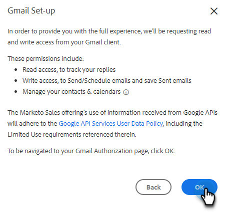

# Mit Gmail verbinden {#connect-to-gmail}

Wenn Sie sich mit Gmail verbinden, erhalten Sie ein Tracking der Antworten, Zugriff auf den Gmail-Versandkanal, die Möglichkeit, E-Mails in Gmail zu planen und die Compliance zu gewährleisten.

>[!CAUTION]
>
>Wenn Sie in Ihrem Gmail[Konto Filter oder Regeln verwenden, ](https://support.google.com/mail/answer/6579?hl=en#zippy=%2Ccreate-a-filter%2Cedit-or-delete-filters){target="_blank"} E-Mails automatisch als gelesen zu markieren, kann dies zu Problemen mit dem Antwort-Tracking führen. Es wird empfohlen, alle Regeln zu deaktivieren, die E-Mails bei Verwendung des Antwort-Trackings mit Gmail automatisch als gelesen markieren.

1. Klicken Sie in Marketo Sales auf das Zahnradsymbol und wählen Sie **Einstellungen** aus.

   

1. Wählen Sie unter Mein Konto die Option **E-Mail-Einstellungen** aus.

   

1. Klicken Sie auf die Registerkarte **E-Mail** Verbindung .

   

1. Klicken Sie **Erste Schritte**.

   

1. Wählen Sie **Ich verwende Gmail, um E-Mails zu senden** und klicken Sie auf **Weiter**.

   

1. Klicken Sie auf **OK**.

   

1. Wenn Sie sich bereits bei Gmail angemeldet haben, wählen Sie das Konto aus, mit dem Sie eine Verbindung herstellen möchten. Wenn nicht, geben Sie Ihre Gmail-Adresse ein und klicken Sie auf **Weiter**. In diesem Beispiel sind wir noch nicht angemeldet.

   

1. Geben Sie Ihr Kennwort ein und klicken Sie auf **Weiter**.

   

1. Klicken Sie **Zulassen**.

   

   Sie können diese Verbindung verwenden, um E-Mails zu verfolgen und auch als Versandkanal.

>[!NOTE]
>
>Gmail setzt seine eigenen Versandbeschränkungen durch. [Weitere Informationen finden Sie hier](/help/marketo/product-docs/marketo-sales-connect/email/email-delivery/email-connection-throttling.md#email-provider-limits).
