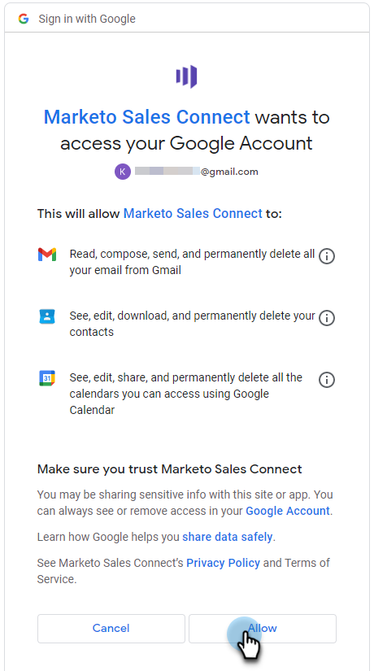

# Verbindung zu Gmail herstellen {#connect-to-gmail}

Die Verbindung mit Gmail bedeutet, dass Sie Antwort-Tracking, Zugriff auf den Kanal Gmail-Versand, die Möglichkeit erhalten, E-Mails in Gmail zu planen und die Einhaltung der Vorschriften zu gewährleisten.

>[!CAUTION]
>
>Wenn du [Filter verwenden](https://support.google.com/mail/answer/6579?hl=en#zippy=%2Ccreate-a-filter%2Cedit-or-delete-filters){target="_blank"} oder Regeln in Ihrem Gmail-Konto verwenden, um E-Mails automatisch als gelesen zu kennzeichnen, kann dies zu Problemen beim Antworten-Tracking führen. Es wird empfohlen, alle Regeln zu deaktivieren, die E-Mails bei Verwendung des Antworten-Trackings mit Gmail automatisch als gelesen markieren.

1. Klicken Sie in Marketo Sales auf das Zahnradsymbol und wählen Sie **Einstellungen**.

   

1. Wählen Sie unter Mein Konto die Option **E-Mail-Einstellungen**.

   

1. Klicken Sie auf **Email Connection** Registerkarte.

   

1. Klicken **Erste Schritte**.

   

1. Auswählen **Ich verwende Gmail zum Senden von E-Mails** und klicken Sie auf **Nächste**.

   

1. Klicken **OK**.

   

1. Wenn Sie sich bereits bei Gmail angemeldet haben, wählen Sie das Konto aus, mit dem Sie eine Verbindung herstellen möchten. Wenn nicht, geben Sie Ihre Gmail-Adresse ein und klicken Sie auf **Nächste**. In diesem Beispiel sind wir noch nicht angemeldet.

   

1. Geben Sie Ihr Kennwort ein und klicken Sie auf **Nächste**.

   

1. Klicken **Zulassen**.

   

   Sie können diese Verbindung verwenden, um E-Mails und Sendungen zu verfolgen.

>[!NOTE]
>
>Gmail erzwingt eigene Versandbeschränkungen. [Weitere Informationen finden Sie hier](/help/marketo/product-docs/marketo-sales-connect/email/email-delivery/email-connection-throttling.md#email-provider-limits).
