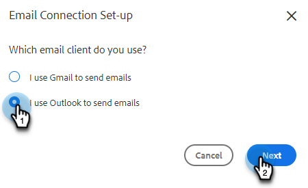

# Mit Outlook verbinden {#connect-to-outlook}

Erfahren Sie, wie Sie Ihr Sales Insight-Aktionskonto mit Outlook verbinden.

>[!NOTE]
>
>Jeder Benutzer muss über sein Marketo-Verkaufskonto eine Verbindung zu Outlook herstellen.

## Mit Outlook Online verbinden {#connecting-to-outlook-online}

Die Verbindung mit Outlook bedeutet, dass Sie Antwort-Tracking, Zugriff auf den Kanal Outlook-Versand, die Möglichkeit, E-Mails in Outlook zu planen und die Einhaltung von Vorschriften zu senden, erhalten.

1. Klicken Sie in Marketo Sales auf das Zahnradsymbol und wählen Sie **Einstellungen**.

   

1. Wählen Sie unter Mein Konto die Option **E-Mail-Einstellungen**.

   

1. Klicken Sie auf **Email Connection** Registerkarte.

   

1. Klicken **Erste Schritte**.

   

1. Auswählen **Ich verwende Outlook zum Senden von E-Mails** und klicken Sie auf **Nächste**.

   

1. Wählen Sie die Version von Outlook aus, die Sie verwenden, und klicken Sie auf **Nächste**. In diesem Beispiel wählen wir Outlook Online.

   

   <table> 
    <tbody>
     <tr>
      <td><strong>Outlook Online</strong></td> 
      <td>Auch als Exchange Online bekannt</td> 
     </tr>
     <tr>
      <td><strong>On-Premise-Exchange</strong></td> 
      <td>Enthält Exchange 2013 und 2016</td> 
     </tr>
    </tbody>
   </table>

   >[!NOTE]
   >
   >Marketo unterstützt derzeit keine Exchange Hybrid-Konten.

1. Klicken **OK**.

   

1. Wenn Sie nicht bei Outlook angemeldet sind, geben Sie Ihre Anmeldedaten ein und klicken Sie auf **Nächste**. Wählen Sie das Konto, mit dem Sie eine Verbindung herstellen möchten, und klicken Sie auf **Nächste**. In diesem Beispiel sind wir bereits angemeldet.

   

1. Klicken **Accept**.

   

   Sie können diese Verbindung verwenden, um E-Mails und Sendungen zu verfolgen.

   >[!NOTE]
   >
   >Outlook Online (Office365) erzwingt eigene Versandbeschränkungen. [Weitere Informationen finden Sie hier](/help/marketo/product-docs/marketo-sales-connect/email/email-delivery/email-connection-throttling.md#email-provider-limits).

## Herstellen einer Verbindung zu Exchange On-Premise {#connecting-to-exchange-on-premise}

Eine Verbindung zu Exchange On-Premise bedeutet, dass Sie Antwort-Tracking, Zugriff auf den Kanal Outlook-Versand, die Möglichkeit zur Planung von E-Mails in Outlook und die Einhaltung von Richtlinien erhalten.

1. Klicken Sie in Marketo Sales auf das Zahnradsymbol und wählen Sie **Einstellungen**.

   

1. Wählen Sie unter Mein Konto die Option **E-Mail-Einstellungen**.

   

1. Klicken Sie auf **Email Connection** Registerkarte.

   

1. Klicken **Erste Schritte**.

   

1. Auswählen **Ich verwende Outlook zum Senden von E-Mails** und klicken Sie auf **Nächste**.

   

1. Wählen Sie die Version von Outlook aus, die Sie verwenden, und klicken Sie auf **Nächste**. In diesem Beispiel wählen wir Exchange On-Premise.

   

   <table> 
    <tbody>
     <tr>
      <td><strong>Outlook Online</strong></td> 
      <td>Auch als Exchange Online bekannt</td> 
     </tr>
     <tr>
      <td><strong>On-Premise-Exchange</strong></td> 
      <td>Enthält Exchange 2013 und 2016</td> 
     </tr>
    </tbody>
   </table>

1. Geben Sie Ihre Anmeldedaten ein und klicken Sie auf **Verbinden**.

   

   >[!NOTE]
   >
   >Wenn Sie Autodiscover in der Dropdown-Liste Exchange Version deaktivieren, müssen Sie Ihre IT-Abteilung nach der Exchange-URL fragen.

   Sie können diese Verbindung verwenden, um E-Mails und Sendungen zu verfolgen.

   >[!NOTE]
   >
   >Bei Verwendung von Exchange On-Premise legt Ihr IT-Team Ihre E-Mail-Versandgrenze fest.

## Erhalten der Berechtigung zum Verbinden mit Outlook Online {#getting-permission-to-connect-to-outlook-online}

Möglicherweise müssen Sie mit Ihrem IT-Team zusammenarbeiten, um die Berechtigung für Marketo Sales zu erhalten, eine Verbindung zu Ihrem Outlook Online-Konto (Microsoft 365) herzustellen.

>[!NOTE]
>
>Informieren Sie das IT-Team, das Ihr Microsoft 365-Konto verwaltet, darüber, dass die Anwendung, die Zugriff benötigt, &quot;Marketo Sales Connect&quot;ist.

Je nach den Einstellungen Ihres IT-Teams und der aktuellen Konfiguration ist es am besten, sich mit Ihnen darüber zu beraten, wie Sie den Zugriff gewähren. Nachstehend finden Sie einige Artikel, die die Konversation unterstützen.

* Globale Zustimmung: [Integrierte Apps und Azure AD für Microsoft 365-Administratoren](https://learn.microsoft.com/en-us/microsoft-365/enterprise/integrated-apps-and-azure-ads?view=o365-worldwide){target="_blank"}
* Benutzereinwilligung: [Konfigurieren der Zustimmung von Benutzern zu Anwendungen](https://learn.microsoft.com/en-us/azure/active-directory/manage-apps/configure-user-consent?tabs=azure-portal&amp;pivots=portal){target="_blank"}
* Admin Consent: [Konfigurieren des Workflows für die Admin-Zustimmung](https://learn.microsoft.com/en-us/microsoft-365/admin/misc/user-consent?source=recommendations&amp;view=o365-worldwide){target="_blank"}
* Aktivierung oder Deaktivierung der Benutzerzustimmung: [Verwalten der Benutzerzustimmung für Apps in Microsoft 365](https://learn.microsoft.com/en-us/microsoft-365/admin/misc/user-consent?source=recommendations&amp;view=o365-worldwide){target="_blank"}
* Verwalten mit Microsoft Defender: [OAuth-Apps verwalten](https://learn.microsoft.com/en-us/defender-cloud-apps/manage-app-permissions){target="_blank"}
