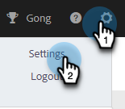
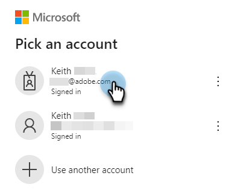

# Verbinden mit Outlook {#connect-to-outlook}

Erfahren Sie, wie Sie Ihr Sales Insight Actions-Konto mit Outlook verbinden.

>[!NOTE]
>
>Jeder Benutzer muss über sein Marketo-Kundenkonto eine Verbindung zu Outlook herstellen.

## Herstellen einer Verbindung zu Outlook Online {#connecting-to-outlook-online}

Wenn Sie eine Verbindung zu Outlook herstellen, erhalten Sie ein Tracking der Antworten, Zugriff auf den Outlook-Versandkanal, die Möglichkeit, E-Mails in Outlook zu planen und die Einhaltung der Vorschriften zu senden.

1. Klicken Sie in Marketo Sales auf das Zahnradsymbol und wählen Sie **Einstellungen** aus.

   

1. Wählen Sie unter Mein Konto die Option **E-Mail-Einstellungen** aus.

   

1. Klicken Sie auf die Registerkarte **E-Mail** Verbindung .

   

1. Klicken Sie auf **Erste Schritte**.

   

1. Wählen Sie **Ich verwende Outlook zum Senden von E-Mails** und klicken Sie auf **Weiter**.

   

1. Wählen Sie die verwendete Outlook-Version aus und klicken Sie auf **Weiter**. In diesem Beispiel wählen wir Outlook Online.

   

   <table>
    <tbody>
     <tr>
      <td><strong>Outlook Online</strong></td>
      <td>Auch als Exchange Online bekannt</td>
     </tr>
     <tr>
      <td><strong>Exchange On-Premise</strong></td>
      <td>Umfasst Exchange 2013 und 2016</td>
     </tr>
    </tbody>
   </table>

   >[!NOTE]
   >
   >Marketo unterstützt derzeit keine Exchange Hybrid-Konten.

1. Klicken Sie auf **OK**.

   

1. Wenn Sie nicht bei Outlook angemeldet sind, geben Sie Ihre Anmeldeinformationen ein und klicken Sie auf **Weiter**. Wenn ja, wählen Sie das Konto, mit dem Sie eine Verbindung herstellen möchten, und klicken Sie auf **Weiter**. In diesem Beispiel sind wir bereits angemeldet.

   

1. Klicken Sie **Akzeptieren**.

   

   Sie können diese Verbindung verwenden, um E-Mails zu verfolgen und auch als Versandkanal.

   >[!NOTE]
   >
   >Outlook Online (Office365) erzwingt seine eigenen Versandbeschränkungen. [Weitere Informationen finden Sie hier](/help/marketo/product-docs/marketo-sales-connect/email/email-delivery/email-connection-throttling.md#email-provider-limits).

## Herstellen einer Verbindung zu Exchange On-Premise {#connecting-to-exchange-on-premise}

Die Verbindung zu Exchange On-Premise bedeutet, dass Sie die Antwort verfolgen, auf den Outlook-Versandkanal zugreifen, E-Mails in Outlook planen und die Compliance sicherstellen können.

1. Klicken Sie in Marketo Sales auf das Zahnradsymbol und wählen Sie **Einstellungen** aus.

   

1. Wählen Sie unter Mein Konto die Option **E-Mail-Einstellungen** aus.

   

1. Klicken Sie auf die Registerkarte **E-Mail** Verbindung .

   

1. Klicken Sie auf **Erste Schritte**.

   

1. Wählen Sie **Ich verwende Outlook zum Senden von E-Mails** und klicken Sie auf **Weiter**.

   

1. Wählen Sie die verwendete Outlook-Version aus und klicken Sie auf **Weiter**. In diesem Beispiel wählen wir Exchange On-Premise.

   

   <table>
    <tbody>
     <tr>
      <td><strong>Outlook Online</strong></td>
      <td>Auch als Exchange Online bekannt</td>
     </tr>
     <tr>
      <td><strong>Exchange On-Premise</strong></td>
      <td>Umfasst Exchange 2013 und 2016</td>
     </tr>
    </tbody>
   </table>

1. Geben Sie Ihre Anmeldedaten ein und klicken Sie auf **Verbinden**.

   

   >[!NOTE]
   >
   >Wenn Sie die automatische Erkennung in der Dropdown-Liste Exchange-Version deaktivieren, müssen Sie die IT-Abteilung nach der Exchange-URL fragen.

   Sie können diese Verbindung verwenden, um E-Mails zu verfolgen und auch als Versandkanal.

   >[!NOTE]
   >
   >Wenn Sie Exchange On-Premise verwenden, legt Ihr IT-Team Ihr E-Mail-Versandlimit fest.

## Erhalten der Berechtigung zum Herstellen einer Verbindung mit Outlook Online {#getting-permission-to-connect-to-outlook-online}

Möglicherweise müssen Sie mit Ihrem IT-Team zusammenarbeiten, um die Erlaubnis zu erhalten, dass Marketo Sales eine Verbindung zu Ihrem Outlook Online-Konto (Microsoft 365) herstellen kann.

>[!NOTE]
>
>Informieren Sie das IT-Team, das Ihr Microsoft 365-Konto verwaltet, dass die Anwendung, auf die Zugriff benötigt wird, &quot;Marketo Sales Connect“ lautet.

Je nach den Voreinstellungen und der aktuellen Konfiguration Ihres IT-Teams ist es am besten, sich mit ihm über die Gewährung des Zugriffs zu beraten. Im Folgenden finden Sie einige Artikel, die Ihnen bei der Konversation helfen können.

* Globales Einverständnis: [Integrierte Apps und Azure AD für Microsoft 365-Administratoren](https://learn.microsoft.com/en-us/microsoft-365/enterprise/integrated-apps-and-azure-ads?view=o365-worldwide){target="_blank"}
* Benutzereinverständnis: [Konfigurieren, wie Benutzer Anwendungen zustimmen](https://learn.microsoft.com/en-us/azure/active-directory/manage-apps/configure-user-consent?tabs=azure-portal&pivots=portal){target="_blank"}
* Admin-Einverständnis: [Konfigurieren des Workflows für das Admin-Einverständnis](https://learn.microsoft.com/en-us/microsoft-365/admin/misc/user-consent?source=recommendations&view=o365-worldwide){target="_blank"}
* Aktivieren oder Deaktivieren des Benutzereinverständnisses: [Verwalten des Benutzereinverständnisses für Apps in Microsoft 365](https://learn.microsoft.com/en-us/microsoft-365/admin/misc/user-consent?source=recommendations&view=o365-worldwide){target="_blank"}
* Verwalten mit Microsoft Defender: [Verwalten von OAuth-Apps](https://learn.microsoft.com/en-us/defender-cloud-apps/manage-app-permissions){target="_blank"}
