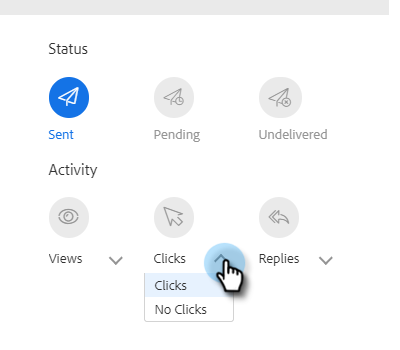
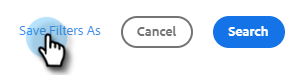
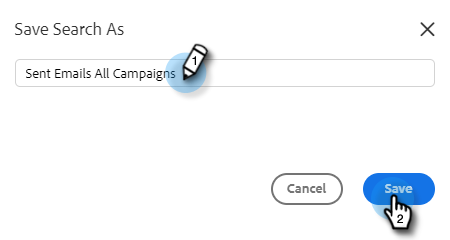

# Erweiterte Suche - Übersicht {#advanced-search-overview}

Mithilfe der erweiterten Suche können Sie eine Liste Ihrer aktivsten potenziellen Kunden erstellen, die E-Mails angesehen, angeklickt oder beantwortet haben.

## Zugriff auf die erweiterte Suche {#how-to-access-advanced-search}

1. Klicken Sie in der Web-Anwendung auf **[!UICONTROL Command Center]**.

   

1. Klicken Sie auf **[!UICONTROL E-Mails]**.

   

1. Wählen Sie die entsprechende Registerkarte aus.

   

1. Klicken Sie [!UICONTROL Erweiterte Suche].

   

## Filter {#filters}

**Datum**

Wählen Sie den Datumsbereich für Ihre Suche. Vordefinierte Datumswerte werden je nach ausgewähltem E-Mail-Status aktualisiert [!UICONTROL Gesendet], [!UICONTROL Nicht zugestellt], [!UICONTROL Ausstehend]).

**Wer**

Filtern Sie nach E-Mail-Empfänger/Absender im Abschnitt [!UICONTROL Wer].

<table>
 <tr>
  <td><strong>Dropdown</strong></td>
  <td><strong>Beschreibung</strong></td>
 </tr>
 <tr>
  <td><strong>[!UICONTROL Anzeigen als]</strong></td>
  <td>Filtern Sie nach einem bestimmten Absender in Ihrer Sales Connect-Instanz (diese Option steht nur Administratoren zur Verfügung).</td>
 </tr>
 <tr>
  <td><strong>[!UICONTROL nach Gruppe]</strong></td>
  <td>E-Mails nach einer bestimmten Empfängergruppe filtern</td>
 </tr>
 <tr>
  <td><strong>[!UICONTROL nach Person]</strong></td>
  <td>Nach einem bestimmten Empfänger filtern.</td>
 </tr>
</table>

**Wenn**

Wählen Sie „Nach Erstellungsdatum“, „Zustellungsdatum“, „Fehlgeschlagen“ oder „Geplant“ aus. Die verfügbaren Optionen ändern sich je nach ausgewähltem E-Mail-Status ([!UICONTROL Gesendet], [!UICONTROL Nicht &#x200B;], [!UICONTROL Ausstehend]).

**Kampagnen**

E-Mails nach Kampagnenbeteiligung filtern.

**Status**

Es gibt drei E-Mail-Status zur Auswahl. Die Typ-/Aktivitätsoptionen ändern sich je nach ausgewähltem Status.

_&#x200B;**Status: gesendet**&#x200B;_

Filtert nach der Aktivität „Gesendete E-Mails“. Sie können [!UICONTROL Ansichten]/[!UICONTROL keine Ansichten], [!UICONTROL Klicks]/[!UICONTROL keine Klicks] und/oder [!UICONTROL Antworten]/[!UICONTROL keine Antworten].

_&#x200B;**Status: Ausstehend**&#x200B;_

Filtert nach allen ausstehenden E-Mails.

<table>
 <tr>
  <td><strong>Status</strong></td>
  <td><strong>Beschreibung</strong></td>
 </tr>
 <tr>
  <td><strong>[!UICONTROL Geplant]</strong></td>
  <td>E-Mails, die über das Fenster „Erstellen“ (Salesforce oder die Web-App), E-Mail-Plug-ins oder eine Kampagne geplant wurden.</td>
 </tr>
 <tr>
  <td><strong>[!UICONTROL Entwürfe]</strong></td>
  <td>E-Mails, die sich derzeit im Entwurfsstatus befinden. E-Mails benötigen eine Betreffzeile und einen Empfänger, damit sie als Entwurf gespeichert werden können.</td>
 </tr>
 <tr>
  <td><strong>[!UICONTROL wird ausgeführt]</strong></td>
  <td>E-Mails, die gerade gesendet werden. E-Mails sollten in diesem Zustand nicht länger als einige Sekunden bleiben.</td>
 </tr>
</table>

_&#x200B;**Status: Nicht zugestellt**&#x200B;_

Filtert nach E-Mails, die nie zugestellt wurden.

<table>
 <tr>
  <td><strong>Status</strong></td>
  <td><strong>Beschreibung</strong></td>
 </tr>
 <tr>
  <td><strong>[!UICONTROL fehlgeschlagen]</strong></td>
  <td>Wenn eine E-Mail nicht von Sales Connect gesendet werden kann (häufige Gründe sind: E-Mails werden an abgemeldete/blockierte Kontakte gesendet oder es gab ein Problem beim Ausfüllen der dynamischen Felder).</td>
 </tr>
 <tr>
  <td><strong>[!UICONTROL gebounct]</strong></td>
  <td>Eine E-Mail wird als Bounce markiert, wenn sie vom Server des Empfängers abgelehnt wird. Hier werden nur E-Mails angezeigt, die über Sales Connect-Server gesendet wurden.</td>
 </tr>
 <tr>
  <td><strong>[!UICONTROL Spam]</strong></td>
  <td>Wann die E-Mail vom Empfänger als Spam markiert wurde (allgemeiner Begriff für unerwünschte E-Mails). Hier werden nur E-Mails angezeigt, die über Sales Connect-Server gesendet wurden.</td>
 </tr>
</table>

## Gespeicherte Suchvorgänge {#saved-searches}

So erstellen Sie eine gespeicherte Suche.

1. Nachdem Sie alle Filter eingerichtet haben, klicken Sie auf **[!UICONTROL Filter speichern unter]**.

   

1. Geben Sie der Suche einen Namen und klicken Sie auf **[!UICONTROL Speichern]**.

   

Ihre gespeicherten Suchvorgänge werden in der Seitenleiste auf der linken Seite angezeigt.

