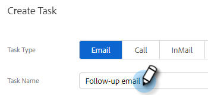

# Zuweisen von Aufgaben zu Team-Mitgliedern {#assigning-tasks-to-team-members}

Wenn Sie mit anderen Team-Mitgliedern zusammenarbeiten möchten, kann die Zuweisung von Aufgaben eine hervorragende Möglichkeit sein, Ihre Interessensbekundungsbemühungen zu koordinieren.

>[!NOTE]
>
>Sie können nur Aufgaben für freigegebene Kontakte zuweisen.

1. Klicken Sie in der Webanwendung auf **Command Center**.

   

1. Klicks **Aufgabe hinzufügen**.

   

1. Wählen Sie den Aufgabentyp aus.

   

1. Geben Sie Ihrer Aufgabe einen Namen.

   

1. Wählen Sie im Feld Aufgabe zuweisen die Person in Ihrem Team aus, der Sie die Aufgabe zuweisen möchten.

   

1. Fügen Sie die Person, mit der Sie in Kontakt treten möchten, in das Personenfeld ein.

   

1. Wählen Sie das Fälligkeitsdatum aus.

   

1. Festlegen der Priorität.

   

1. Fügen Sie wichtige Details hinzu, die für Ihr Team relevant sind (optional), und klicken Sie auf **Erstellen**.

   
