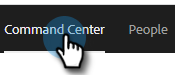
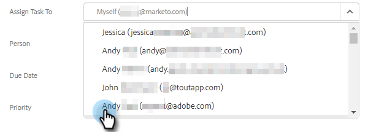
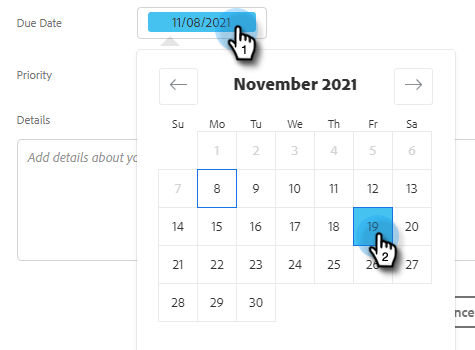

# Zuweisen von Aufgaben zu Team-Mitgliedern {#assigning-tasks-to-team-members}

Wenn Sie mit anderen Team-Mitgliedern zusammenarbeiten möchten, kann die Zuweisung von Aufgaben eine gute Möglichkeit sein, Ihre Interessentenaktivitäten zu koordinieren.

>[!NOTE]
>
>Sie können Aufgaben nur freigegebenen Kontakten zuweisen.

1. Klicken Sie in der Web-Anwendung auf **[!UICONTROL Command Center]**.

   

1. Klicken Sie **[!UICONTROL Aufgabe hinzufügen]**.

   

1. Wählen Sie den Aufgabentyp.

   

1. Benennen Sie Ihre Aufgabe.

   

1. Wählen Sie die Person in Ihrem Team, der Sie die Aufgabe zuweisen möchten, im Feld Aufgabe zuweisen aus.

   

1. Fügen Sie im Feld Person die Person hinzu, mit der Sie Kontakt aufnehmen möchten.

   

1. Wählen Sie das Fälligkeitsdatum aus.

   

1. Priorität festlegen.

   

1. Fügen Sie alle wichtigen Details hinzu, die für Ihren Teamkollegen relevant sind (optional), und klicken Sie auf **[!UICONTROL Erstellen]**.

   
