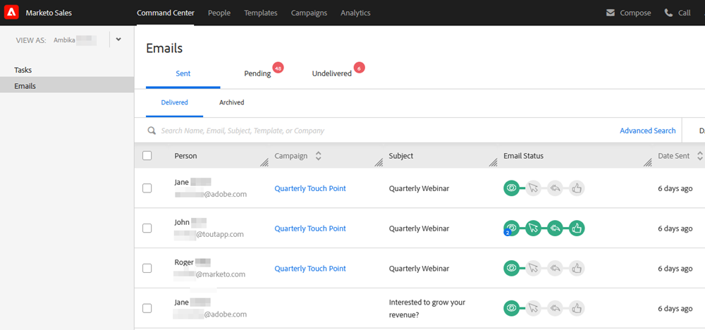

# Übersicht über das Command Center {#command-center-overview}

Das [!UICONTROL Command Center] ist eine einheitliche Ansicht, die Ihnen hilft, Ihren nächsten Schritt zu finden und gleichzeitig sicherzustellen, dass nichts durch die Ritzen fällt.

## Verwalten von E-Mails {#manage-emails}

Im E-Mail-Bereich des [!UICONTROL Command Center] können Sie Ihre gesamten E-Mail-Aktivitäten verwalten. Stellen Sie sich vor, dass Sie E-Mails, die von [!DNL Sales Connect] gesendet wurden, als Ihren E-Mail-Postausgang betrachten. Verwalten Sie Ihre geplanten E-Mails, prüfen Sie, wer mit Ihren E-Mails interagiert hat, ob es Probleme mit der Zustellung Ihrer E-Mails gab, und vieles mehr.

Der Abschnitt E-Mail bietet Ihnen einen Überblick über alle Ihre E-Mails und vereinfacht deren Organisation durch primäre Registerkarten und Unterregisterkarten, die als Ordner fungieren, in denen Ihre E-Mails automatisch basierend auf ihrem Status gespeichert werden.

<table>
 <tr>
  <th>Primär</th>
  <th>Sekundär</th>
  <th>Beschreibung</th>
 </tr>
 <tr>
  <th rowspan="2">[!UICONTROL gesendet]</th>
  <td>[!UICONTROL übermittelt]</td>
  <td>E-Mails, die an den Empfänger gesendet wurden.</td>
 </tr>
 <tr>
  <td>[!UICONTROL archiviert]</td>
  <td>Vom Benutzer archivierte E-Mails, um das Tracking der E-Mails zu deaktivieren.</td>
 </tr>
 <tr>
  <th rowspan="3">[!UICONTROL Pending]</th>
  <td>[!UICONTROL Geplant]</td>
  <td>E-Mails, die derzeit für den Versand geplant sind. Sobald eine E-Mail gesendet wurde, wird sie in den Ordner für zugestellte Nachrichten verschoben.</td>
 </tr>
 <tr>
  <td>[!UICONTROL -Entwurf]</td>
  <td>Als Entwurf gespeicherte E-Mails. 
  <strong>Hinweis</strong>: Nur einzelne E-Mails können als Entwürfe gespeichert werden. Massen-E-Mails (E-Mails auswählen und senden sowie Gruppen-E-Mails) werden nicht als Entwürfe gespeichert.</td>
 </tr>
 <tr>
  <td>[!UICONTROL In Bearbeitung]</td>
  <td>Dies ist ein Zwischenstatus, in den E-Mails versetzt werden, wenn sie am Versand teilnehmen. E-Mails sollten nur einige Augenblicke in Bearbeitung sein.</td>
 </tr>
 <tr>
  <th rowspan="3">[!UICONTROL nicht zugestellt]</th>
  <td>[!UICONTROL fehlgeschlagen]</td>
  <td>E-Mails, die nicht zugestellt wurden.
</td>
 </tr>
 <tr>
  <td>[!UICONTROL gebounct]</td>
  <td>E-Mails, die vom E-Mail-Server der Empfänger abgelehnt wurden. 
  <strong>Hinweis</strong>: Dies wird nur erkannt, wenn Sie ein älterer ToutApp-Benutzer sind und Zugriff auf MSC-Server als Versandkanal haben.</td>
 </tr>
 <tr>
  <td>[!UICONTROL Spam]</td>
  <td>E-Mails, die vom Empfänger manuell als Spam gekennzeichnet wurden. 
  <strong>Hinweis</strong>: Dies wird nur erkannt, wenn Sie ein älterer ToutApp-Benutzer sind und Zugriff auf MSC-Server als Versandkanal haben.</td>
 </tr>
</table>

## Aufgaben verwalten {#manage-tasks}

Der Aufgabenabschnitt ist Ihre zentrale Anlaufstelle für die Verwaltung und Ausführung von Aufgaben. Hier können Sie Ihre Aufgaben nahtlos verwalten, um Ihre Produktivität zu steigern und sich auf die relevantesten Elemente zu konzentrieren.

## Follow-up mit engagierten potenziellen Kunden {#follow-up-with-engaged-prospects}

Sobald Sie mit der Interaktion mit Ihren Interessenten über das Fenster „Erstellen“ oder die Kampagnen begonnen haben, können Sie beginnen, die am meisten interagierenden Interessenten erneut anzusprechen, indem Sie die erweiterte Suchfunktion verwenden.

Wenn Sie beispielsweise 100 Personen zu einer Kampagne in MSC hinzufügen, möchten Sie möglicherweise die Personen erneut ansprechen, die Ihre E-Mail angesehen und geklickt, aber nicht darauf geantwortet haben. Zu diesem Zweck können Sie den Kampagnenfilter zusammen mit den Filtern Ansichts- und Klickstatus für die Aktivitätsfilter verwenden, um eine Liste der Personen zu erstellen, die erneut angesprochen werden sollen.

Bonus: Wenn Sie Ihre erweiterte Suche speichern, funktioniert sie als dynamische Liste und fügt E-Mails hinzu, die die Interaktionskriterien erfüllen, sobald der Empfänger Ihre E-Mail anzeigt oder darauf klickt.

>[!MORELIKETHIS]
>
>* Aufgaben
>* Erweiterte Suche - Übersicht
>* Erstellen von Massen-E-Mails mit Auswählen und Senden
