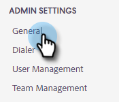
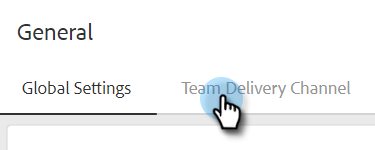

# Einrichten eines benutzerdefinierten Versandkanals für Ihr Team {#set-up-a-custom-delivery-channel-for-your-team}

>[!NOTE]
>
>**Administratorberechtigungen erforderlich**

>[!NOTE]
>
>* Zusätzlich zur Einrichtung Ihres SMTP-Servers muss Ihre [E-Mail-Identität überprüft werden](/help/marketo/product-docs/marketo-sales-insight/actions/getting-started/email-settings/verify-your-email.md) bevor Sie E-Mails versenden können.
>* Es wird empfohlen, mit Ihrem IT-Team oder SMTP-Server-Anbieter zusammenzuarbeiten, um die richtigen Server-Anmeldeinformationen für Ihren SMTP-Server zu erhalten.
>* Sie können Ihre Gmail- und [!DNL Exchange]-Server-Anmeldedaten nicht über den SMTP-Server verbinden. Nutzen Sie unseren E-Mail-Verbindungsservice, um sich mit diesen Anbietern zu integrieren.

1. Klicken Sie auf das Zahnradsymbol und wählen Sie **[!UICONTROL Einstellungen]** aus.

   

1. Klicken [!UICONTROL &#x200B; unter &quot;]&quot; auf **[!UICONTROL Allgemein]**.

   

1. Klicken Sie auf **[!UICONTROL Registerkarte]** Team-Versandkanal“.

   

1. Geben Sie Ihre SMTP-Server-Anmeldeinformationen ein und klicken Sie auf **[!UICONTROL Verbinden]**.

   

   >[!NOTE]
   >
   >Der SMTP-Server des Teams ist der Standard-Versandkanal der Standard-E-Mail-Identität für alle Team-Mitglieder. Darüber hinaus ist sie als Versandkanal-Option für alle anderen E-Mail-Identitäten verfügbar.

   >[!MORELIKETHIS]
   >
   >* [E-Mail-Verbindung für Gmail-Benutzer](/help/marketo/product-docs/marketo-sales-connect/email-plugins/gmail/email-connection-for-gmail-users.md)
   >* [E-Mail-Verbindung für [!DNL Outlook] Benutzer](/help/marketo/product-docs/marketo-sales-connect/email-plugins/msc-for-outlook/email-connection-for-outlook-users.md)
