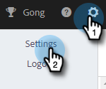

# Einrichten eines benutzerdefinierten Bereitstellungskanals für Ihr Team {#set-up-a-custom-delivery-channel-for-your-team}

>[!NOTE]
>
>**Erforderliche Administratorberechtigungen**

>[!NOTE]
>
>* Zusätzlich zur Einrichtung Ihres SMTP-Servers muss Ihr [E-Mail-Identität muss überprüft werden](/help/marketo/product-docs/marketo-sales-insight/actions/getting-started/email-settings/verify-your-email.md) bevor Sie E-Mails versenden können.
>* Wir empfehlen, mit Ihrem IT-Team oder SMTP-Serveranbieter zusammenzuarbeiten, um die richtigen Serverberechtigungen für Ihren SMTP-Server zu erhalten.
>* Sie können Ihren Gmail- und Exchange-Server nicht mit den SMTP-Server-Anmeldedaten verbinden. Bitte nutzen Sie unseren Email Connection-Dienst, um sich mit diesen Anbietern zu integrieren.

1. Klicken Sie auf das Zahnradsymbol und wählen Sie **Einstellungen**.

   

1. Klicken Sie unter &quot;Admin Settings&quot;auf **Allgemein**.

   

1. Klicken Sie auf **Team Delivery Channel** Registerkarte.

   

1. Geben Sie Ihre SMTP Server-Anmeldedaten ein und klicken Sie auf **Verbinden**.

   

   >[!NOTE]
   >
   >Der Team-SMTP-Server ist der standardmäßige Versandkanal der Standard-E-Mail-Identität für alle Teammitglieder. Darüber hinaus ist es als Option für den Versandkanal für alle anderen E-Mail-Identitäten verfügbar.

   >[!MORELIKETHIS]
   >
   >* [E-Mail-Verbindung für Gmail-Benutzer](/help/marketo/product-docs/marketo-sales-connect/email-plugins/gmail/email-connection-for-gmail-users.md)
   >* [E-Mail-Verbindung für Outlook-Benutzer](/help/marketo/product-docs/marketo-sales-connect/email-plugins/msc-for-outlook/email-connection-for-outlook-users.md)

