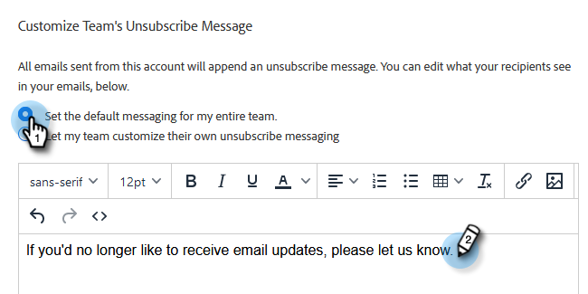
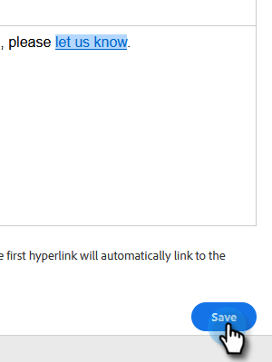

# Abmelde-Link-Nachricht anpassen {#customize-unsubscribe-link-message}

Wir haben Teams immer erlaubt, ihre Abmelde-Link-Nachrichten anzupassen, aber Administratoren haben die Möglichkeit, die Abmelde-Link-Nachrichten für ihr gesamtes Team festzulegen, um eine konsistente Nachrichtenübermittlung zu gewährleisten.

>[!NOTE]
>
>Sie können keinen Abmelde-Link eines Drittanbieters für [!DNL Marketo Sales] verwenden, da diese Informationen nicht in unserer Datenbank erfasst werden.

1. Klicken Sie auf das Zahnradsymbol und wählen Sie **[!UICONTROL Einstellungen]** aus.

   

1. Klicken [!UICONTROL  unter „Admin] auf **[!UICONTROL Abmeldungen]**.

   

1. Legen Sie fest, ob diese Nachricht der Standard für Ihr gesamtes Team ist oder ob Sie möchten, dass das Team seine eigenen Nachrichten erstellt (in diesem Beispiel wählen wir „Standardnachrichten„). Schreiben Sie Ihre benutzerdefinierte Nachricht in das Textfeld.

   

1. Markieren Sie den Text, auf den die Benutzer klicken sollen, um zur Abmeldeseite zu gelangen, und klicken Sie dann auf das Link-Symbol.

   

   >[!NOTE]
   >
   >Es spielt keine Rolle, welche URL Sie eingeben. Wenn die E-Mail gesendet wird, wird der erste (oder einzige) Hyperlink automatisch mit der standardmäßigen Abmeldeseite verknüpft.

1. Geben Sie eine URL ein, bestimmen Sie, ob der Link im aktuellen oder einem neuen Fenster geöffnet werden soll, und klicken Sie auf **[!UICONTROL Speichern]**.

   

1. Klicken **[!UICONTROL unten auf]** Speichern“, um Ihre Änderungen zu speichern.

   
