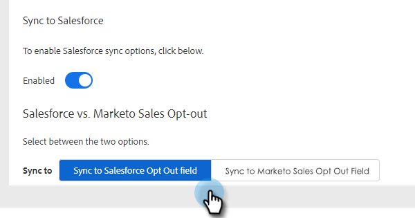

# Synchronisieren von Abmeldungen mit [!DNL Salesforce] {#syncing-unsubscribes-with-salesforce}

Wenn Sie Abmeldungen mit einem Opt-out-Feld in Salesforce synchronisieren möchten, können Sie die Salesforce-Abmeldesynchronisierung verwenden.

## Voraussetzungen für Abmeldungen zur Synchronisierung mit Salesforce {#requirements-for-unsubscribes-to-sync-to-salesforce}

* Abmeldesynchronisierung muss aktiviert sein (für die nächtliche Synchronisierung)
* Das Opt-out-Feld muss in [!DNL Salesforce] installiert sein
* Personendatensätze in [!DNL Marketo Sales] müssen eine [!DNL Salesforce] ID haben

**Push-Abmeldungen**

Wenn in [!DNL Marketo Sales] ein Abo storniert wird, pushen wir es in Echtzeit an [!DNL Salesforce] und aktualisieren eines der Opt-out-Felder, die Sie für die Synchronisierung ausgewählt haben. Wenn Sie die [!DNL Salesforce] deaktiviert haben, pushen wir das Abo-Abo dennoch an die E-Mail-Abmeldung.

**Abo-Synchronisierung**

Wenn Sie die Abmeldesynchronisierung aktiviert haben (Schritt 3 unten), schalten Sie die nächtliche Synchronisierung ein. Die Synchronisation erfolgt einmal täglich um 20:0000 Uhr PST. Alle Abmeldungen in Marketo Sales werden bidirektional mit dem Opt-out-Feld in Salesforce synchronisiert.

>[!NOTE]
>
>Die Abmeldesynchronisierung mit Salesforce synchronisiert Abmeldungen, aber keine erneuten Abmeldungen. Wenn Sie ein Abo von Marketo Sales und Salesforce entfernen möchten, deaktivieren Sie das Kontrollkästchen Abo in Salesforce kündigen und entfernen Sie das Abo in Marketo Sales.

## Konfigurieren von Abmeldesynchronisierung mit [!DNL Salesforce] {#configure-unsubscribe-sync-to-salesforce}

Benutzerinnen und Benutzer können entscheiden, ob sie ihre Abmeldungen mit dem standardmäßigen E-Mail-Opt-out-Feld synchronisieren möchten, mit dem Marketo ebenfalls synchronisieren kann, oder sie können mit dem [!DNL Marketo Sales]-Opt-out-Feld synchronisieren, sodass zwischen Abmeldungen von Verkäufen und Abmeldungen von Marketing unterschieden werden kann.

1. Klicken Sie auf das Zahnradsymbol und wählen Sie **[!UICONTROL Einstellungen]** aus.

   

1. Wählen [!UICONTROL &#x200B; unter „Admin]Einstellungen die Option **[!UICONTROL Abmeldungen]** aus.

   

1. Klicken Sie auf die **[!UICONTROL Integrationen]**. Aktivieren [!UICONTROL &#x200B; unter „Mit Salesforce synchronisieren] die nächtliche Synchronisierung.

   

1. Wählen Sie das Feld aus, mit dem Sie synchronisieren möchten.

   

   | Feld | Beschreibung |
   |---|---|
   | **Mit [!DNL Salesforce] Opt-out-Feld synchronisieren** | Standardmäßig ausgewählt. Nur [!DNL Salesforce] Feld „Opt-out“ wird aktualisiert. |
   | **Mit [!DNL Marketo Sales] Opt-out-Feld synchronisieren** | Wenn Sie Verkaufs- und Marketing-Abmeldungen trennen möchten, wählen Sie diese Option, um das zusätzliche Feld [[!DNL Marketo Sales] Opt-out“ zu aktualisieren](#msoo) |

## Installieren des Opt-out-Felds im Seiten-Layout {#installing-the-opt-out-field-in-the-page-layout}

**E-Mail-Opt-out**

„E-Mail-Opt-out“ ist ein Standardfeld in [!DNL Salesforce], das über [!DNL Salesforce] installiert werden kann. Sie müssen [!DNL Salesforce] sein, um es zu installieren.

1. Wechseln Sie zu [Salesforce.com](https://salesforce.com) und melden Sie sich an.

   

1. Klicken Sie auf Ihren Benutzernamen und wählen Sie **[!UICONTROL Setup]**.

   

1. Suchen Sie im Feld „Schnellsuche“ nach Kontakt oder Lead. In diesem Szenario installieren wir das Feld im Layout Kontaktseite , Sie sollten es jedoch für beide Personendatensätze installieren.

   

1. Wählen Sie **[!UICONTROL Seitenlayouts]** aus.

   

1. Klicken Sie **[!UICONTROL Bearbeiten]** neben dem Seitenlayout, dem Sie das Feld hinzufügen möchten.

   

1. Wählen Sie **[!UICONTROL Felder]** aus.

   

1. Ziehen Sie „E[!UICONTROL Mail-Abmeldung] per Drag-and-Drop in das Seitenlayout.

   

1. Klicken Sie auf **[!UICONTROL Speichern]**.

   

## Abmeldung von Marketo Sales {#marketo-sales-opt-out}

Das Feld Marketo Sales Opt-out ist ein benutzerdefiniertes Feld, das Benutzenden zur Verfügung steht, die das Marketo Sales Insight Package [aus der AppExchange) ](/help/marketo/product-docs/marketo-sales-insight/msi-for-salesforce/installation/install-marketo-sales-insight-package-in-salesforce-appexchange.md){target="_blank"} haben.

Nachdem Sie das Marketo Sales Insight-Package erfolgreich von der AppExchange in Salesforce installiert haben, wird das Feld Marketo Sales Opt-out für Sie verfügbar.
