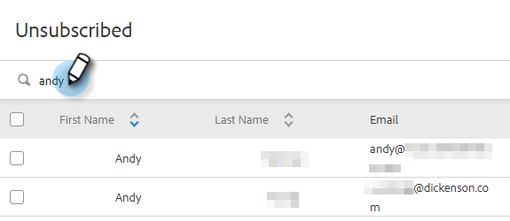

# Übersicht über die Abmeldung {#unsubscribe-overview}

Für Unternehmen wird es immer wichtiger, die Datenschutzgesetze für E-Mails einzuhalten. Um Ihnen dabei zu helfen, haben wir einige Verbesserungen an unserem Abmeldeerlebnis vorgenommen.

* Abmelde-Links werden in allen E-Mails platziert, die von Marketo Sales und Salesforce gesendet werden (dies gilt nicht für benutzerdefinierte E-Mails, die von Outlook oder Gmail gesendet werden)
* Administratoren können Nachrichten zur Abmeldung für ihr gesamtes Team bearbeiten
* Abmeldeinformationen werden in PDV gespeichert
* Abmeldungen können manuell erfolgen: geklickt Link, Salesforce Sync und Bounce
* Neuer Abmelde-Link für Landingpage

## Abmelde-Link-Landingpage {#unsubscribe-link-landing-page}

Wenn eine Person auf Ihren Abmelde-Link klickt, wird sie zu einer Landingpage weitergeleitet, auf der sie auswählen kann, wofür sie sich abmelden möchte und warum.

Diese Informationen werden in der Ansicht „Personendetails“ gespeichert, um sie später anzuzeigen.

## Gruppe abmelden {#unsubscribe-group}

Alle abgemeldeten Personen an einem Ort anzeigen und verwalten.

Verwenden Sie die Suchleiste, um nach abgemeldeten Personen zu suchen.

Wenn Sie Administrator sind, können Sie zur Abmeldegruppe gehen, um nach Abmeldungen von Konten zu filtern und alle Abmeldungen anzuzeigen, die in Ihrer Personendatenbank erfasst wurden.

## Verlaufskarte für Abmeldung {#unsubscribe-history-card}

Die Karte Verlauf abmelden hilft Admins und Benutzern, kontextuelle Informationen über den Verlauf der Abmeldung ihrer Kontakte zu erhalten. Navigieren Sie dorthin, indem Sie zur Registerkarte Personen wechseln und eine Person auswählen. Er befindet sich am unteren Rand der Registerkarte Info in der Ansicht „Personendetails“.

>[!NOTE]
>
>Es wird nur dann eine Karte „Verlauf abmelden“ geben, wenn sich die Person _irgendwann_ hat.

<table> 
 <colgroup> 
  <col> 
  <col> 
 </colgroup> 
 <tbody> 
  <tr> 
   <td><strong>Datum</strong></td> 
   <td>
Zeigt das Datum, an dem das Abmelden/erneute Abonnieren stattgefunden hat.
</td> 
  </tr> 
  <tr> 
   <td><strong>Details</strong></td> 
   <td>
Erneut abonnieren: Ein Sales Connect-Administrator hat die Abmeldung manuell aus dem Kontaktdatensatz entfernt. Möglicherweise werden auch Details zu den Gründen angezeigt, aus denen der Kontakt das Abonnement gekündigt hat.

Abo beenden: Das Abonnement des Kontakts wurde gekündigt.
</td> 
  </tr> 
  <tr> 
   <td><strong>Quelle</strong></td> 
   <td>
Salesforce-Synchronisation: Das Abmelden wurde von einer Synchronisation mit Salesforce erfasst.

Manuell: Benutzende haben auf die Schaltfläche zum Abmelden geklickt, um sich abzumelden.

Angeklickter Link: Empfänger einer E-Mail hat auf den Abmelde-Link geklickt.

„Admin-Name“: Der Name eines Administrators wird angezeigt, wenn die Aktion zum erneuten Abonnieren von Kontakten ausgeführt wurde. Auf diese Weise erfahren Benutzende, wer die Abmeldung entfernt hat.
</td> 
  </tr> 
 </tbody> 
</table>

>[!MORELIKETHIS]
>
>[Abmelde-Link-Nachricht anpassen](/help/marketo/product-docs/marketo-sales-insight/actions/email/unsubscribes/customize-unsubscribe-link-message.md)
