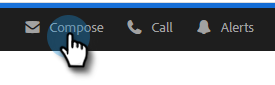

# Hinzufügen eines Anhangs oder verfolgbarer Inhalte zu Ihrer E-Mail {#add-an-attachment-or-trackable-content-to-your-email}

Beim Versand einer E-Mail über Marketo Sales haben Sie die Möglichkeit, eine Datei als Anhang hinzuzufügen oder eine Datei zu einem herunterladbaren (und verfolgbaren) Link zu machen.

>[!NOTE]
>
>In der Regel ist jede Datei über 20 MB zu groß für die Bereitstellung. Die Größe eines Anhangs, der per E-Mail gesendet werden kann, hängt vom verwendeten E-Mail-Versandkanal ab.

## Anlage hinzufügen {#add-an-attachment}

1. Erstellen Sie Ihren E-Mail-Entwurf (es gibt mehrere Möglichkeiten, dies zu tun, in diesem Beispiel wählen wir **Erstellen** in der Kopfzeile).

   

1. Füllen Sie das Feld An aus und geben Sie einen Betreff ein.

   

1. Klicken Sie auf das Anlagensymbol.

   

1. Wählen Sie die angehängte Datei aus und klicken Sie auf **Einfügen**.

   

   >[!NOTE]
   >
   >Wenn Sie eine Datei hochladen müssen, klicken Sie auf **Schaltfläche** Inhalt hochladen“ oben rechts im Fenster.

   Der Anhang wird unten in der E-Mail angezeigt.

   

## Tracking-Inhalte hinzufügen {#add-trackable-content}

1. Erstellen Sie Ihren E-Mail-Entwurf (es gibt mehrere Möglichkeiten, dies zu tun, in diesem Beispiel wählen wir das Fenster Erstellen ).

   

1. Füllen Sie das Feld An aus und geben Sie einen Betreff ein.

   

1. Klicken Sie auf die Stelle in der E-Mail, an der der verfolgbare Inhalt angezeigt werden soll, und klicken Sie dann auf das Anlagensymbol.

   

1. Wählen Sie den hinzuzufügenden Inhalt aus, klicken Sie auf den **Inhalt wird verfolgt** und klicken Sie auf **Einfügen**.

   

   >[!NOTE]
   >
   >Wenn Sie eine Datei hochladen müssen, klicken Sie auf **Schaltfläche** Inhalt hochladen“ oben rechts im Fenster.

   Der Inhalt wird als Link in Ihrer E-Mail angezeigt. Der Empfänger kann auf den Link klicken, um den Inhalt herunterzuladen.

   

   >[!NOTE]
   >
   >Benutzer werden im Live-Feed benachrichtigt, wenn Benutzer ihre verfolgten Inhalte anzeigen. Benutzer können auch den Inhalt mit der höchsten Leistung im Abschnitt Inhalt der Analytics-Seite sehen.

## Nachverfolgbare Inhaltsaktualisierungen {#trackable-content-updates}

**Tracking-Inhalts-Viewer**

Wenn ein Lead auf verfolgbaren Inhalt in Ihrer E-Mail klickt, öffnet sich ein Inhalts-Viewer.

Innerhalb des Inhalts-Viewers können Leads die folgenden Dinge tun.

* Dokument herunterladen

* Seite durch das Dokument

* Kontaktinformationen des Absenders anzeigen

**Nachverfolgbare Inhaltsereignisse im Live-Feed**

Wenn ein Lead auf den Link unseres Dokuments klickt, wird ein Klickereignis angezeigt. Sie können auf diesen Link klicken, um den Inhalt anzuzeigen. Solange Sie in Ihrem Actions-Konto im Browser angemeldet sind, zählen wir diese Klicks nicht als Ereignisse.

Jedes Mal, wenn der Lead zu einer anderen Seite des Dokuments wechselt, erhalten Sie ein „Angezeigt“-Ereignis im Live-Feed, das den Namen des Dokuments anzeigt.
