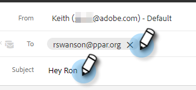

# Hinzufügen eines Anhangs oder verfolgbaren Inhalts zu Ihrer E-Mail {#add-an-attachment-or-trackable-content-to-your-email}

Beim Versand einer E-Mail über Marketo Sales haben Sie die Möglichkeit, eine Datei als Anhang hinzuzufügen oder eine Datei als herunterladbaren (und nachverfolgten) Link zu formatieren.

>[!NOTE]
>
>Normalerweise ist jede Datei über 20 MB zu groß, um bereitgestellt werden zu können. Die Größe eines Anhangs, den Sie per E-Mail senden können, hängt vom verwendeten E-Mail-Versandkanal ab.

## Anlage hinzufügen {#add-an-attachment}

1. Erstellen Sie Ihren E-Mail-Entwurf (dazu gibt es mehrere Möglichkeiten, in diesem Beispiel wählen wir **Erstellen** in der Kopfzeile).

   

1. Füllen Sie das Feld An aus und geben Sie einen Betreff ein.

   

1. Klicken Sie auf das Anlagensymbol.

   

1. Wählen Sie die anzuhängende Datei aus und klicken Sie auf **Einfügen**.

   

   >[!NOTE]
   >
   >Wenn Sie eine Datei hochladen müssen, klicken Sie auf das **Inhalt hochladen** rechts oben im Fenster.

   Der Anhang wird unten in Ihrer E-Mail angezeigt.

   

## Verfolgbaren Inhalt hinzufügen {#add-trackable-content}

1. Erstellen Sie Ihren E-Mail-Entwurf (dazu gibt es mehrere Möglichkeiten, in diesem Beispiel wählen wir das Fenster Erstellen aus).

   

1. Füllen Sie das Feld An aus und geben Sie einen Betreff ein.

   

1. Klicken Sie auf die Stelle in der E-Mail, an der der nachverfolgte Inhalt erscheinen soll, und klicken Sie auf das Anlagensymbol.

   

1. Wählen Sie den Inhalt aus, den Sie hinzufügen möchten, und klicken Sie auf die **Inhalt wird verfolgt** und klicken Sie **Einfügen**.

   

   >[!NOTE]
   >
   >Wenn Sie eine Datei hochladen müssen, klicken Sie auf das **Inhalt hochladen** rechts oben im Fenster.

   Der Inhalt wird als Link in Ihrer E-Mail angezeigt. Der Empfänger kann auf den Link klicken, um den Inhalt herunterzuladen.

   

   >[!NOTE]
   >
   >Benutzer werden im Live Feed benachrichtigt, wenn sie ihren verfolgten Inhalt anzeigen. Benutzer können auch die Inhalte mit der höchsten Leistung im Inhaltsabschnitt der Analytics-Seite sehen.

## Verfolgbare Inhaltsaktualisierungen {#trackable-content-updates}

**Tracking Content Viewer**

Wenn ein Lead auf verfolgbaren Inhalt in Ihrer E-Mail klickt, wird ein Content-Viewer geöffnet.

Innerhalb des Inhalts-Viewers können Leads die folgenden Schritte ausführen.

* Dokument herunterladen

* Seite durch das Dokument

* Kontaktdaten des Absenders anzeigen

**Verfolgbare Inhaltsereignisse im Live Feed**

Wenn ein Lead auf den Link unseres Dokuments klickt, wird ein Klickereignis angezeigt. Sie können auf diesen Link klicken, um den Inhalt anzuzeigen. Solange Sie bei Ihrem Aktionskonto im Browser angemeldet sind, zählen wir diese Klicks nicht als Ereignisse.

Jedes Mal, wenn der Lead zu einer anderen Seite im Dokument wechselt, erhalten Sie im Live-Feed ein &quot;Viewed&quot;-Ereignis, das den Namen des Dokuments anzeigt.
