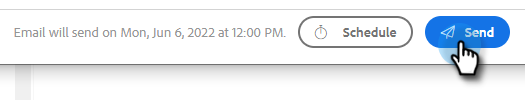

# Planen einer E-Mail {#scheduling-an-email}

Führen Sie die folgenden einfachen Schritte aus, um eine E-Mail zu planen.

>[!NOTE]
>
>Um Ihre Standardzeitzone zu aktualisieren, gehen Sie zur Seite Einstellungen .

1. Erstellen Sie Ihren E-Mail-Entwurf (es gibt mehrere Möglichkeiten, dies zu tun, in diesem Beispiel wählen wir **Erstellen** in der Kopfzeile).

   

1. Wenn Sie mit dem Erstellen Ihrer E-Mail fertig sind, klicken **unten** auf „Zeitplan“

   

1. Klicken Sie auf das Datum, um die Datumsauswahl zu öffnen und ein Datum auszuwählen.

   

1. Geben Sie die Zeit ein, zu der die E-Mail gesendet werden soll. Wählen Sie die gewünschte Zeitzone aus und klicken Sie auf **Speichern**. Schließen Sie abschließend die Planung.

   

1. Nachdem Sie Ihr geplantes Datum und Ihre geplante Uhrzeit ausgewählt haben, klicken Sie auf **Senden**, um die E-Mail zu planen.

   

   >[!NOTE]
   >
   >Geplante E-Mails können im Abschnitt Geplante Ordner des Command Centers angezeigt/bearbeitet werden.

   >[!MORELIKETHIS]
   >
   >[Übersicht über das Command Center](/help/marketo/product-docs/marketo-sales-insight/actions/email/command-center/command-center-overview.md)
