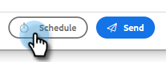

# E-Mail planen {#scheduling-an-email}

Befolgen Sie diese einfachen Schritte, um eine E-Mail zu planen.

>[!NOTE]
>
>Um Ihre Standardzeitzone zu aktualisieren, gehen Sie zur Seite Einstellungen .

1. Erstellen Sie Ihren E-Mail-Entwurf (dazu gibt es mehrere Möglichkeiten, in diesem Beispiel wählen wir **Erstellen** in der Kopfzeile).

   

1. Wenn Sie die Erstellung Ihrer E-Mail abgeschlossen haben, klicken Sie unten rechts auf **Plan** .

   

1. Klicken Sie auf das Datum, um die Datumsauswahl zu öffnen und ein Datum auszuwählen.

   

1. Geben Sie den Zeitpunkt ein, zu dem die E-Mail gesendet werden soll. Wählen Sie die gewünschte Zeitzone aus und klicken Sie auf **Speichern**. Schließen Sie die Planungsaktivität.

   

1. Nachdem Sie das geplante Datum/die Uhrzeit ausgewählt haben, klicken Sie auf **Senden** , um die E-Mail zu planen.

   

   >[!NOTE]
   >
   >Geplante E-Mails können im Bereich für geplante Ordner im Command Center angezeigt/bearbeitet werden.

   >[!MORELIKETHIS]
   >
   >[Übersicht über die Befehlszentrale](/help/marketo/product-docs/marketo-sales-insight/actions/email/command-center/command-center-overview.md)
