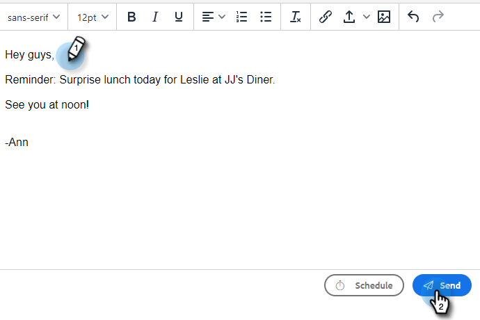

# Versenden einer getrackten E-Mail {#sending-a-tracked-email}

Beim Versand einer E-Mail mit Marketo Sales Connect werden Ansichten (E-Mail-Öffnungen) und Klicks (angeklickte Links) verfolgt.

>[!PREREQUISITES]
>
>Sie müssen eine Identität verifizieren und einen E-Mail-Versandkanal einrichten, bevor Sie eine verfolgte E-Mail senden.
>
>* [E-Mail-Adresse überprüfen](/help/marketo/product-docs/marketo-sales-insight/actions/getting-started/email-settings/verify-your-email.md)
>* Einrichten eines Versandkanals für [Outlook](/help/marketo/product-docs/marketo-sales-connect/email-plugins/msc-for-outlook/email-connection-for-outlook-users.md) oder [Gmail](/help/marketo/product-docs/marketo-sales-connect/email-plugins/gmail/email-connection-for-gmail-users.md)

1. Erstellen Sie Ihren E-Mail-Entwurf (dazu gibt es mehrere Möglichkeiten, in diesem Beispiel wählen wir **Erstellen** in der Kopfzeile).

   

1. Geben Sie den Namen oder die E-Mail-Adresse eines Empfängers im **nach** -Feld.

   

   >[!NOTE]
   >
   >Sie können nur eine Person im Feld &quot;An&quot;haben.

1. Fügen Sie alle Empfänger hinzu, die Sie in den entsprechenden Feldern zu CC oder BCC hinzufügen möchten.

   

   >[!NOTE]
   >
   >Wenn jemand, der CC’d oder BCC’d war, die E-Mail öffnet, wird diese Öffnung als Ansicht auf den Datensatz der Person im **nach** -Feld.

1. Fügen Sie eine Betreffzeile hinzu.

   

   >[!NOTE]
   >
   >Betreffzeile und Empfänger sind zum Senden der E-Mail erforderlich. Wir werden **Entwurf automatisch speichern** nachdem Betreffzeile und Empfänger hinzugefügt wurden.

1. Erstellen Sie Ihre E-Mail mit dem Editor. Klicken **Senden** (oder [Zeitplan](/help/marketo/product-docs/marketo-sales-connect/email/using-the-compose-window/scheduling-an-email.md), wenn Sie es vorziehen).

   

   >[!MORELIKETHIS]
   >
   >* [E-Mail planen](/help/marketo/product-docs/marketo-sales-insight/actions/email/using-the-compose-window/scheduling-an-email.md)
   >* [Vorlagen](/help/marketo/product-docs/marketo-sales-insight/actions/templates/manage-templates.md#create-a-new-template)

