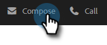

# Verwenden einer Vorlage im Fenster „Erstellen“ {#using-a-template-in-the-compose-window}

## Suchen und Verwenden von Vorlagen {#finding-and-using-templates}

1. Erstellen Sie Ihren E-Mail-Entwurf (es gibt mehrere Möglichkeiten, dies zu tun, in diesem Beispiel wählen wir **Erstellen** in der Kopfzeile).

   

1. Füllen Sie das Feld An aus.

   

1. Klicken Sie auf das Suchsymbol im Vorlagenbereich, um das Vorlagensuchfeld zu öffnen.

   

1. Wählen Sie eine Kategorie für die Suche aus (oder wählen Sie Alle aus, um alle Kategorien zu durchsuchen).

   

1. Suchen Sie nach Vorlagenname, Betreffzeile oder Textkörper der E-Mail. Klicken Sie auf die gewünschte Vorlage, um sie auszuwählen.

   

   >[!NOTE]
   >
   >Wenn Sie eine andere Vorlage auswählen, werden alle derzeit im Editor enthaltenen Informationen ersetzt. Wenn Sie Änderungen vornehmen, sollten Sie diese unbedingt kopieren, bevor Sie eine andere Vorlage auswählen.

## Anheften von Vorlagenkategorien im Fenster „Erstellen“ {#pinning-template-categories-in-the-compose-window}

Favorisiert **bis zu fünf** Vorlagenkategorien, um schnellen Zugriff auf Ihre am häufigsten verwendeten Vorlagen zu erhalten.

1. Erstellen Sie Ihren E-Mail-Entwurf (es gibt mehrere Möglichkeiten, dies zu tun, in diesem Beispiel wählen wir **Erstellen** in der Kopfzeile).

   

1. Klicken Sie auf das Symbol **+** neben Favoriten.

   

1. Klicken Sie auf **Kategorie anheften** und wählen Sie die gewünschte Kategorie aus.

   

   >[!TIP]
   >
   >Es wird empfohlen, die Kategorie „Alle“ anzuheften, um schnellen Zugriff auf die Suche in der gesamten Vorlagenbibliothek zu erhalten, da Sie häufig alle Vorlagen durchsuchen müssen, um zu finden, wonach Sie suchen. Wenn Sie eine angeheftete Kategorie ausgewählt haben und auf das Suchsymbol klicken, wird für die Suche standardmäßig die Suche innerhalb der angehefteten Kategorie ausgewählt.

1. Klicken Sie abschließend **Änderungen speichern** (optional: wiederholen Sie Schritt 3, um weitere hinzuzufügen).

   

   >[!TIP]
   >
   >Sie können die angehefteten Kategorien neu anordnen, indem Sie sie einfach per Drag-and-Drop verschieben, bevor Sie Ihre Änderungen speichern.

   

   >[!NOTE]
   >
   >**Favoriten** ist standardmäßig vorhanden. Es enthält bevorzugte E-Mail-Vorlagen, keine Kategorien.

   Ihre ausgewählte Kategorie ist jetzt angeheftet.
