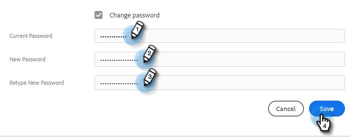

# Marketo Sales Password ändern {#change-your-marketo-sales-password}

Sie müssen Ihr Passwort ändern? So geht es.

## Passwort bei der Anmeldung ändern {#change-your-password-while-signed-in}

1. Klicken Sie auf das Zahnradsymbol und wählen Sie **Einstellungen**.

   

1. Ihre Seite &quot;Mein Profil&quot;wird standardmäßig geöffnet. Wählen Sie unter &quot;Kontodetails&quot;die Option **Kennwort ändern** aktivieren.

   

1. Geben Sie Ihr aktuelles Kennwort ein. Geben Sie dann Ihren neuen ein und geben Sie ihn erneut ein, um sicherzustellen, dass er übereinstimmt. Klicks **Speichern** wann geschehen.

   

>[!NOTE]
>
>Passwörter müssen:
>
>* mindestens neun Zeichen enthalten
>* Groß- und Kleinschreibung verwenden (sowohl OBERER als auch UNTERER)
>* Eine Zahl einschließen
>* Sonderzeichen einschließen

## Kennwort beim Abmelden ändern {#change-your-password-while-signed-out}

1. Navigieren Sie zum [Anmeldung bei Sales Connect](https://toutapp.com/login) Seite. Geben Sie Ihre E-Mail-Adresse ein und klicken Sie auf **Anmelden**.

   

1. Klicks **Kennwort vergessen**.

   

1. Geben Sie die dem Konto zugeordnete E-Mail-Adresse ein und klicken Sie auf **E-Mail zum Zurücksetzen senden**.

   

1. Wir senden eine E-Mail, um zu überprüfen, ob der Kontoinhaber das Passwort ändern möchte. Klicks **Kennwort zurücksetzen**.

   

   >[!NOTE]
   >
   >Überprüfen Sie auch Ihren Spam-Ordner, da diese E-Mail manchmal dort landet.

1. Geben Sie Ihr neues Kennwort ein und bestätigen Sie es. Klicks **Kennwort festlegen** wann geschehen.

   
