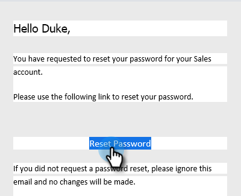

# Ändern des Marketo Sales-Kennworts {#change-your-marketo-sales-password}

Müssen Sie Ihr Passwort ändern? Und so geht das.

## Ändern des Passworts bei Anmeldung {#change-your-password-while-signed-in}

1. Klicken Sie auf das Zahnradsymbol und wählen Sie **[!UICONTROL Einstellungen]** aus.

   

1. Die Seite [!UICONTROL Mein Profil] wird standardmäßig geöffnet. Aktivieren [!UICONTROL  unter &quot;]&quot; das Kontrollkästchen **[!UICONTROL Kennwort ändern]**.

   

1. Geben Sie Ihr aktuelles Kennwort ein. Geben Sie dann Ihre neue ein, und geben Sie sie erneut ein, um sicherzustellen, dass sie übereinstimmen. Klicken Sie auf **[!UICONTROL Speichern]**, wenn Sie fertig sind.

   

>[!NOTE]
>
>Kennwörter müssen:
>
>* enthält mindestens neun Zeichen
>* Gemischte Groß-/Kleinschreibung verwenden (sowohl oben als auch unten)
>* Zahl einschließen
>* Sonderzeichen einfügen

## Ändern des Kennworts bei Abmeldung {#change-your-password-while-signed-out}

1. Navigieren Sie zur Seite [Sales Connect-Anmeldung](https://toutapp.com/login). Geben Sie Ihre E-Mail-Adresse ein und klicken Sie auf **[!UICONTROL Anmelden]**.

   

1. Klicken Sie **[!UICONTROL Kennwort vergessen]**.

   

1. Geben Sie die mit dem Konto verknüpfte E-Mail-Adresse ein und klicken Sie auf **[!UICONTROL E-Mail zurücksetzen]**.

   

1. Wir senden eine E-Mail, um zu bestätigen, dass der Kontoinhaber das Passwort ändern möchte. Klicken Sie **[!UICONTROL Kennwort zurücksetzen]**.

   

   >[!NOTE]
   >
   >Überprüfen Sie unbedingt auch Ihren Spam-Ordner, da diese E-Mail manchmal dort landen kann.

1. Geben Sie Ihr neues Kennwort ein und bestätigen Sie es. Klicken Sie abschließend **[!UICONTROL Kennwort festlegen]**.

   
