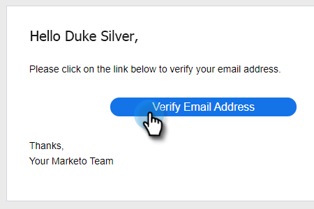

# Identität hinzufügen {#add-identity}

Fügen Sie eine Identität hinzu, wenn Sie mehrere E-Mail-Adressen haben, von denen aus gesendet werden soll.

>[!NOTE]
>
>Die Verwendung mehrerer Identitäten wird bei Gmail- oder Outlook/Exchange-Versandkanälen nicht unterstützt. Gmail und Outlook/Exchange authentifizieren sich auf Benutzerebene, sodass nur E-Mails von der verbundenen E-Mail-Adresse gesendet werden. Um mehrere Identitäten mit unterschiedlichen E-Mail-Adressen zu verwenden, müssen Sie einen SMTP-Drittanbieter (E-Mail-Versandkanal) verbinden, über den Sie E-Mail-Domains registrieren können, von denen aus gesendet werden soll. Auf diese Weise können Benutzer eine Verbindung zum SMTP-Versandkanal herstellen und von jeder E-Mail-Adresse aus senden, solange sie eine registrierte Domain sind.

1. Klicken Sie auf das Symbol Einstellungen .

   

1. Klicken Sie auf **E-Mail-Einstellungen**.

   

1. Klicken Sie **Identität hinzufügen**.

   

1. Geben Sie die Informationen ein (E-Mail und Name sind Pflichtfelder) und klicken Sie auf **Erstellen**.

   

1. Sie erhalten dann eine E-Mail „E-Mail-Adresse überprüfen“. Klicken Sie zum Überprüfen auf **E-Mail-Adresse**.

   

Wenn Sie eine E-Mail in Marketo Sales senden und mehrere Identitäten haben, können Sie zwischen ihnen wechseln.

>[!NOTE]
>
>Die Anzahl der E-Mail-Identitäten, die Sie einrichten können, ist unbegrenzt.

>[!MORELIKETHIS]
>
>[Hinzufügen oder Aktualisieren Ihrer E-Mail-Signatur](/help/marketo/product-docs/marketo-sales-insight/actions/getting-started/email-settings/add-or-update-your-email-signature.md).
