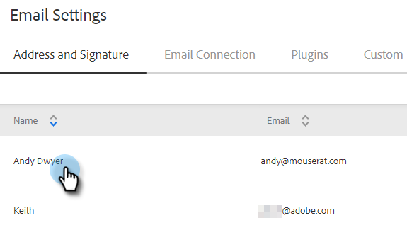
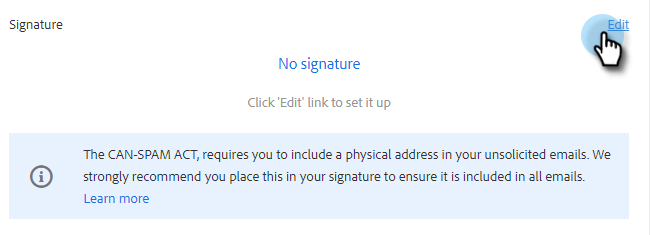

# E-Mail-Signatur hinzufügen oder aktualisieren {#add-or-update-your-email-signature}

Wir möchten, dass E-Mails von Marketo Sales per E-Mail versendet werden, damit sie sich beim Versand von Ihrem eigenen E-Mail-Kunden als nahtlos fühlen. Eine großartige Möglichkeit ist es, Ihre E-Mail-Signatur hinzuzufügen.

1. Klicken Sie auf das Zahnradsymbol und wählen Sie **Einstellungen** aus.

   

1. Wählen Sie unter Mein Konto die Option **E-Mail-Einstellungen** aus.

   

1. Wählen Sie auf der Registerkarte **Adresse und Signatur** die E-Mail-Identität aus, für die Sie eine Signatur erstellen möchten.

   

1. Klicken Sie auf der Signaturkarte auf **Bearbeiten**.

   

1. Geben Sie den gewünschten Text (oder die Bilder) ein und klicken Sie auf **Speichern**.

   

   >[!TIP]
   >
   >Stellen Sie sicher, dass Ihre Signatur im Bildschirm &quot;Erstellen&quot;der in Ihrem E-Mail-Client aufgelisteten Signatur ähnelt.
