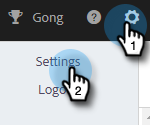
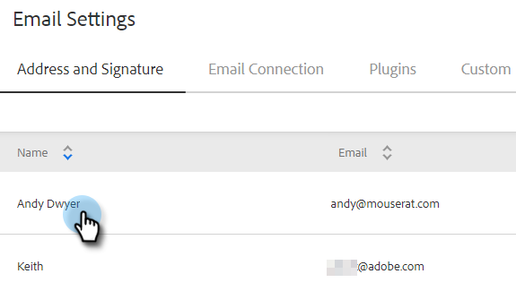

# Hinzufügen oder Aktualisieren Ihrer E-Mail-Signatur {#add-or-update-your-email-signature}

Wir möchten, dass E-Mails von Marketo Sales sich wie ein nahtloses Erlebnis anfühlen, wenn sie über Ihren eigenen E-Mail-Client gesendet werden. Eine gute Möglichkeit, dies zu tun, besteht darin, Ihre E-Mail-Signatur hinzuzufügen.

1. Klicken Sie auf das Zahnradsymbol und wählen Sie **[!UICONTROL Einstellungen]** aus.

   

1. Wählen [!UICONTROL &#x200B; unter „Mein &#x200B;]&quot; die Option **[!UICONTROL E-Mail-Einstellungen]** aus.

   

1. Wählen Sie auf **[!UICONTROL Registerkarte]** Adresse und Signatur“ die E-Mail-Identität aus, für die Sie eine Signatur erstellen möchten.

   

1. Klicken Sie auf [!UICONTROL &#x200B; Karte &#x200B;]Signatur **[!UICONTROL auf]**.

   

1. Geben Sie den gewünschten Text (oder die gewünschten Bilder) ein und klicken Sie auf **[!UICONTROL Speichern]**.

   

   >[!TIP]
   >
   >Stellen Sie sicher, dass Ihre Signatur im Bildschirm Erstellen der in Ihrem E-Mail-Client aufgelisteten Signatur ähnelt.
