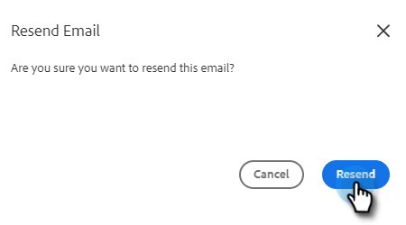

# Prüfen Ihrer E-Mail {#verify-your-email}

Wenn Sie über eine nicht verifizierte E-Mail-Identität verfügen, führen Sie die folgenden Schritte aus.

1. Klicken Sie auf das Zahnradsymbol oben rechts und wählen Sie **Einstellungen**.

   

1. Klicken Sie unter &quot;Mein Konto&quot;auf **E-Mail-Einstellungen**.

   

1. Suchen Sie unter &quot;Adresse und Signatur&quot;die E-Mail, die Sie überprüfen möchten, und klicken Sie auf **Überprüfungs-E-Mail erneut senden**. Eine neue Verifizierungs-E-Mail wird gesendet.

   

1. Klicken Sie auf **Erneut senden**.

   

1. Der Empfänger öffnet dann die E-Mail und führt die Schritte zur Überprüfung der E-Mail-Adresse aus.

   

>[!NOTE]
>
>Wenn Sie die Verifizierungs-E-Mail nicht erhalten, überprüfen Sie Ihren Spam-Ordner. Wenn es nicht vorhanden ist, wenden Sie sich an den [Marketo-Support](https://nation.marketo.com/t5/Support/ct-p/Support).
