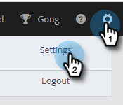
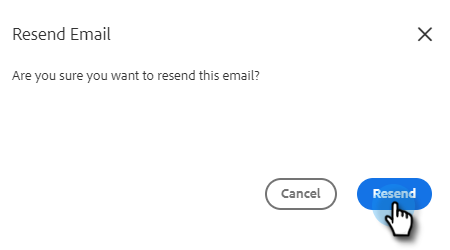
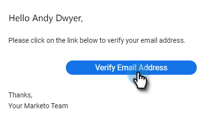

# Prüfen Ihrer E-Mail {#verify-your-email}

Wenn Sie eine nicht verifizierte E-Mail-Identität haben, führen Sie die folgenden Schritte aus.

1. Klicken Sie oben rechts auf das Zahnradsymbol und wählen Sie **[!UICONTROL Einstellungen]** aus.

   

1. Klicken [!UICONTROL &#x200B; unter „Mein &#x200B;]&quot; auf **[!UICONTROL E-Mail-Einstellungen]**.

   

1. Suchen Sie unter [!UICONTROL Adresse und Signatur] die E-Mail, die Sie verifizieren möchten, und klicken Sie auf **[!UICONTROL Bestätigungs-E-Mail erneut senden]**. Eine neue Bestätigungs-E-Mail wird gesendet.

   

1. Klicken Sie **[!UICONTROL Erneut senden]**.

   

1. Der Empfänger öffnet dann die E-Mail und führt die Schritte zur Überprüfung der E-Mail-Adresse aus.

   

>[!NOTE]
>
>Wenn Sie die Bestätigungs-E-Mail nicht erhalten, überprüfen Sie Ihren Spam-Ordner. Ist er nicht vorhanden, wenden Sie sich an den [Marketo-Support](https://nation.marketo.com/t5/support/ct-p/Support?profile.language=de).
