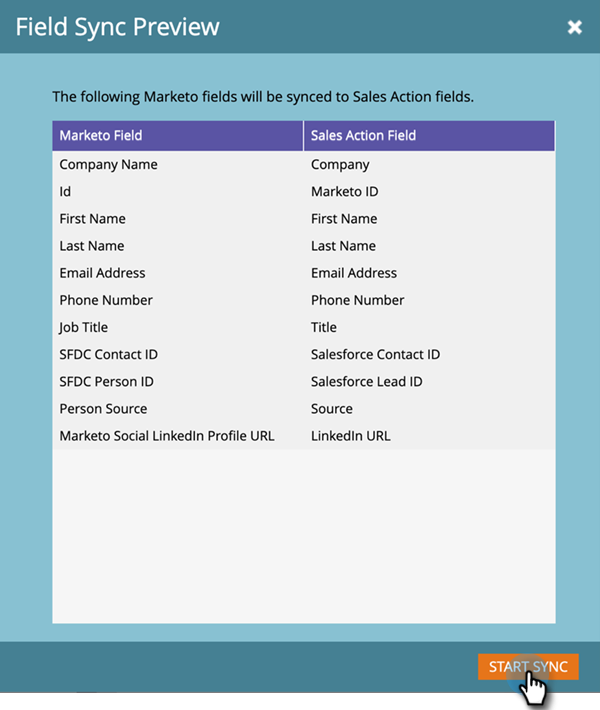
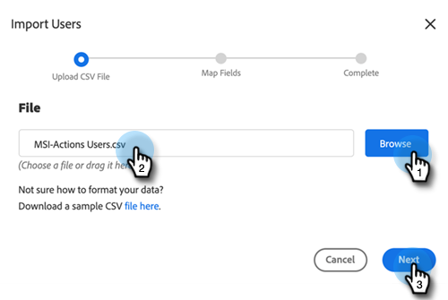

# Admin-Setup-Anleitung für Sales Insight-Aktionen {#sales-insight-actions-admin-setup-guide}

>[!NOTE]
>
>Marketo Sales Insight Actions ist eine webbasierte Anwendung, die über das [Marketo Sales Insight-Paket](/help/marketo/product-docs/marketo-sales-insight/msi-for-salesforce/installation/install-marketo-sales-insight-package-in-salesforce-appexchange.md){target="_blank"} in die Salesforce-Benutzeroberfläche integriert wird. Dies wird manchmal als &quot;Marketo-Verkäufe&quot;oder einfach als &quot;Aktionen&quot;bezeichnet.

>[!PREREQUISITES]
>
>* Vergewissern Sie sich beim Adobe Account Team (Ihrem Kundenbetreuer), dass MSI-Aktionen für Ihr Marketo Engage-Konto aktiviert wurden (wenn Sie keinen Kundenbetreuer haben, wenden Sie sich an den [Marketo-Support](https://nation.marketo.com/t5/support/ct-p/Support){target="_blank"}).
>* Ihre Marketo/Salesforce-Synchronisation muss eingerichtet sein.

<table>
 <tr>
  <th>Persona</th>
  <th>Schritt</th>
 </tr>
 <tr>
  <td>Marketo-Administrator</td>
  <td>Einrichten des Marketo-Verkaufskontos</td>
 </tr>
 <tr>
  <td>Marketo Admin oder  Salesforce Admin</td>
  <td>Marketo-Verkaufskonto mit Salesforce verbinden</td>
 </tr>
 <tr>
  <td>Marketo-Administrator</td>
  <td>Marketo-Verkaufskonto mit Marketo verbinden</td>
 </tr>
 <tr>
  <td>Marketo-Administrator</td>
  <td>Initiieren der Datensynchronisation von Marketo zu Marketo-Verkaufskonto</td>
 </tr>
 <tr>
  <td>Marketo-Administrator</td>
  <td>Benutzer zu MSI-Aktionen einladen</td>
 </tr>
 <tr>
  <td>Salesforce Admin</td>
  <td>MSI-Paket installieren/aktualisieren in Salesforce</td>
 </tr>
 <tr>
  <td>Salesforce Admin</td>
  <td>Konfigurieren von MSI-Aktionen in Salesforce</td>
 </tr>
</table>

## Einrichten des Marketo-Verkaufskontos {#set-up-marketo-sales-account}

1. Klicken Sie in Marketo auf **Admin**.

   

   >[!NOTE]
   >
   >Wenn auf der Karte &quot;Integrationsinformationen&quot;keine Client-ID und kein Client-Geheimnis angezeigt werden, aktivieren Sie Ihre Aktionsinstanz, indem Sie den ersten Benutzer einladen. Daraufhin werden die Client-ID und das Client-Geheimnis angezeigt.

1. Klicken Sie auf **Sales Insight** und dann auf **Aktionskonfiguration**. Wählen Sie aus einer Liste von Marketo-Administratoren aus, die Sie einladen möchten, und klicken Sie auf **Einladung senden**.

   

Der Benutzer erhält eine E-Mail mit Schritten, um Zugriff auf das Konto zu erhalten.

>[!NOTE]
>
>Zusätzliche Benutzer werden nicht über Marketo hinzugefügt und stattdessen über die Seite &quot;Benutzerverwaltung für Verkaufskonten&quot;hinzugefügt. [Klicken Sie hier](/help/marketo/product-docs/marketo-sales-connect/admin/invite-users.md){target="_blank"} , um mehr über das Hinzufügen zusätzlicher Benutzer zu erfahren.

## Marketo-Verkaufskonto mit Salesforce verbinden {#connect-marketo-sales-account-to-salesforce}

1. Klicken Sie in Ihrem Marketo-Verkaufskonto auf das Zahnradsymbol und wählen Sie **Einstellungen** aus.

   

1. Klicken Sie unter &quot;Admin Settings&quot;auf **Salesforce**.

   

1. Klicken Sie auf der Registerkarte Verbindungen und Anpassungen auf **Verbinden**.

   

1. Klicken Sie auf **OK**.

   

Wenn Sie bereits bei Salesforce angemeldet sind, werden Sie angemeldet sein. Ist dies nicht der Fall, werden Sie aufgefordert, sich anzumelden.

## Verbinden von Marketo mit Ihrem App-Konto für Vertrieb {#connect-marketo-to-your-sales-apps-account}

1. Klicken Sie in Ihrem Marketo-Verkaufskonto auf das Zahnradsymbol und wählen Sie **Einstellungen** aus.

   

1. Klicken Sie unter &quot;Admin Settings&quot;auf **Marketo**.

   

1. Klicken Sie auf **connect**. Ihr Konto wird dann verbunden.

   

>[!NOTE]
>
>Wenn keine Verbindung hergestellt wird, kopieren Sie die Anmeldeinformationen aus der Registerkarte &quot;Aktionskonfiguration&quot;von Marketo Sales Insight und fügen Sie sie auf der Registerkarte &quot;Einrichtung&quot;ein.

## Datensynchronisation starten {#initiate-data-sync}

Die Datenzusammenführungsfeldsynchronisierung für Sales Insight-Aktionen ermöglicht es dem System, personenbezogene Daten aus Ihrer Marketo Engage-Datenbank in Ihre Sales Insight-Aktionsdatenbank zu übertragen, Ihre Personendaten auf dem neuesten Stand zu halten und sicherzustellen, dass Aktivitäten in Marketo und Salesforce in den richtigen Datensätzen protokolliert werden.

>[!CAUTION]
>
>Nachdem Sie die Datensynchronisation initiiert haben, sollten Sie den ursprünglichen Benutzer **nicht** in Ihrer Instanz von Sales Insight Actions entfernen. Dies ist der Benutzer, an den die erste Einladung gesendet wurde.

1. Klicken Sie in Marketo auf **Admin**.

   

1. Klicken Sie auf **Sales Insight**.

   

1. Klicken Sie auf die Registerkarte **Aktionskonfiguration** . Klicken Sie auf der Karte &quot;Synchronisierung von Aktionsfeldern&quot;auf **Synchronisieren**.

   

1. Sie sehen eine Vorschau der zu synchronisierenden Felder. Klicken Sie auf **Synchronisation starten**.

   

Personendatensätze, die in Marketo und Salesforce vorhanden sind, werden mit Ihrem Marketo Sales Apps-Konto synchronisiert.

>[!NOTE]
>
>Um mehr darüber zu erfahren, wie Personen und Aktivitätsdaten zwischen Sales Insight-Aktionen, Marketo und Salesforce synchronisiert werden, klicken Sie hier [hier](/help/marketo/product-docs/marketo-sales-insight/actions/admin/sync-sales-action-data-with-marketo-and-salesforce.md){target="_blank"}.

## Einladen einzelner Benutzer zu MSI-Aktionen {#invite-individual-users-to-msi-actions}

1. Klicken Sie in Ihrem Marketo-Verkaufskonto auf das Zahnradsymbol und wählen Sie **Einstellungen** aus.

   

1. Wählen Sie unter &quot;Admin Settings&quot;die Option **User Management**.

   

1. Klicken Sie auf **Aktionen** und wählen Sie **Benutzer einladen** aus.

   

1. Geben Sie die E-Mail-Adresse(n) ein und klicken Sie auf **Einladen**.

   

>[!NOTE]
>
>Standardmäßig werden alle neuen Mitglieder zum Team Alle hinzugefügt.

Sie erhalten eine Bestätigungsnachricht.

## Benutzer über CSV zu MSI-Aktionen einladen {#invite-users-via-csv-to-msi-actions}

1. Klicken Sie in Ihrem Marketo-Verkaufskonto auf das Zahnradsymbol und wählen Sie **Einstellungen** aus.

   

1. Wählen Sie unter &quot;Admin Settings&quot;die Option **User Management**.

   

1. Klicken Sie auf **Aktionen** und wählen Sie **Benutzer über CSV einladen** aus.

   

1. Suchen Sie auf Ihrem Computer nach der CSV-Datei, wählen Sie sie aus und klicken Sie auf **Weiter**.

   

1. Vergewissern Sie sich, dass die Felder ordnungsgemäß zugeordnet sind, und klicken Sie auf **Einladen**.

   

Sie erhalten eine Bestätigungsnachricht, sobald die Einladungen gesendet wurden.

>[!NOTE]
>
>Danach können Sie entweder Ihr vorhandenes MSI-Paket aktualisieren oder ein neues installieren und mit [Konfigurieren von MSI-Aktionen in Salesforce](/help/marketo/product-docs/marketo-sales-insight/actions/crm/salesforce-package-configuration/sales-insight-actions-configuration-in-salesforce.md){target="_blank"} fortfahren.
