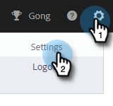

# Admin-Einrichtungshandbuch für Sales Insight Actions {#sales-insight-actions-admin-setup-guide}

>[!NOTE]
>
>Marketo Sales Insight Actions ist ein Web-basiertes Programm, das über das [Marketo Sales Insight Package} ausschließlich mit dem Salesforce CRM integriert ](/help/marketo/product-docs/marketo-sales-insight/msi-for-salesforce/installation/install-marketo-sales-insight-package-in-salesforce-appexchange.md){target="_blank"}. Dies wird manchmal als &quot;Marketo-Vertrieb“ oder einfach als „Aktionen“ bezeichnet.

>[!PREREQUISITES]
>
>* Vergewissern Sie sich beim Adobe Account Team (Ihrem Account Manager), dass MSI Actions für Ihr Marketo Engage Account aktiviert wurde (wenn Sie keinen Account Manager haben, wenden Sie sich an den [Marketo Support](https://nation.marketo.com/t5/support/ct-p/Support){target="_blank"}).
>* Die Synchronisierung von Marketo und Salesforce muss eingerichtet sein.

<table>
 <tr>
  <th>Persona</th>
  <th>Schritt</th>
 </tr>
 <tr>
  <td>Marketo-Administrator</td>
  <td>Marketo-Kundenkonto einrichten</td>
 </tr>
 <tr>
  <td>Marketo Admin oder  [!DNL Salesforce] Admin</td>
  <td>Marketo-Kundenkonto mit verbinden [!DNL Salesforce]</td>
 </tr>
 <tr>
  <td>Marketo-Administrator</td>
  <td>Marketo-Kundenkonto mit Marketo verbinden</td>
 </tr>
 <tr>
  <td>Marketo-Administrator</td>
  <td>Initiieren der Datensynchronisation von Marketo mit dem Marketo-Kundenkonto</td>
 </tr>
 <tr>
  <td>Marketo-Administrator</td>
  <td>Benutzer zu MSI-Aktionen einladen</td>
 </tr>
 <tr>
  <td>[!DNL Salesforce] Admin</td>
  <td>Installieren/Aktualisieren des MSI-Pakets in [!DNL Salesforce]</td>
 </tr>
 <tr>
  <td>[!DNL Salesforce] Admin</td>
  <td>Konfigurieren von MSI-Aktionen in [!DNL Salesforce]</td>
 </tr>
</table>

## Marketo-Kundenkonto einrichten {#set-up-marketo-sales-account}

1. Klicken Sie in Marketo auf **[!UICONTROL Admin]**.

   

   >[!NOTE]
   >
   >Wenn auf der Karte „Integrationsinformationen“ keine Client-ID und kein Client-Geheimnis angezeigt werden, aktivieren Sie Ihre Actions-Instanz, indem Sie den ersten Benutzer einladen. Daraufhin werden die Client-ID und das Client-Geheimnis angezeigt.

1. Klicken Sie **Sales Insight**, dann **Actions Config**. Wählen Sie aus einer Liste von Marketo-Administratoren aus, die eingeladen werden sollen, und klicken Sie auf **Einladen senden**.

   

Der Benutzer erhält eine E-Mail mit Schritten, um Zugriff auf das Konto zu erhalten.

>[!NOTE]
>
>Zusätzliche Benutzende werden nicht über Marketo hinzugefügt, sondern über die Seite „Kundenverwaltung“ des Kundenkontos. [Klicken Sie hier](/help/marketo/product-docs/marketo-sales-connect/admin/invite-users.md){target="_blank"} um mehr über das Hinzufügen zusätzlicher Benutzer zu erfahren.

## Marketo-Kundenkonto mit [!DNL Salesforce] verbinden {#connect-marketo-sales-account-to-salesforce}

1. Klicken Sie in Ihrem Marketo-Kundenkonto auf das Zahnradsymbol und wählen Sie **[!UICONTROL Einstellungen]** aus.

   

1. Klicken [!UICONTROL  unter „Admin-]&quot; auf **[!UICONTROL Salesforce]**.

   

1. Klicken Sie auf [!UICONTROL  Registerkarte ]Verbindungen und Anpassungen“ auf **[!UICONTROL Verbinden]**.

   

1. Klicken Sie auf **[!UICONTROL OK]**.

   

Wenn Sie bereits bei Salesforce angemeldet sind, sind Sie angemeldet. Wenn nicht, werden Sie aufgefordert, sich anzumelden.

## Verbinden von Marketo mit Ihrem Sales Apps-Konto {#connect-marketo-to-your-sales-apps-account}

1. Klicken Sie in Ihrem Marketo-Kundenkonto auf das Zahnradsymbol und wählen Sie **[!UICONTROL Einstellungen]** aus.

   

1. Klicken [!UICONTROL  unter „Admin-]&quot; auf **Marketo**.

   

1. Klicken Sie auf **[!UICONTROL Verbinden]**. Ihr Konto wird dann verbunden.

   

>[!NOTE]
>
>Wenn keine Verbindung hergestellt werden kann, kopieren Sie die Anmeldeinformationen aus der Registerkarte „Aktionskonfiguration“ von Marketo Sales Insight und fügen Sie sie in die Registerkarte „Setup“ ein.

## Initiieren der Datensynchronisation {#initiate-data-sync}

Die Feldsynchronisierung zur Datenvereinheitlichung für Sales Insight Actions ermöglicht es dem System, Personeninformationen aus Ihrer Marketo Engage-Datenbank in Ihre Sales Insight Actions-Datenbank zu ziehen, Ihre Personendaten auf dem neuesten Stand zu halten und sicherzustellen, dass Aktivitäten in Marketo und [!DNL Salesforce] auf den richtigen Datensätzen protokolliert werden.

>[!CAUTION]
>
>Nachdem Sie die Datensynchronisation initiiert haben, sollten Sie **nicht** den ursprünglichen Benutzer aus Ihrer Sales Insight Actions-Instanz entfernen. Dies ist der Benutzer, an den die erste Einladung gesendet wurde.

1. Klicken Sie in Marketo auf **[!UICONTROL Admin]**.

   

1. Klicken Sie **[!UICONTROL Sales Insight]**.

   

1. Klicken Sie auf **[!UICONTROL Registerkarte]** Aktionskonfiguration“. Klicken Sie auf der Karte Aktion Feldsynchronisierung auf **[!UICONTROL Synchronisieren]**.

   

1. Sie sehen eine Vorschau der Felder, die synchronisiert werden. Klicken Sie **[!UICONTROL Synchronisierung starten]**.

   

Personendatensätze, die in Marketo und [!DNL Salesforce] vorhanden sind, werden mit Ihrem Marketo Sales Apps-Konto synchronisiert.

>[!NOTE]
>
>Weitere Informationen dazu, wie Personen- und Aktivitätsdaten zwischen Sales Insight Actions, Marketo und Salesforce synchronisiert werden, [hier ](/help/marketo/product-docs/marketo-sales-insight/actions/admin/sync-sales-action-data-with-marketo-and-salesforce.md){target="_blank"}.

## Einzelne Benutzer zu MSI-Aktionen einladen {#invite-individual-users-to-msi-actions}

1. Klicken Sie in Ihrem Marketo-Kundenkonto auf das Zahnradsymbol und wählen Sie **[!UICONTROL Einstellungen]** aus.

   

1. Wählen [!UICONTROL  unter &quot;]&quot; die Option **[!UICONTROL Benutzerverwaltung]** aus.

   

1. Klicken Sie auf **[!UICONTROL Aktionen]** und wählen Sie **[!UICONTROL Benutzer einladen]** aus.

   

1. Geben Sie die E-Mail-Adresse(n) ein und klicken Sie auf **[!UICONTROL Einladen]**.

   

>[!NOTE]
>
>Standardmäßig werden alle neuen Mitglieder dem Team Alle hinzugefügt.

Sie erhalten eine Bestätigungsnachricht.

## Benutzer über CSV zu MSI-Aktionen einladen {#invite-users-via-csv-to-msi-actions}

1. Klicken Sie in Ihrem Marketo-Kundenkonto auf das Zahnradsymbol und wählen Sie **[!UICONTROL Einstellungen]** aus.

   

1. Wählen [!UICONTROL  unter &quot;]&quot; die Option **[!UICONTROL Benutzerverwaltung]** aus.

   

1. Klicken Sie auf **[!UICONTROL Aktionen]** und wählen Sie **[!UICONTROL Benutzer über CSV einladen]** aus.

   

1. Suchen Sie die CSV-Datei auf Ihrem Computer, wählen Sie sie aus und klicken Sie auf **[!UICONTROL Weiter]**.

   

1. Vergewissern Sie sich, dass die Felder ordnungsgemäß zugeordnet sind, und klicken Sie auf **[!UICONTROL Einladen]**.

   

Sie erhalten eine Bestätigungsnachricht, sobald die Einladungen gesendet wurden.

>[!NOTE]
>
>Sobald dies geschehen ist, können Sie entweder Ihr bestehendes MSI-Paket aktualisieren oder ein neues installieren und mit &quot;[ von MSI-Aktionen in Salesforce&quot; ](/help/marketo/product-docs/marketo-sales-insight/actions/crm/salesforce-package-configuration/sales-insight-actions-configuration-in-salesforce.md){target="_blank"}.
