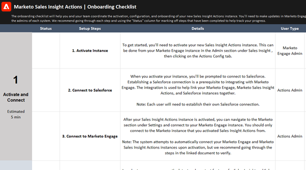

# Checkliste für Einblicke in Verkaufsaktionen - Benutzer-Onboarding {#sales-insight-actions-user-onboarding-checklist}

Wenn Sie nach Ressourcen für die ersten Schritte mit Marketo Sales Insight-Aktionen suchen, laden Sie bitte [die Onboarding-Checkliste herunter](/help/marketo/product-docs/marketo-sales-insight/actions/getting-started/assets/onboarding-checklist-marketo-sales-insight-actions-2023.xlsx).

>[!NOTE]
>
>Marketo Sales Insight Actions ist eine webbasierte Anwendung, die über das [Marketo Sales Insight-Paket](/help/marketo/product-docs/marketo-sales-insight/msi-for-salesforce/installation/install-marketo-sales-insight-package-in-salesforce-appexchange.md){target="_blank"} in die Salesforce-Benutzeroberfläche integriert wird. Dies wird manchmal als &quot;Marketo-Verkäufe&quot;oder einfach als &quot;Aktionen&quot;bezeichnet.

 

Die Checkliste hilft Ihnen und Ihrem Team bei der Koordinierung der Aktivierung, Konfiguration und des Onboarding Ihrer neuen Instanz von Sales Insight Actions. Sie müssen Aktualisierungen in Marketo-, Salesforce- und Marketo Sales Insight-Aktionen vornehmen, um die Einrichtung abzuschließen. Stellen Sie daher sicher, dass Sie sich mit den Administratoren der einzelnen Systeme abstimmen.
