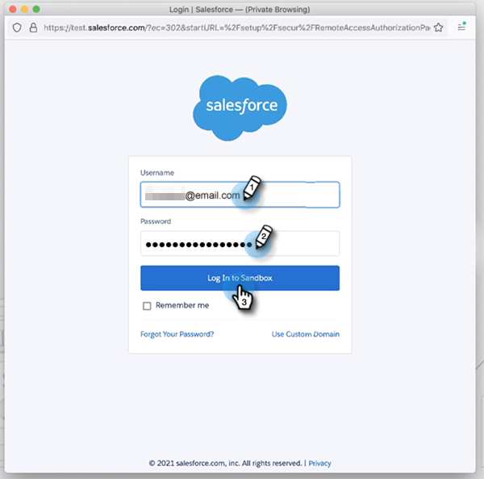
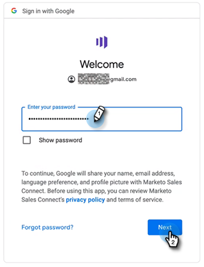

# Benutzerhandbuch zum Onboarding von Sales Insight-Aktionen {#sales-insight-actions-user-onboarding-guide}

>[!NOTE]
>
>Marketo Sales Insight Actions ist ein Web-basiertes Programm, das über das [Marketo Sales Insight Package} ausschließlich mit dem Salesforce CRM integriert ](/help/marketo/product-docs/marketo-sales-insight/msi-for-salesforce/installation/install-marketo-sales-insight-package-in-salesforce-appexchange.md){target="_blank"}. Dies wird manchmal als &quot;Marketo-Vertrieb“ oder einfach als „Aktionen“ bezeichnet.

>[!PREREQUISITES]
>
>* Ein Administrator muss einen Benutzer einladen, um mit der Verwendung von MSI-Aktionen zu beginnen.
>* Um Ihr Konto mit [!DNL Salesforce] zu aktivieren, müssen Sie in den [!DNL Salesforce] Profilberechtigungen „API aktiviert“ haben.

Neue Benutzer müssen die folgenden Schritte ausführen.

1. Klicken Sie in der Begrüßungs-E-Mail **[!UICONTROL Erste Schritte]**.

   

1. Klicken Sie **[!UICONTROL Konto bei Salesforce aktivieren]**.

   

1. Wenn Sie bereits bei Ihrem [!DNL Salesforce]-Konto angemeldet sind, werden Sie automatisch zum nächsten Bildschirm weitergeleitet. Wenn Sie nicht angemeldet sind, tun Sie dies jetzt.

   

>[!NOTE]
>
>Die E-Mail-ID Ihrer [!DNL Salesforce] und Ihres Verkaufskontos muss übereinstimmen.

1. Klicken Sie **[!UICONTROL Zulassen]**.

   

1. Klicken Sie **[!UICONTROL Starten]**.

   

1. Klicken Sie auf **[!UICONTROL Weiter]**.

   

1. Wählen Sie den von Ihnen verwendeten E-Mail-Client (Gmail oder [!DNL Outlook]) und klicken Sie auf **[!UICONTROL Weiter]**.

   

1. Geben Sie Ihre E-Mail-Adresse ein und klicken Sie auf **[!UICONTROL Weiter]**.

   

1. Geben Sie Ihr Kennwort ein und klicken Sie auf **[!UICONTROL Weiter]**.

   

1. Klicken Sie auf **[!UICONTROL Fortfahren]**.

   

>[!NOTE]
>
>Wenn Sie sich für Outlook entscheiden, wird ein Outlook-Authentifizierungsbildschirm angezeigt, in dem Sie Ihre E-Mail-Adresse eingeben.

1. Sie sehen die Erfolgsmeldung E-Mail-Verbindung einrichten , dann werden Sie zum nächsten Bildschirm weitergeleitet.

   

1. Geben Sie Ihre benutzerdefinierte Signatur ein und klicken Sie auf **[!UICONTROL Speichern]** (wenn Sie dies später über Ihre Profilseite tun möchten, klicken Sie auf **[!UICONTROL Überspringen]**).

   

1. Klicken Sie auf **[!UICONTROL Fertigstellen]**.

   

1. Sie sehen die Option für eine kurze Einführung in die Verkaufsaktionen von Marketo. Klicken Sie **[!UICONTROL Weiter]**, um sie anzuzeigen, oder **[!UICONTROL Nicht jetzt]**, um sie für später zu speichern.

   

1. Wenn Sie die Tour abgeschlossen haben oder sie übersprungen haben, wählen Sie aus, ob Sie sich direkt bei der Web-Anwendung oder Ihrem [!DNL Salesforce]-Konto anmelden möchten, über das Sie auf alle Funktionen im MSI-Bedienfeld zugreifen können (in diesem Beispiel wählen wir **[!UICONTROL Salesforce starten]**).

   

1. In [!DNL Salesforce] (Classic oder Lightning) können Sie zu jedem Lead, Kontakt, Konto oder jeder Opportunity navigieren. Alle Ihre Verkaufsaktionen sind über die Dropdown-Liste im MSI-Bedienfeld verfügbar.

   
