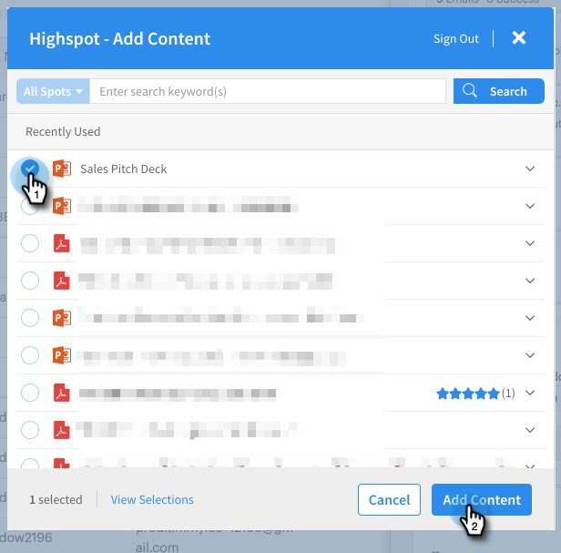

# Highspot-Integration {#highspot-integration}

Der Vertrieb kann über Sales Insight Actions auf Highspot-Funktionen zugreifen und während des gesamten Verkaufszyklus für mehr Sichtbarkeit, Effizienz und Leistung sorgen. Benutzende von Sales Insight Action können Verkaufsinhalte auswählen, die auf der Verkaufsplattform von Highspot gespeichert sind, und diese direkt in E-Mails, E-Mail-Vorlagen und Verkaufskampagnen einfügen, während sie gleichzeitig das Content-Tracking und die Analysen in Highspot- und Insight-Verkaufaktionen erfassen.

## Aktivieren der Highspot-Integration {#enabling-highspot-integration}

>[!NOTE]
>
>Sie müssen über Administratorrechte verfügen, um Highspot für Ihre Sales Insight Actions-Instanz zu aktivieren.

1. Klicken Sie auf das Zahnradsymbol und wählen Sie **Einstellungen** aus.

   

1. Wählen **unter &quot;**&quot; die Option **Allgemein** aus.

   

1. Scrollen Sie zur Karte **Integrationen** und klicken Sie auf den Schieberegler, um Highspot zu aktivieren.

   

Jetzt sehen Benutzerinnen und Benutzer eine Option zur Auswahl von Highspot, wenn sie auf die Schaltfläche zum Hochladen von Inhalten im Fenster „Erstellen“, im Vorlageneditor und im Kampagnen-E-Mail-Editor klicken.

## Zugreifen auf Highspot-Inhalte und Freigeben von Inhalten per E-Mail {#accessing-highspot-content}

Greifen Sie auf Highspot zu und fügen Sie Ihren E-Mails Inhalte aus dem Fenster für das Erstellen von Insight-Aktionen, dem Vorlageneditor und dem E-Mail-Editor für Vertriebskampagnen hinzu. Im Folgenden finden Sie die Schritte zum Zugriff auf Inhalte über das Fenster „Erstellen“.

1. Erstellen Sie Ihren E-Mail-Entwurf (es gibt mehrere Möglichkeiten, dies zu tun, in diesem Beispiel wählen wir **Erstellen** in der Kopfzeile).

   

1. Füllen Sie das Feld An aus und geben Sie einen Betreff ein.

   

1. Schreiben Sie Ihre Nachricht. Klicken Sie auf die Stelle in der E-Mail, an der der Highspot-Inhalt eingefügt werden soll. Klicken Sie auf den Pfeil der Dropdown-Liste (neben dem Bildsymbol) und wählen Sie **Highspot**.

   

1. Melden Sie sich bei Ihrem Highspot-Konto an (wenn Sie noch nicht angemeldet sind).

   

1. Wählen Sie den gewünschten Inhalt aus und klicken Sie auf die Schaltfläche **Inhalt hinzufügen**.

   

   >[!TIP]
   >
   >Wenn Sie die gewünschten Inhalte nicht schnell sehen, verwenden Sie die Suchleiste oben.

   Der Inhalt wird als Link in Ihrer E-Mail angezeigt. Der Empfänger kann zum Anzeigen/Herunterladen auf den Link klicken.

   

## Tracking von Klicks auf Highspot-Inhalte {#tracking-clicks-on-highspot-content}

Wenn Empfänger Inhalte öffnen, die Sie senden, werden Sie im Live-Feed benachrichtigt. Die Aktivität wird als Klick mit Details zum Inhalts-Link angezeigt. Darüber hinaus werden die Ansichten zu Inhalten und Downloads in Highspot verfolgt.

