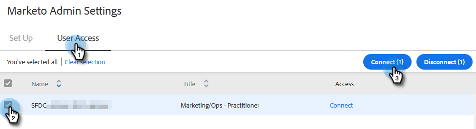

# Gewähren von Marketo-Zugriff für Benutzer {#grant-marketo-access-to-users}

Gehen Sie wie in diesem Artikel beschrieben vor, um Ihren [!DNL Sales Insight Actions] Zugriff auf die Marketo-Verbindung zu gewähren. Dadurch werden Funktionen wie „Interessante Momente“ im Live-Feed und der Zugriff auf Marketing-Kampagnen freigeschaltet.

Sie müssen Benutzer zu [[!DNL Sales Insight Actions]](/help/marketo/product-docs/marketo-sales-insight/actions/admin/invite-users-and-admins.md#invite-users) einladen, bevor sie auf der Seite Marketo > [!UICONTROL Team-Zugriff] (in [!DNL Sales Insight Actions]) angezeigt werden, auf der der Zugriff auf die Marketo-Verbindung gewährt wird.

>[!CAUTION]
>
>Bitte warten Sie 10 Minuten nach der Verbindung von [!DNL Sales Insight Actions] mit Marketo, bevor Sie diese Schritte ausführen.

1. Klicken Sie auf das Zahnradsymbol und wählen Sie **[!UICONTROL Einstellungen]** aus.

   

1. Klicken [!UICONTROL  unter „Admin-]&quot; auf **Marketo**.

   

1. Klicken Sie auf **[!UICONTROL Registerkarte]** Benutzerzugriff“. Wählen Sie einen oder mehrere Benutzer aus und klicken Sie dann auf **[!UICONTROL Verbinden]**.

   

   >[!NOTE]
   >
   >Sie können die Arbeitsbereichszuweisung nur einmal zum Zeitpunkt der Gewährung des Zugriffs für Benutzer durchführen. Nachdem er festgelegt wurde, müssen Sie den Benutzer trennen, um ihn zu ändern.

1. Wenn für Ihr Marketo-Abonnement Arbeitsbereiche aktiviert sind, können Sie jedem Benutzer bzw. jeder Benutzergruppe Arbeitsbereiche zuweisen. Wenn keine Arbeitsbereiche ausgewählt sind, weisen wir sie dem standardmäßigen Marketo-Arbeitsbereich zu.

   

   **OPTIONALER SCHRITT**: Klicken Sie auf die Dropdown-Liste Workspace und wählen Sie Ihren/Ihre gewünschten Arbeitsbereich(e) aus.

   

1. Klicken Sie auf **[!UICONTROL Verbinden]**.

   

Sie können zusätzliche Benutzer von der Seite [!UICONTROL Team-]&quot; hinzufügen und die obigen Schritte ausführen, um sie miteinander zu verbinden.
