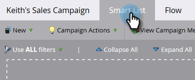

# Marketing-Kampagnen in Sales-Insight-Aktionen sichtbar machen {#make-a-marketing-campaign-visible-in-sales-insight-actions}

Kampagnen können nur freigegeben werden, wenn sie sichtbar gemacht werden.

Mit Sales Insight-Aktionen haben Benutzer Zugriff auf eine neue Verkaufs-App namens toutapp.com. Diese App bietet neue Aktionsfunktionen, übernimmt aber auch die Funktion _Zu Marketing-Kampagne hinzufügen_, die in der Kernversion von Sales Insights verfügbar ist. Dies sollten Sie beachten, da Ihre Marketo-Kampagnen je nachdem, wo Benutzerinnen und Benutzer auf die Funktion Zu Marketing-Kampagne hinzufügen zugreifen sollen (toutapp.com oder das MSI SFDC-Paketerlebnis), anders konfiguriert werden müssen. Weitere Informationen finden Sie im Hinweis in Schritt 4 .

1. Wählen (oder erstellen) Sie die Kampagne, die Sie freigeben möchten.

   

1. Klicken Sie auf **Registerkarte** Smart-Liste“.

   

1. Trigger Fügen Sie den _Kampagne ist angefordert_ hinzu.

   

1. Wählen Sie für die Quelle „is“ **Webservice-API**.

   

   >[!NOTE]
   >
   >Wenn Sie die Marketing-Kampagne Benutzern anzeigen möchten, die _Zur Marketing-Kampagne hinzufügen_ aus der Web-Anwendung toutapp.com verwenden (dies gilt auch, wenn die Web-Anwendung über das Marketo-Verkaufs-Postausgangsobjekt in das CRM eingebettet ist), setzen Sie sie auf „Web-Service-API“. Wenn die Marketing-Kampagne angezeigt werden soll, wenn Benutzende die Aktionen des MSI-Bedienfelds in Salesforce für den Lead, den Kontakt, die Kontoseite oder die Massenaktionsschaltflächen in den Lead- und Kontaktlistenansichten verwenden, aktualisieren Sie sie auf „Verkaufsinsights“

1. Klicken Sie auf **Registerkarte** Fluss“.

   

1. Fügen Sie die Flussaktion _Interessanter Moment_ hinzu.

   

1. Wählen Sie für Typ die Option **Web**.

   

1. Schreiben Sie _Feld &quot;_&quot; eine Nachricht an Ihr Vertriebsteam. In diesem Beispiel verwenden wir Token, um das ausgefüllte Formular anzugeben.

   

1. Klicken Sie auf **Registerkarte** und **Aktivieren** die Kampagne.

   
