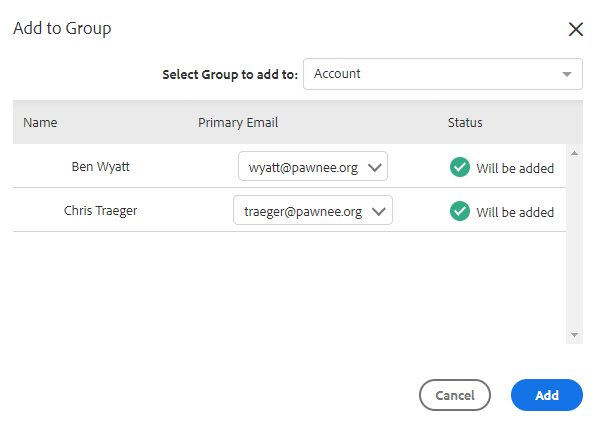

# Massenaktionen für Personen {#bulk-actions-on-people}

Es gibt ein paar Dinge, die Sie mit Ihren Kontakten in großen Mengen tun können, um Zeit zu sparen.

Der erste Schritt für alle verfügbaren Massenaktionen besteht darin, zwei oder mehr Kontakte auszuwählen und auf die Punkte (drei vertikale Punkte) zu klicken.

## Personen zur Gruppe hinzufügen {#add-people-to-group}

Gleichzeitiges Hinzufügen mehrerer Personen zu einer Gruppe

## Quelle {#source}

Wir weisen jedem Kontakt, der in die Datenbank aufgenommen wird, automatisch eine Quelle zu. Verwenden Sie diesen Schritt, um diese Quelle zu aktualisieren.

>[!NOTE]
>
>Quellen können nicht angepasst werden.

## Autorisierung {#authorization}

In Übereinstimmung mit [DSGVO](https://eugdpr.org/) verwenden Sie die Autorisierung , um anzugeben, wie Sie die Erlaubnis erhalten haben, mit diesen Kontakten zu interagieren.

## Abbestellen {#unsubscribe}

Führen Sie eine Massenabmeldung bei Kontakten durch, die keine Korrespondenz mehr von Ihnen erhalten möchten.

