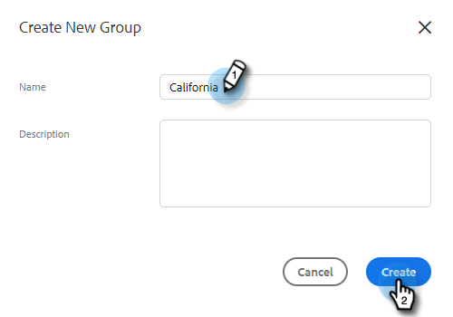
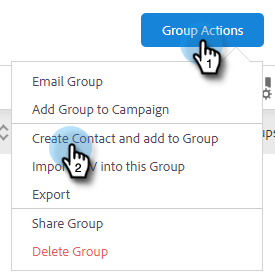

# Gruppen verwalten {#manage-groups}

Erfahren Sie, wie Sie Ihre Gruppen in [!DNL Sales Insight Actions] verwalten.

## Gruppentypen {#group-types}

<table> 
 <colgroup> 
  <col> 
  <col> 
 </colgroup> 
 <tbody> 
  <tr> 
   <th>Gruppe</th> 
   <th>Beschreibung</th> 
  </tr> 
  <tr> 
   <td>[!UICONTROL Alle Personen]</td> 
   <td>Alle Kontakte von allen Benutzern, die für Sie sichtbar sind.</td> 
  </tr> 
  <tr> 
   <td>[!UICONTROL Dynamische Gruppen]</td> 
   <td>Meine Kontakte: Alle Kontakte, deren Inhaber Sie sind. Abmeldungen: Kontakte, die sich vom Erhalt von Korrespondenz abgemeldet haben.</td> 
  </tr> 
  <tr> 
   <td>[!UICONTROL Meine Gruppen]</td> 
   <td>Von Ihnen erstellte Gruppen. Sie können Ihre Kontakte enthalten oder Kontakte, die für Sie freigegeben wurden.</td> 
  </tr> 
  <tr> 
   <td>[!UICONTROL Team Groups]</td> 
   <td>Gruppen, die für und/oder von Ihnen freigegeben wurden. Sie können eigene Kontakte oder Kontakte enthalten, die Sie für Ihre Teammitglieder freigegeben haben.</td> 
  </tr> 
 </tbody> 
</table>

## Erstellen einer Gruppe {#create-a-group}

1. Klicken Sie auf [!UICONTROL  Seite ]Personen“ auf das **+** neben [!UICONTROL Gruppen].

   

1. Benennen Sie Ihre Gruppe und klicken Sie auf **[!UICONTROL Erstellen]**.

   

   Das war&#39;s!

## Kontakte zu einer Gruppe hinzufügen {#add-contacts-to-a-group}

1. Suchen Sie auf [!UICONTROL  Seite ]Personen“ die Gruppe, der Sie Personen hinzufügen möchten, und wählen Sie sie aus.

   

1. Klicken Sie auf **[!UICONTROL Gruppenaktionen]** und wählen Sie **[!UICONTROL Kontakt erstellen und zu Gruppe hinzufügen]** aus.

   

1. Füllen Sie die Kontaktinformationen aus und klicken Sie auf **Erstellen** (oder **Erstellen und Neu hinzufügen** um eine weitere hinzuzufügen).

   

   Und du bist fertig!

   >[!NOTE]
   >
   >Möglicherweise müssen Sie auf Aktualisieren klicken, um neue hinzugefügte Kontakte anzuzeigen.

## Freigeben einer Gruppe {#share-a-group}

1. Suchen Sie auf [!UICONTROL  Seite ]Personen“ die Gruppe, die Sie freigeben möchten, und wählen Sie sie aus.

   

1. Klicken Sie auf die Punkte (drei vertikale Punkte) und wählen Sie **[!UICONTROL Freigeben]**.

   

1. Klicken Sie auf die Dropdown-Liste, wählen Sie das Team aus, für das Sie die Gruppe freigeben möchten, und klicken Sie auf **[!UICONTROL Freigeben]**.

   

   Die Gruppe gehört weiterhin Ihnen, wird aber jetzt unter &quot;_&quot;_.

## Freigabe einer Gruppe aufheben {#unshare-a-group}

1. Suchen Sie auf [!UICONTROL  Seite ]Personen“ die Gruppe, deren Freigabe Sie aufheben möchten, und wählen Sie sie aus.

   

1. Klicken Sie auf die Punkte (drei vertikale Punkte) und wählen Sie **[!UICONTROL Freigeben]**.

   

1. Klicken Sie auf **X** neben dem Team, für das Sie die Gruppe freigegeben haben, und klicken Sie dann auf Aus dem Modal.

   

   Die Gruppe ist jetzt nicht freigegeben.

## Eine Gruppe umbenennen {#rename-a-group}

1. Suchen Sie auf [!UICONTROL  Seite ]Personen“ die Gruppe, die Sie umbenennen möchten, und wählen Sie sie aus.

   

1. Klicken Sie auf die Punkte (drei vertikale Punkte) und wählen Sie **[!UICONTROL Bearbeiten]**.

   

1. Geben Sie den neuen Namen ein und klicken Sie auf **[!UICONTROL Speichern]**.

   

## Löschen einer Gruppe {#delete-a-group}

1. Suchen Sie auf der Seite Personen die Gruppe, die Sie löschen möchten, und wählen Sie sie aus.

   

1. Klicken Sie auf die Punkte (drei vertikale Punkte) und wählen Sie **[!UICONTROL Löschen]**.

   

1. Klicken Sie **[!UICONTROL Löschen]** zur Bestätigung.

   
