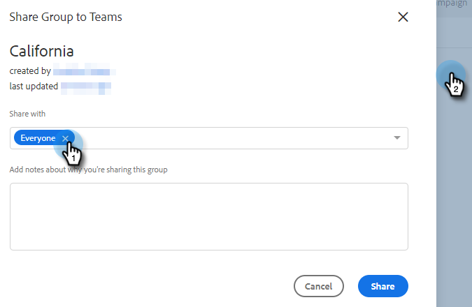
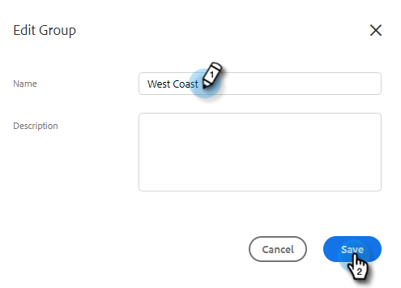
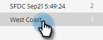

# Gruppen verwalten {#manage-groups}

Erfahren Sie, wie Sie Ihre Gruppen in Sales Insight-Aktionen verwalten.

## Gruppentypen {#group-types}

<table> 
 <colgroup> 
  <col> 
  <col> 
 </colgroup> 
 <tbody> 
  <tr> 
   <th>Gruppe</th> 
   <th>Beschreibung</th> 
  </tr> 
  <tr> 
   <td>Alle Personen</td> 
   <td>Alle Kontakte von allen Benutzern, die für Sie sichtbar sind.</td> 
  </tr> 
  <tr> 
   <td>Dynamische Gruppen</td> 
   <td>Meine Ansprechpartner: Alle Kontakte, die du besitzt. Abmeldungen: Kontakte, die sich vom Erhalt des Schriftstücks abgemeldet haben.</td> 
  </tr> 
  <tr> 
   <td>Meine Gruppen</td> 
   <td>Von Ihnen erstellte Gruppen. Sie können Ihre Kontakte oder Kontakte enthalten, die für Sie freigegeben wurden.</td> 
  </tr> 
  <tr> 
   <td>Teamgruppen</td> 
   <td>Gruppen, die für und/oder von Ihnen freigegeben wurden. Sie können Kontakte enthalten, die Ihre Teamkollegen besitzen, oder Kontakte, die Sie mit ihnen geteilt haben.</td> 
  </tr> 
 </tbody> 
</table>

## Erstellen einer Gruppe {#create-a-group}

1. Klicken Sie auf der Seite &quot;Personen&quot;auf die **+** neben Gruppen.

   

1. Benennen Sie Ihre Gruppe und klicken Sie auf **Erstellen**.

   

   Das ist es!

## Hinzufügen von Kontakten zu einer Gruppe {#add-contacts-to-a-group}

1. Suchen und wählen Sie auf der Seite Personen die Gruppe aus, der Sie Personen hinzufügen möchten.

   

1. Klicken **Gruppenaktionen** und wählen Sie **Kontakt erstellen und zu Gruppe hinzufügen**.

   

   >[!NOTE]
   >
   >Dadurch wird jeweils ein Kontakt hinzugefügt. Gehen Sie wie folgt vor, um mehrere Kontakte gleichzeitig hinzuzufügen: [diese Schritte](/help/marketo/product-docs/marketo-sales-insight/actions/people/managing-contacts/import-contacts-via-csv.md).

1. Füllen Sie die Kontaktdaten aus und klicken Sie auf **Erstellen** (oder **Erstellen und Hinzufügen neuer** , um einen weiteren hinzuzufügen).

   

   Und du bist fertig!

   >[!NOTE]
   >
   >Möglicherweise müssen Sie die Schaltfläche &quot;Aktualisieren&quot;drücken, um neue Kontakte zu sehen.

## Freigeben von Gruppen {#share-a-group}

1. Suchen und wählen Sie auf der Seite Personen die Gruppe aus, die Sie freigeben möchten.

   

1. Klicken Sie auf das Feld (drei vertikale Punkte) und wählen Sie **Freigeben**.

   

1. Klicken Sie auf das Dropdown-Menü, wählen Sie das Team aus, für das Sie die Gruppe freigeben möchten, und klicken Sie auf **Freigeben**.

   

   Sie besitzen weiterhin die Gruppe, aber sie wird jetzt unter _Team-Gruppen_.

## Aufheben der Freigabe einer Gruppe {#unshare-a-group}

1. Suchen und wählen Sie auf der Seite Personen die Gruppe aus, deren Freigabe Sie aufheben möchten.

   

1. Klicken Sie auf das Feld (drei vertikale Punkte) und wählen Sie **Freigeben**.

   

1. Klicken Sie auf **X** neben dem Team, für das Sie die Gruppe freigegeben haben, klicken Sie dann aus dem Modal.

   

   Die Gruppenfreigabe ist jetzt aufgehoben.

## Eine Gruppe umbenennen {#rename-a-group}

1. Suchen und wählen Sie auf der Seite Personen die Gruppe aus, die Sie umbenennen möchten.

   

1. Klicken Sie auf das Feld (drei vertikale Punkte) und wählen Sie **Bearbeiten**.

   

1. Geben Sie den neuen Namen ein und klicken Sie auf **Speichern**.

   

## Eine Gruppe löschen {#delete-a-group}

1. Suchen und wählen Sie auf der Seite Personen die Gruppe aus, die Sie löschen möchten.

   

1. Klicken Sie auf das Feld (drei vertikale Punkte) und wählen Sie **Löschen**.

   

1. Klicken **Löschen** zur Bestätigung.

   
