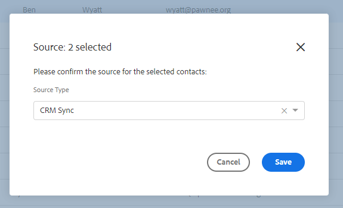

# Sales Insight-Aktionen und DSGVO-Compliance {#sales-insight-actions-and-gdpr-compliance}

Die Datenschutz-Grundverordnung (DSGVO) ist eine Rechtsvorschrift der Europäischen Union, die am 25. Mai 2018 in Kraft trat.

## Überblick {#overview}

Ihr Ziel ist es, die Rechte der betroffenen Personen innerhalb der Europäischen Union (EU) und des Europäischen Wirtschaftsraums (EWR) in Bezug auf die Art und Weise, wie ihre personenbezogenen Daten verwendet und geschützt werden, zu stärken. „Personenbezogene Daten“ sind alle Informationen, die sich auf eine identifizierte oder identifizierbare natürliche Person beziehen.

Die DSGVO ist auf sechs Grundprinzipien aufgebaut (die in Artikel 5 der Rechtsvorschriften näher erläutert werden):

1. Transparenz in Bezug darauf, wie Daten verwendet werden und wofür sie verwendet werden.
1. Es wird sichergestellt, dass die erhobenen Daten nur für die zum Zeitpunkt der Erhebung ausdrücklich angegebenen Zwecke verwendet werden.
1. Beschränkung der Datenerfassung auf das zur Erfüllung des Zwecks ihrer Erhebung erforderliche Maß.
1. Sicherstellen der Genauigkeit der Daten.
1. Die Daten nur so lange zu speichern, wie dies für den vorgesehenen Zweck erforderlich ist.
1. Schutz vor unbefugter Nutzung oder versehentlichem Verlust der Daten durch geeignete Sicherheitsmaßnahmen.

Darüber hinaus gibt es eine neue Anforderung an die Rechenschaftspflicht, um zu demonstrieren, wie die Compliance verwaltet und verfolgt wird. Dazu gehört die Führung von Aufzeichnungen darüber, wie und warum personenbezogene Daten erfasst wurden, sowie die Dokumentation der zu ihrem Schutz eingerichteten Verfahren.

## Für wen gilt sie? {#to-whom-does-it-apply}

Die DSGVO gilt für alle Organisationen innerhalb oder außerhalb der EU, die Waren oder Dienstleistungen für betroffene Personen in der EU und im EWR vermarkten und/oder deren Verhalten nachverfolgen. Wenn Sie mit betroffenen Personen in Europa Geschäfte machen, die die Verarbeitung ihrer personenbezogenen Daten beinhalten, gilt diese Gesetzgebung für Sie. Bei Verstößen gegen die Verordnung werden erhebliche Geldbußen verhängt, wobei die Höchststrafe für einen einzigen Verstoß 20 Millionen Euro oder 4 % des weltweiten Jahresumsatzes beträgt, je nachdem, welcher Betrag höher ist.

## Auswirkungen auf das Marketing {#implications-for-marketing}

Marketing-Experten zielen darauf ab, Kundenerlebnisse zu schaffen, die sich persönlich und menschlich anfühlen, auf Vertrauen basieren und mit Sorgfalt bereitgestellt werden. Obwohl die DSGVO diese Begriffe nicht verwendet, sind die Ziele dieselben - die Rechte der Kunden zu respektieren und ihr Vertrauen zu gewinnen. Um dieses Vertrauen aufzubauen und aufrechtzuerhalten, müssen Marketing-Experten auf das Wie, Wann und Warum ihre Kunden interagieren möchten abgestimmt sein. Es ist wichtig, dass Kundenpräferenzen respektiert werden, nicht nur als gesetzliche Anforderung, sondern als Grundlage für kundenorientierte Interaktionspraktiken.

Wie Marketing-Experten diese höheren Erwartungen in Bezug auf die Erfassung, Verwendung und Sicherheit der personenbezogenen Daten, die routinemäßig im Rahmen ihrer Arbeit verwendet werden, erfüllen, ist von entscheidender Bedeutung, und Marketo kann dabei helfen, diese Erwartungen zu erfüllen.

Es gibt zwei wichtige Aspekte der DSGVO, in denen Marketing-Experten vergangene, aktuelle und zukünftige Vorgehensweisen überprüfen müssen. Das erste ist die Zustimmung des Einzelnen zur Verarbeitung seiner personenbezogenen Daten, das zweite die Rechenschaftspflicht, d. h. die Fähigkeit zu demonstrieren, wie die Grundsätze der DSGVO befolgt werden.

In unserem E-Book (DSGVO und [ Marketer) stellen wir umfangreiche Informationen zum Einverständnis und zur Rechenschaftspflicht innerhalb der Marketo-Plattform ](https://www.marketo.com/ebooks/the-gdpr-and-the-marketer/). In diesem Artikel konzentrieren wir uns jedoch speziell auf die neuen Funktionen in [!DNL Sales Insight Actions], die Ihrem Unternehmen bei der Einhaltung der DSGVO-Regeln helfen.

## DSGVO-Compliance in [!DNL Sales Insight Actions] {#gdpr-compliance-in-marketo-sales-connect}

[!DNL Sales Insight Actions] ist eine leistungsstarke Anwendung, die Teil der Marketo Engagement Platform ist und einen einzigen Workflow und eine einheitliche Ansicht für Vertrieb und Marketing bietet, um die Pipeline durch kollaboratives Engagement gemeinsam schneller zu fördern. Neue Funktionen in [!DNL Sales Insight Actions] wurden speziell unter Berücksichtigung der DSGVO-Compliance erstellt. Wir werden alle drei Funktionen darlegen und erläutern, wie sie bei ordnungsgemäßer Verwendung die Einhaltung der DSGVO durch Ihr Unternehmen unterstützen.

## Compliance-Karte {#compliance-card}

[!DNL Sales Insight Actions] enthält eine Kompatibilitätskarte in der Personendetailansicht, um wichtige Informationen zum Autorisierungstyp eines Kontakts sowie zu seinem Source-Typ anzugeben. Auf diese Weise können Benutzende Informationen, die für den Datenschutz wichtig sind, einfach hinzufügen und verfolgen und sie bei fundierteren Entscheidungen über Kampagnen-/Outreach-Strategien unterstützen.

**Autorisierungstyp des Kontakts**

Innerhalb der Compliance Card können Benutzer über die Dropdown-Liste Autorisierung die Rechtsgrundlage für die Verarbeitung der personenbezogenen Daten eines Kontakts verfolgen. Wenn Sie den Autorisierungstyp eines Kontakts verstehen, können [!DNL Sales Insight Actions] Benutzerinnen und Benutzer fundiertere Entscheidungen zu Kontaktpraktiken treffen und sicherstellen, dass jede Kampagne oder jede Interaktion rechtmäßig und angemessen ist.

Die Benutzer haben zahlreiche Optionen zur Auswahl, darunter:

* Einverständnis
* Berechtigtes Interesse
* Leistung eines Vertrags
* Einhaltung gesetzlicher Verpflichtungen
* Schutz lebenswichtiger Interessen
* Öffentliches Interesse/Offizielle Behörde
* Andere

**Source-Typ kontaktieren**

Mit der neuen Kompatibilitätskarte können Benutzer die Quelle eines Kontakts verfolgen. Der Source-Typ definiert, woher die Kontaktinformationen beim ersten Hochladen in [!DNL Sales Insight Actions] stammen. Das Verständnis des Quelltyps eines Kontakts hilft auch bei Entscheidungen über Kontaktpraktiken sowie bei der Bestimmung, welche anderen Systeme oder Standorte personenbezogene Daten gespeichert werden, um sicherzustellen, dass jede Interaktion mit den DSGVO-Rechtsvorschriften im Einklang steht.

Auch hier stehen Benutzenden zahlreiche Dropdown-Optionen zur Auswahl, darunter:

* [!UICONTROL CRM-Synchronisation]
* [!UICONTROL Importieren]
* [!UICONTROL Manueller Upload]
* [!UICONTROL Chrome-Erweiterung]
* [!UICONTROL Sonstige]

**Bearbeiten der Kompatibilitätskarte**

Wenn die Ansicht „Personendetails“ geöffnet ist, klicken Sie auf **[!UICONTROL Karte &quot;]**&quot; auf „Bearbeiten“.

Es werden zwei Dropdown-Listen angezeigt: [!UICONTROL Autorisierungstyp] und [!UICONTROL Source-Typ].

Wenn Sie als [!UICONTROL Autorisierungstyp“ „Einverständnis] auswählen, werden zwei Pflichtfelder angezeigt: [!UICONTROL Einverständnisdatum] und [!UICONTROL Zweck der ]&quot;. Diese beiden Felder sind nicht auf andere Optionen anwendbar.

Wenn &quot;[!UICONTROL Other]&quot; entweder für [!UICONTROL Autorisierungstyp] oder [!UICONTROL Source-Typ] ausgewählt wurde, können Sie Text eingeben, um den [!UICONTROL Source-Typ zu ].

**Massenaktionen**

[!DNL Sales Insight Actions] ermöglicht auch die Massenaktualisierung der Autorisierungs- und Source-Typen eines Kontakts, wodurch wertvolle Zeit im Compliance-Prozess gespart wird.

Wenn Sie einen oder mehrere Kontakte auf der Seite [!UICONTROL Personen] auswählen, wird rechts ein Punkt (Menü mit drei Punkten) angezeigt. Klicken Sie darauf, und Sie sehen, dass Autorisierung und Source Optionen sind. Sie können die Autorisierung oder Source mehrerer Kontakte gleichzeitig festlegen.

Wenn Sie auf das Autorisierungs-Modal klicken, wird ein Popup mit Dropdown-Optionen angezeigt, die mit denen in der Kompatibilitätskarte übereinstimmen.

Nachdem der [!UICONTROL Autorisierungstyp] aktualisiert wurde, wird ein Bestätigungs-Popup angezeigt, in dem Sie die aktualisierten Details in der Kompatibilitätskarte in der Detailansicht der Person sehen können.

Ebenso kann der Source-Typ auch stapelweise aktualisiert werden, indem Sie auf das Source-Modal klicken.

Nachdem Sie den richtigen Source-Typ für Ihre ausgewählten Kontakte ausgewählt haben, wird ein Bestätigungsfenster angezeigt, um die erfolgreiche Aktualisierung zu bestätigen.

## Kontaktdaten aus [!DNL Sales Insight Actions] exportieren {#exporting-contact-data-from-marketo-sales-connect}

Sie haben die Möglichkeit, Kontaktinformationen aus der Personendetailansicht zu exportieren. Beim Exportieren wird eine CSV-Datei mit den folgenden Spalten heruntergeladen:

<table> 
 <colgroup> 
  <col> 
  <col> 
  <col> 
 </colgroup> 
 <tbody> 
  <tr> 
   <td>[!UICONTROL Vorname]</td> 
   <td>[!UICONTROL-Website]</td> 
   <td>[!DNL Facebook]</td> 
  </tr> 
  <tr> 
   <td>[!UICONTROL Nachname]</td> 
   <td>[!UICONTROL Sonstige]</td> 
   <td>[!DNL Twitter]</td> 
  </tr> 
  <tr> 
   <td>[!UICONTROL Firma]</td> 
   <td>[!UICONTROL Aktualisiert um]</td> 
   <td>[!DNL LinkedIn]</td> 
  </tr> 
  <tr> 
   <td>[!UICONTROL Titel]</td> 
   <td>[!UICONTROL erstellt um]</td> 
   <td>[!UICONTROL exportiert um]</td> 
  </tr> 
  <tr> 
   <td>[!UICONTROL E-Mail-ID]</td> 
   <td>[!DNL Salesforce] ID</td> 
   <td> </td> 
  </tr> 
  <tr> 
   <td>[!UICONTROL Telefonnummer]</td> 
   <td>[!UICONTROL Personen-ID]</td> 
   <td> </td> 
  </tr> 
 </tbody> 
</table>

>[!NOTE]
>
>Dies kann jeweils nur ein Kontakt sein. Es gibt derzeit keine Funktion, die Massenexporte von Kontakten ermöglicht.

Um Kontaktinformationen zu exportieren, klicken Sie auf die drei vertikalen Punkte in der Kopfzeile der Personendetailansicht und wählen Sie **[!UICONTROL Exportieren]**. Die CSV-Datei wird automatisch heruntergeladen.

>[!NOTE]
>
>Die DSGVO erfordert auch die Möglichkeit, Kontakte aus der Benutzeroberfläche zu löschen, [!DNL Sales Insight Actions] verfügt jedoch bereits über diese Funktion.

## Abbestellungen {#unsubscribes}

Ein häufig falsch verstandener Bereich der DSGVO umfasst Kontakte, die sich von der Datenbank des Unternehmens abmelden. Um die neuen Regeln zum Schutz der Daten von Abmeldepflichtigen einzuhalten, wurde die folgende Funktion in [!DNL Sales Insight Actions] integriert:

**Abmelde-Links:** Abmelde-Links werden automatisch an alle E-Mails angehängt, die von der Sales Connect-Webanwendung gesendet werden, um sicherzustellen, dass Kontakte eine barrierefreie Möglichkeit zum Opt-out erhalten.\
**Abmeldesynchronisierung:** Benutzer können Abmeldungen mit und von ihrem CRM (Salesforce) synchronisieren, um sicherzustellen, dass die Abmeldungen auf dem neuesten Stand sind.\
**Abmeldeverlauf:** Benutzer können historische Opt-outs und Opt-ins in der Personendetailansicht sehen.\
**Abmeldeentfernung:** der Rückmeldung eines abgemeldeten Kontakts setzt voraus, dass der Benutzer über Administratorrechte verfügt und nachweist, dass der Kontakt seine neue Einwilligung zur Kontaktaufnahme erteilt hat.

## Künftige Updates {#future-updates}

Als begeisterter Verfechter der Macht und Kundenorientierung der Interaktionsökonomie versteht Marketo, wie wichtig es ist, die Privatsphäre und den Datenschutz in die Hände der betroffenen Person zu legen. Wie bei anderen Datenschutzgesetzen erfordert die Einhaltung der DSGVO ein Engagement sowohl von Marketo als auch von unseren Kunden. Dieser Artikel soll Ihnen dabei helfen, Marketo in geeigneter Weise zu nutzen, um die Einhaltung der DSGVO durch Ihr Unternehmen zu gewährleisten.

Wir werden die geltenden DSGVO-Leitlinien der Regulierungsbehörden und die damit verbundenen Rechtsvorschriften weiterhin genau verfolgen. Updates werden an unser Trust Center unter [trust.marketo.com](https://trust.marketo.com) gesendet.
