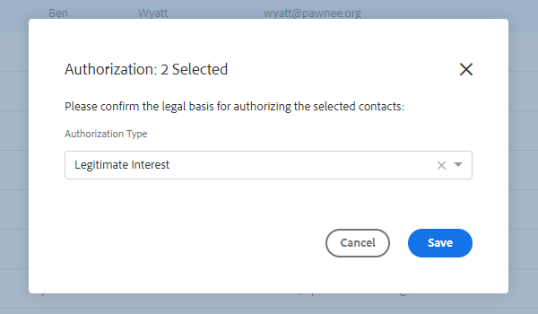

# Sales Insight-Aktionen und Einhaltung der DSGVO {#sales-insight-actions-and-gdpr-compliance}

Die Datenschutz-Grundverordnung (DSGVO) ist eine EU-Rechtsvorschrift, die am 25. Mai 2018 in Kraft getreten ist.

## Überblick {#overview}

Ziel ist es, die Rechte der betroffenen Personen in der Europäischen Union (EU) und im Europäischen Wirtschaftsraum (EWR) hinsichtlich der Verwendung und des Schutzes ihrer personenbezogenen Daten zu stärken. &quot;Personenbezogene Daten&quot;sind alle Informationen, die sich auf eine identifizierte oder identifizierbare natürliche Person beziehen.

Die DSGVO basiert auf sechs zentralen Grundsätzen (siehe Artikel 5 der Rechtsvorschriften):

1. Transparenz darüber, wie Daten verwendet werden und wofür sie verwendet werden.
1. Sicherstellung, dass die erfassten Daten nur für die zum Zeitpunkt der Erhebung explizit festgelegten Zwecke verwendet werden.
1. Beschränken der Datenerfassung auf das für den Zweck, für den sie erfasst wird, erforderliche Maß.
1. Sicherstellung der Genauigkeit der Daten.
1. Speichern der Daten nur so lange, wie dies für den vorgesehenen Zweck erforderlich ist.
1. Verhütung der unbefugten Nutzung oder des versehentlichen Verlusts der Daten durch Einsatz geeigneter Sicherheitsmaßnahmen.

Darüber hinaus gibt es eine neue Rechenschaftspflicht, um nachweisen zu können, wie die Einhaltung der Vorschriften verwaltet und verfolgt wird. Dies bedeutet, dass Aufzeichnungen darüber geführt werden, wie und warum personenbezogene Daten erfasst wurden, sowie die Dokumentation der zum Schutz dieser Daten eingerichteten Prozesse.

## Auf wen trifft es zu? {#to-whom-does-it-apply}

Die DSGVO gilt für alle Organisationen innerhalb oder außerhalb der EU, die Waren oder Dienstleistungen für betroffene Personen in der EU und im EWR vermarkten und/oder deren Verhalten nachverfolgen. Wenn Sie mit betroffenen Personen in Europa Geschäfte machen, die die Verarbeitung ihrer personenbezogenen Daten beinhalten, gilt diese Gesetzgebung für Sie. Bei Verstößen gegen die Verordnung werden erhebliche Geldbußen verhängt, wobei die Höchststrafe für einen einzigen Verstoß 20 Millionen Euro oder 4 % des weltweiten Jahresumsatzes beträgt, je nachdem, welcher Betrag höher ist.

## Auswirkungen auf das Marketing {#implications-for-marketing}

Marketingexperten wollen Kundenerlebnisse schaffen, die sich persönlich und menschlich fühlen, auf Vertrauen beruhen und mit Sorgfalt bereitgestellt werden. Obwohl die DSGVO diese Bedingungen nicht verwendet, sind die Ziele identisch: die Rechte der Kunden zu achten und ihr Vertrauen zu gewinnen. Um dieses Vertrauen zu schaffen und zu erhalten, müssen Marketing-Experten darauf achten, wie, wann und warum ihre Kunden interagieren möchten. Es ist wichtig, dass Kundenpräferenzen respektiert werden, nicht nur als gesetzliche Voraussetzung, sondern als Grundlage für kundenorientierte Interaktionsmethoden.

Die Art und Weise, wie Marketer diese höheren Erwartungen in Bezug auf die Erfassung, Nutzung und Sicherheit personenbezogener Daten, die routinemäßig im Zuge ihrer Arbeit verwendet werden, erfüllen, ist von entscheidender Bedeutung, und Marketo kann dabei helfen, diese Erwartungen zu erfüllen.

Es gibt zwei Hauptaspekte der DSGVO, in denen Marketingexperten vergangene, aktuelle und zukünftige Vorgehensweisen überprüfen müssen. Die erste ist die Einwilligung des Einzelnen zur Verarbeitung seiner personenbezogenen Daten, die zweite ist die Rechenschaftspflicht, nämlich nachweisen zu können, wie die Grundsätze der DSGVO eingehalten werden.

In unserem E-Book, [DSGVO und The Marketer](https://www.marketo.com/ebooks/the-gdpr-and-the-marketer/), bieten wir umfassende Informationen über Einverständnis und Verantwortlichkeit innerhalb der Marketo-Plattform. In diesem Artikel konzentrieren wir uns jedoch speziell auf die neuen Funktionen in Sales Insight-Aktionen, die Ihrem Unternehmen helfen, die DSGVO-Regeln einzuhalten.

## DSGVO-Compliance in Sales Insight-Aktionen {#gdpr-compliance-in-marketo-sales-connect}

Sales Insight-Aktionen sind eine leistungsstarke Anwendung - Teil der Marketo-Interaktionsplattform -, die einen einzigen Workflow und eine Ansicht für Vertrieb und Marketing bietet, um die Pipeline durch kollaborative Interaktion gemeinsam schneller zu führen. Neue Funktionen in Sales Insight-Aktionen wurden speziell mit Blick auf die Einhaltung der DSGVO erstellt. Wir werden alle drei Funktionen skizzieren und erläutern, wie sie bei ordnungsgemäßer Verwendung die Einhaltung der DSGVO in Ihrem Unternehmen unterstützen.

## Compliance Card {#compliance-card}

Sales Insight-Aktionen enthalten in der Personendetailansicht eine Compliance-Karte mit wichtigen Informationen zum Autorisierungstyp eines Kontakts sowie zum Source-Typ. Auf diese Weise können Benutzer Informationen, die für den Datenschutz von entscheidender Bedeutung sind, einfach hinzufügen und verfolgen und ihnen dabei helfen, fundiertere Entscheidungen über die Kampagnen-/Kontaktstrategie zu treffen.

**Autorisierungstyp kontaktieren**

Innerhalb der Compliance Card können Benutzer die Rechtsgrundlage für die Verarbeitung der personenbezogenen Daten eines Kontakts über die Dropdown-Liste Autorisierung verfolgen. Durch das Verständnis des Autorisierungstyps eines Kontakts können Benutzer von Sales Insight Actions fundiertere Entscheidungen zu Outreach-Verfahren treffen, um sicherzustellen, dass jede Kampagne oder Interaktion legal und angemessen ist.

Benutzer haben verschiedene Optionen zur Auswahl, darunter:

* Einverständnis
* Berechtigtes Interesse
* Leistung eines Vertrags
* Einhaltung gesetzlicher Verpflichtungen
* Schutz lebenswichtiger Interessen
* Öffentliches Interesse/Offizielle Behörde
* Andere

**Source-Typ kontaktieren**

Innerhalb der neuen Compliance Card können Benutzer die Quelle eines Kontakts verfolgen. Der Source-Typ definiert, woher die Informationen eines Kontakts kamen, als sie zum ersten Mal in Sales Insight-Aktionen hochgeladen wurden. Das Verständnis des Quelltyps eines Kontakts hilft auch bei Entscheidungen zu Outreach-Verfahren sowie bei der Bestimmung, welche anderen Systeme oder Standorte personenbezogene Daten speichern, und stellt sicher, dass jede Interaktion mit den DSGVO-Vorschriften im Einklang steht.

Auch hier haben Benutzer zahlreiche Dropdown-Optionen zur Auswahl, darunter:

* CRM-Synch
* Importieren
* Manueller Upload
* Chrome-Erweiterung
* Andere

**Bearbeiten der Compliance Card**

Wenn die Personendetailansicht geöffnet ist, klicken Sie auf der Einhaltungskarte auf **Bearbeiten** .

Es werden zwei Dropdown-Listen angezeigt: Autorisierungstyp und Source-Typ.

Wenn Sie als Autorisierungstyp &quot;Einverständnis&quot;wählen, werden zwei erforderliche Felder angezeigt: &quot;Datum der Zustimmung&quot;und &quot;Zweck der Verarbeitung&quot;. Diese beiden Felder können nicht auf andere Optionen angewendet werden.

Wenn &quot;Sonstige&quot;für den Autorisierungstyp oder den Source-Typ ausgewählt ist, können Sie Text zur Beschreibung des Source-Typs eingeben.

**Massenaktionen**

Mit Sales Insight-Aktionen können auch die Autorisierungs- und Source-Typen eines Kontakts stapelweise aktualisiert werden, wodurch wertvolle Zeit im Compliance-Prozess eingespart wird.

Wenn Sie auf der Seite &quot;Personen&quot;einen oder mehrere Kontakte auswählen, wird rechts ein Punkt (Menü mit drei Punkten) angezeigt. Klicken Sie darauf. Daraufhin werden die Optionen Autorisierung und Source sind angezeigt. Sie können die Autorisierung oder Source mehrerer Kontakte gleichzeitig festlegen.

Wenn Sie auf das Autorisierungs-Modal klicken, wird ein Popup mit Dropdown-Optionen angezeigt, die mit den Optionen in der Kompatibilitätskarte übereinstimmen.

Nachdem der Autorisierungstyp aktualisiert wurde, erhalten Sie ein Bestätigungs-Popup, in dem Sie die aktualisierten Details in der Kompatibilitätskarte in der Personendetailansicht sehen können.

Ebenso kann der Source-Typ durch Klicken auf das Source-Modal stapelweise aktualisiert werden.

Nach Auswahl des für Ihre Kontakte passenden Source-Typs wird ein Bestätigungsfenster angezeigt, in dem Sie die erfolgreiche Aktualisierung bestätigen können.

## Exportieren von Kontaktdaten aus Sales Insight-Aktionen {#exporting-contact-data-from-marketo-sales-connect}

Sie können Kontaktinformationen aus der Personendetailansicht exportieren. Beim Export wird eine .CSV-Datei mit den folgenden Spalten heruntergeladen:

<table> 
 <colgroup> 
  <col> 
  <col> 
  <col> 
 </colgroup> 
 <tbody> 
  <tr> 
   <td>Vorname</td> 
   <td>Website</td> 
   <td>Facebook</td> 
  </tr> 
  <tr> 
   <td>Nachname</td> 
   <td>Andere</td> 
   <td>Twitter</td> 
  </tr> 
  <tr> 
   <td>Unternehmen</td> 
   <td>Aktualisiert um</td> 
   <td>LinkedIn</td> 
  </tr> 
  <tr> 
   <td>Titel</td> 
   <td>Erstellt um</td> 
   <td>Exportiert nach</td> 
  </tr> 
  <tr> 
   <td>E-Mail-ID</td> 
   <td>Salesforce-ID</td> 
   <td> </td> 
  </tr> 
  <tr> 
   <td>Telefonnummer</td> 
   <td>Personen-ID</td> 
   <td> </td> 
  </tr> 
 </tbody> 
</table>

>[!NOTE]
>
>Dies kann jeweils nur einmal erfolgen. Es gibt derzeit keine Funktion, die den Massenexport von Kontakten ermöglicht.

Um Kontaktinformationen zu exportieren, klicken Sie auf die drei vertikalen Punkte in der Kopfzeile der Personendetailansicht und wählen Sie **Exportieren** aus. Die .CSV-Datei wird automatisch heruntergeladen.

>[!NOTE]
>
>Die DSGVO erfordert auch die Möglichkeit, Kontakte aus der Benutzeroberfläche zu löschen. Sales Insight-Aktionen verfügen jedoch bereits über diese Funktionalität.

## Abbestellungen {#unsubscribes}

Ein häufig missverständlicher Bereich der DSGVO umfasst Kontakte, die sich von der Datenbank der Organisation abmelden. Um neue Regeln zum Schutz der Daten derjenigen einzuhalten, die sich abmelden, wurde die folgende Funktion in Sales Insight-Aktionen einbezogen:

**Abmelde-Links:** Abmelde-Links werden automatisch an alle E-Mails angehängt, die von der Sales Connect-Webanwendung gesendet werden. So können Sie sicherstellen, dass Kontakte eine Möglichkeit zum Abmelden erhalten.\
**Synchronisierung der Abmeldung:** Benutzer können Abmeldungen von und von ihrem CRM-System (Salesforce) synchronisieren, um sicherzustellen, dass Opt-outs aktuell sind.\
**Abmeldeverlauf:** Benutzer können historische Opt-outs und Opt-ins in der Detailansicht der Person sehen.\
**Entfernen des Abonnements:** Wenn ein abgemeldeter Kontakt wieder aktiviert wird, muss der Benutzer über Administratorrechte verfügen und nachweisen, dass der Kontakt neue Einwilligung zur Kontaktaufnahme gegeben hat.

## Zukünftige Updates {#future-updates}

Als begeisterter Verfechter der Macht und Kundenorientierung der Interaktionswirtschaft versteht Marketo, wie wichtig es ist, die Privatsphäre und den Datenschutz in die Hände der betroffenen Person zu legen. Wie bei anderen Datenschutzgesetzen erfordert die Einhaltung der DSGVO das Engagement von Marketo und unseren Kunden. Dieser Artikel soll Ihnen dabei helfen, Marketo auf geeignete Weise zu verwenden, um die DSGVO Ihres Unternehmens einzuhalten.

Wir werden die geltenden DSGVO-Leitlinien der Regulierungsbehörden und der damit zusammenhängenden Rechtsvorschriften weiterhin genau verfolgen. Aktualisierungen werden in unserem Vertrauenszentrum unter [trust.marketo.com](https://trust.marketo.com) veröffentlicht.
