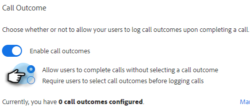
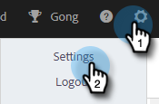

# Ergebnisse der Aufrufe {#call-outcomes}

Ermöglichen Sie es Ihren Verkaufsteams, bei Anrufen die Ergebnisse der Anrufe auszuwählen, damit Ihr Team die Auswirkungen Ihrer Kundeninteraktionen verstehen kann.

>[!NOTE]
>
>**Erforderliche Administratorberechtigungen**

## Aktivieren der Anrufergebnisse {#enable-call-outcomes}

1. Klicken Sie auf das Zahnradsymbol und wählen Sie **Einstellungen** aus.

   

1. Wählen Sie unter &quot;Admin Settings&quot;**Dialer** aus.

   

1. Wählen Sie **Ergebnisse der Aufrufe aktivieren** aus.

   

1. Wählen Sie die gewünschte Ergebnisanforderung für den Anruf aus.

   

## Ergebnisse von Aufrufen erstellen {#create-call-outcomes}

>[!NOTE]
>
>Sie können maximal 15 Aufrufergebnisse erstellen.

1. Klicken Sie auf das Zahnradsymbol und wählen Sie **Einstellungen** aus.

   

1. Wählen Sie unter &quot;Admin Settings&quot;**Dialer** aus.

   

1. Klicken Sie auf **Ergebnisse der Aufrufe verwalten**.

   

1. Geben Sie den gewünschten Ergebnisnamen des Aufrufs in das Textfeld ein.

   

1. Klicken Sie auf die Dropdown-Liste Antworten und wählen Sie den Ergebnistyp aus (in diesem Beispiel wählen wir Beantwortet aus). Klicken Sie dann auf **Hinzufügen**.

   

## Ergebnis eines Aufrufs auswählen {#choose-a-call-outcome}

Sobald die Ergebnisse der Aufrufe aktiviert wurden. Benutzer können beim Aufruf eine auswählen.

1. Klicken Sie auf die Anruftaste, um den Dialer zu starten.

   

1. Geben Sie die Aufrufinformationen in den Dialer ein und klicken Sie auf **Aufruf**.

   

1. Wählen Sie das Aufrufergebnis aus, das den Aufruf am besten beschreibt.

   

1. Beenden Sie den Aufruf.

   

1. Protokollieren Sie den -Aufruf.

   

>[!MORELIKETHIS]
>
>* [Gründe für Aufrufe protokollieren und Ergebnisse an Salesforce aufrufen](/help/marketo/product-docs/marketo-sales-insight/actions/phone/log-call-reasons-and-call-outcomes-to-salesforce.md)
>* [Aufrufgründe](/help/marketo/product-docs/marketo-sales-insight/actions/phone/call-reasons.md)
