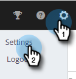

# Aufrufaufzeichnung aktivieren {#enable-call-recording}

Als Administrator können Sie die Aufrufaufzeichnung für Ihre Sales Insight-Aktionsaufrufe aktivieren. Das Aufzeichnen der Anrufe Ihres Teams kann eine gute Möglichkeit sein, Ihre Vertriebsmitarbeiter bei den Best-Call-Verfahren zu unterstützen.

1. Klicken Sie auf das Symbol Einstellungen und wählen Sie **Einstellungen** aus.

   

1. Klicken Sie unter &quot;Admin Settings&quot;auf **Dialer**.

   

1. Wählen Sie den Umschalter **Aufrufaufzeichnung aktivieren** aus.

   

1. Wenn Sie Ihren Verkäufern die Möglichkeit geben möchten, die Aufrufaufzeichnung für sich selbst zu aktivieren oder zu deaktivieren, klicken Sie auf **Optionale Aufzeichnung für alle Teammitglieder**. Wenn alle Aufrufe automatisch aufgezeichnet werden sollen, klicken Sie auf **Alle Aufrufe aufzeichnen**.

   

>[!MORELIKETHIS]
>
>[Einstellungen für die Zustimmung von zwei Parteien](/help/marketo/product-docs/marketo-sales-insight/actions/phone/two-party-consent-settings.md)
