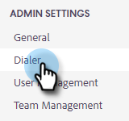

# Anrufaufzeichnung aktivieren {#enable-call-recording}

Als Administrator können Sie die Anrufaufzeichnung für Ihre Sales Insight-Aktionsaufrufe aktivieren. Die Anrufe Ihres Teams aufzunehmen kann eine gute Möglichkeit sein, Ihre Vertriebsmitarbeiter über die Best Practices für Anrufe zu informieren.

1. Klicken Sie auf das Symbol Einstellungen und wählen Sie **Einstellungen** aus.

   

1. Klicken Sie unter „Admin Settings“ auf **Dialer**.

   

1. Wählen Sie den Umschalter **Aufzeichnung von Anrufen aktivieren** aus.

   

1. Wenn Sie Ihren Verkäufern die Möglichkeit geben möchten, die Anrufaufzeichnung für sich selbst zu aktivieren oder zu deaktivieren, klicken Sie auf **Optionale Aufzeichnung für alle Team-Mitglieder**. Wenn alle Anrufe automatisch aufgezeichnet werden sollen, klicken Sie auf **Alle Anrufe aufzeichnen**.

   

>[!MORELIKETHIS]
>
>[Zwei-Parteien-Einverständniseinstellungen](/help/marketo/product-docs/marketo-sales-insight/actions/phone/two-party-consent-settings.md)
