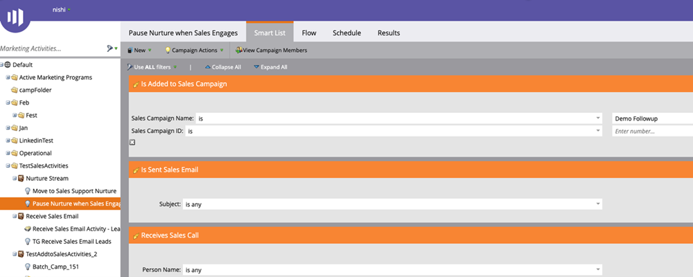

# Übersicht über die Funktionen von Sales Insight-Aktionen {#msi-actions-feature-overview}

Mit Marketing-gestützten Intelligenz- und Interaktionswerkzeugen können Sie mithilfe von Sales Insight-Aktionen die Prospektionsbemühungen in einem einzigen Workflow beschleunigen.

>[!NOTE]
>
>Marketo Sales Insight Actions ist eine webbasierte Anwendung, die über das [Marketo Sales Insight-Paket](/help/marketo/product-docs/marketo-sales-insight/msi-for-salesforce/installation/install-marketo-sales-insight-package-in-salesforce-appexchange.md){target="_blank"} in die Salesforce-Benutzeroberfläche integriert wird. Dies wird manchmal als &quot;Marketo-Verkäufe&quot;oder einfach als &quot;Aktionen&quot;bezeichnet.

>[!AVAILABILITY]
>
>Diese Funktion wird derzeit für alle Sales Insight-Benutzer eingeführt. Wenn Sie beim Rollout eine Priorität erhalten möchten, senden Sie bitte eine E-Mail an `sales-insights(at)adobe(dot)com`.

Eine Videoübersicht zu Sales Insight-Aktionen erhalten Sie, wenn Sie [hier klicken](https://experienceleague.adobe.com/docs/marketo-learn/tutorials/sales-insight-actions/overview.html){target="_blank"}.

## Lead-Layout und Kontaktlayout {#lead-layout-and-contact-layout}

Die folgenden Aktionen sind in der Dropdown-Liste &quot;Aktionen auswählen&quot;in der oberen Navigationsleiste verfügbar:

* Verkaufs-E-Mail senden
   * E-Mails zum Verkauf verfügen über Anzeigen, Klick und Antwort-Tracking (wenn der Versandkanal eingerichtet ist).
   * Umfasst E-Mail-Personalization, benutzerdefinierte Signatur und Anlagen
   * Vorlagenfreigabe und Berichte
   * Teamfreigabe, Gruppierung von E-Mails und CC/BCC-Fähigkeit
   * Die E-Mail-Aktivität Vertrieb wird im Marketo-Personendatensatz protokolliert
   * Entsprechende Filter und Trigger in Marketo Smart Campaigns (Details unten)

* Zur Verkaufskampagne hinzufügen
   * Hinzufügen von Leads zu Verkaufsbüchern, die eine Folge von E-Mails und Aufgaben sind
   * Enthält Teamzugriff und -freigabe, Aufgabenerstellung, Wochenenden überspringen, OOO-E-Mails als Antworten ignorieren und automatisches Ende
   * Die Kampagnenaktivität wird im Marketo-Personendatensatz protokolliert
   * Entsprechende Filter und Trigger in Marketo Smart Campaigns (Details unten)

* Vertriebsfachhändler
   * Verkaufsaufrufe über den Dialer im CRM-System durchführen
   * Enthält lokale Präsenz, voraufgezeichnet
   * Ergebnis der Protokollaufrufe, Aufrufaufzeichnung im Bedienfeld und Aktivitätsverlauf
   * Die Aufrufaktivität wird im Marketo-Personendatensatz protokolliert
   * Filter und Trigger in Marketo Smart Campaigns

* Aufgabe hinzufügen
   * Erstellen Sie E-Mail-, Call-, InMail- und benutzerdefinierte Aufgaben für Ihre Leads.
   * Automatisieren der Aufgabenerstellung mit Verkaufskampagnen
   * Synchronisieren von Aufgaben mit Salesforce
   * Protokollaufgaben im Abschnitt &quot;Salesforce-Aktivitätsverlauf&quot;

Sie können auf den Live Feed zugreifen, indem Sie auf das Symbol ((0)) in der oberen Navigationsleiste klicken. Dazu gehören die Möglichkeit, Live-Updates zu Verkaufsaktivitäten zusammen mit der Funktion zum Andocken des Bildschirms anzuzeigen.

Die folgenden Daten sind auf den Registerkarten im MSI-Bedienfeld verfügbar:

* Insights-Dashboard
   * Das Interaktions-Velocity-Raster umfasst Aktivitäten aus Verkaufs-E-Mails, Verkaufskampagnen-Aktionen und Vertriebs-Dialer.
   * Bevorstehende Verkaufskampagnen - Wenn ein Lead Teil einer laufenden Kampagne ist, stehen diese Informationen im Tab Bevorstehende Verkaufskampagnen zur Verfügung
   * Bevorstehende Aufgaben - Wenn eine Aufgabe für einen Lead ansteht, stehen diese Informationen auf der Registerkarte &quot;Bevorstehende Aufgaben&quot;zur Verfügung

* E-Mail-Tab
   * Alle versandten E-Mails werden hier protokolliert. Die Aktivitäten werden auch im Marketo-Personendatensatz protokolliert
   * Die Spalten umfassen Betreff, Öffnen, Klicken, Antworten (nur für E-Mails mit eingerichtetem Versandkanal verfügbar), Absender, Datum
   * Umfasst die Karte mit zusätzlichen Details wie Sender, Vorlage, Vertriebskampagne und Vorschau-E-Mail

* Registerkarte &quot;Aufruf&quot;
   * Alle Anrufe, die über die Verkaufsdialfunktion platziert werden, werden hier protokolliert. Die Aktivitäten werden auch im Marketo-Personendatensatz protokolliert
   * Zu den Spalten gehören Name, Ergebnis, Hinweise, Angerufen am, Dauer und Link zur Aufzeichnung
   * Enthält die Karte für die Abschiebung mit zusätzlichen Details wie &quot;Anruf durchgeführt von&quot;, &quot;Anruf beantwortet von&quot;, &quot;Telefonnummer und Status&quot;

## Konto- und Opportunity-Layout {#account-and-opportunity-layout}

Die folgenden Aktionen sind in der oberen Navigationsleiste verfügbar:

* Verkaufs-E-Mail senden - Möglichkeit, personalisierte oder vorlagenbasierte Gruppen-E-Mails mit Ansicht-, Klick- und Antworttracking an alle Kontakte zu senden, die mit einem Konto/einer Gelegenheit verknüpft sind
   * E-Mails zum Verkauf verfügen über Anzeigen, Klick und Antwort-Tracking (wenn der Versandkanal eingerichtet ist).
   * Umfasst E-Mail-Personalization, benutzerdefinierte Signatur und Anlagen
   * Vorlagenfreigabe und Berichte
   * Teamfreigabe, Gruppierung von E-Mails und CC/BCC-Fähigkeit
   * Die E-Mail-Aktivität Vertrieb wird im Marketo-Personendatensatz protokolliert
   * Entsprechende Filter und Trigger in Marketo Smart Campaigns (Details unten)

* Zu Verkaufskampagne hinzufügen - Fügen Sie allen mit einem Konto/einer Gelegenheit verbundenen Kontakten zu Verkaufsbüchern hinzu, die eine Folge von E-Mails und Aufgaben sind.
   * Hinzufügen von Leads zu Verkaufsbüchern, die eine Folge von E-Mails und Aufgaben sind
   * Enthält Teamzugriff und -freigabe, Aufgabenerstellung, Wochenenden überspringen, OOO-E-Mails als Antworten ignorieren und automatisches Ende
   * Die Kampagnenaktivität wird im Marketo-Personendatensatz protokolliert
   * Entsprechende Filter und Trigger in Marketo Smart Campaigns (Details unten)

Sie können auf den Live-Feed zugreifen, indem Sie in der oberen Navigationsleiste auf das Symbol ((0)) klicken. Dazu gehören die Möglichkeit, Live-Updates zu Verkaufsaktivitäten zusammen mit der Funktion zum Andocken des Bildschirms anzuzeigen.

Die folgenden Daten sind in den Registerkarten verfügbar:

* Insights-Dashboard
   * Das Interaktions-Velocity-Raster umfasst Aktivitäten aus Verkaufs-E-Mails, Verkaufskampagnen-Aktionen und dem Vertriebspartner.
   * Bevorstehende Verkaufskampagnen - Wenn ein Kontakt aus dem Konto/der Gelegenheit Teil einer laufenden Kampagne ist, stehen diese Informationen im Tab Bevorstehende Verkaufskampagnen zur Verfügung
   * Bevorstehende Aufgaben - Wenn es eine bevorstehende Aufgabe gibt, die einen Kontakt aus dem Konto/der Gelegenheit betrifft, werden diese Informationen im Tab Bevorstehende Aufgaben verfügbar sein.

* E-Mail-Tab
   * Alle Verkaufs-E-Mails, die an Kontakte aus dem Konto/der Gelegenheit gesendet werden, werden hier protokolliert. Die Aktivitäten werden auch im Marketo-Personendatensatz protokolliert
   * Die Spalten umfassen Betreff, Öffnung, Klick, Antworten (nur für E-Mails mit eingerichtetem Versandkanal verfügbar), Absender und Datum
   * Umfasst die Karte mit zusätzlichen Details wie Sender, Vorlage, Vertriebskampagne und Vorschau-E-Mail

* Registerkarte &quot;Aufruf&quot;
   * Alle Anrufe an Kontakte aus dem Konto/der Möglichkeit, die über die Funktion des Vertriebs-Dialers durchgeführt werden, werden hier protokolliert. Die Aktivitäten werden auch im Marketo-Personendatensatz protokolliert
   * Zu den Spalten gehören Name, Ergebnis, Hinweise, Anrufbeantworter, Dauer und Link zur Aufzeichnung
   * Enthält die Karte für die Abschiebung mit zusätzlichen Details wie &quot;Anruf durchgeführt von&quot;, &quot;Anruf beantwortet von&quot;, &quot;Telefonnummer und Status&quot;

## Lead- und Kontaktlisten-Ansicht (Massenaktionen) {#lead-and-contact-list-view}

* Verkaufs-E-Mail senden - Möglichkeit, personalisierte oder vorlagenbasierte E-Mails mit Ansicht, Klick und Antwort-Tracking an eine Liste von Kontakten/Leads zu senden
* Vertriebskampagne senden - Fügen Sie zu Verkaufsbüchern hinzu, die eine Abfolge von E-Mails und Aufgaben zu einer Liste von Kontakten/Leads darstellen.

## Registerkarte &quot;Marketo Global&quot; {#marketo-global-tab}

**Registerkarte &quot;Beste Betten&quot;**

Die folgenden Massenaktionen sind in der Dropdown-Liste auf der Registerkarte Beste Betten verfügbar:

* Verkaufs-E-Mail senden - Möglichkeit, personalisierte oder vorlagenbasierte E-Mails mit Ansicht-, Klick- und Antworttracking zu senden
* Verkaufskampagne senden - Fügen Sie Leads zu Verkaufsbüchern hinzu, die eine Folge von E-Mails und Aufgaben sind.

  

Die folgenden Inline-Aktionen sind für einzelne Leads/Kontakte auf der Registerkarte Beste Betas verfügbar:

* Verkaufs-E-Mail senden - Möglichkeit, personalisierte oder vorlagenbasierte E-Mails mit Ansicht-, Klick- und Antworttracking zu senden
* Verkaufskampagne senden - Fügen Sie Leads zu Verkaufsbüchern hinzu, die eine Folge von E-Mails und Aufgaben sind.
* Vertriebspartner - Verkaufen Sie über den im CRM-System verfügbaren Dialer Verkaufsanrufe.
* Aufgabe hinzufügen - Erstellen von E-Mail-, Aufruf-, Kunden- oder LinkedIn-Aufgaben für potenzielle Leads

  

**Registerkarte &quot;E-Mail&quot;**

* Alle versandten E-Mails werden hier protokolliert. Die Aktivitäten werden auch im Marketo-Personendatensatz protokolliert
* Die Spalten umfassen Betreff, Öffnung, Klick, Antworten (nur für E-Mails mit eingerichtetem Versandkanal verfügbar), Absender und Datum
* Umfasst die Karte mit zusätzlichen Details wie Sender, Vorlage, Vertriebskampagne und Vorschau-E-Mail

**Tab aufrufen**

* Alle Anrufe, die über die Verkaufsdialfunktion platziert werden, werden hier protokolliert. Die Aktivitäten werden auch im Marketo-Personendatensatz protokolliert
* Zu den Spalten gehören Name, Ergebnis, Hinweise, Anrufbeantworter, Dauer und Link zur Aufzeichnung
* Enthält die Karte für die Abschiebung mit zusätzlichen Details wie &quot;Anruf durchgeführt von&quot;, &quot;Anruf beantwortet von&quot;, &quot;Telefonnummer und Status&quot;

**Registerkarte &quot;Aufgabe&quot;**

* E-Mail-, Anruf-, InMail- und benutzerdefinierte Aufgaben, die erstellt und abgeschlossen wurden, stehen in diesem Tab zur Aufgabenverwaltung zur Verfügung. Möglichkeit zum Hinzufügen von Aufgaben
* Automatisieren der Aufgabenerstellung mit Verkaufskampagnen
* Synchronisieren von Aufgaben mit Salesforce
* Protokollaufgaben im Abschnitt &quot;Salesforce-Aktivitätsverlauf&quot;

  

**Live-Feed**

* Möglichkeit, Live-Updates zu Verkaufsaktivitäten zusammen mit der Funktion zum Andocken des Bildschirms anzuzeigen
* Eingebettete Schaltflächen für E-Mails, Aufrufe und Kadenz ermöglichen es jedem Kunden, Einblicke zu erhalten.

## In Marketo verfügbare Funktionen {#features-available-in-marketo}

In Marketo erfasste Verkaufsaktivitäten:

* Verkaufs-E-Mail senden - Benutzer hat eine Verkaufs-E-Mail an einen Lead gesendet
* E-Mail zum offenen Vertrieb - Lead öffnet eine E-Mail zum Vertrieb
* Klicken Sie auf Sales Email - Lead klickt auf einen Link in einer Verkaufs-E-Mail
* Antwort-E-Mail für Vertrieb - Lead beantwortet eine E-Mail für Vertrieb
* Verkaufsaufruf empfangen - Lead erhielt einen Anruf von einem Verkäufer, der den Vertriebspartner nutzt.
* Zu Vertriebskampagne hinzufügen - Lead wurde zu einer erstellten Verkaufskampagne hinzugefügt.
* Aus Vertriebskampagne entfernt - Lead wurde aus einer erstellten Verkaufskampagne entfernt

Zu den Filtern und Triggern gehören:

* Verkaufs-E-Mail senden
* Geöffnete Verkaufs-E-Mail
* angeklickte E-Mail zum Vertrieb
* Hat auf Vertriebsemail geantwortet
* Hat Verkaufsanruf empfangen
* Zur Vertriebskampagne hinzugefügt
* Aus Verkaufskampagne entfernt

  
