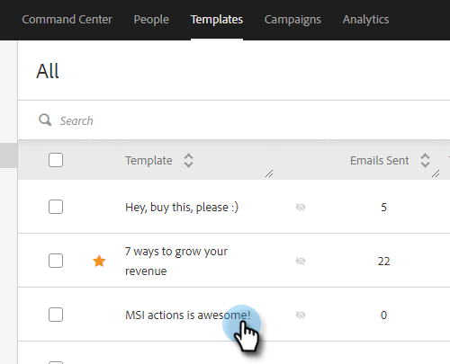
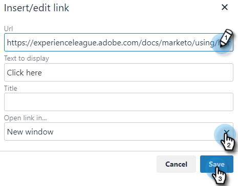
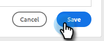

# Hinzufügen von Hyperlink-Text {#add-hyperlinked-text}

Gehen Sie wie folgt vor, um zu erfahren, wie Sie Ihren E-Mail-Vorlagen Hyperlinks hinzufügen.

1. Wählen Sie auf [!UICONTROL &#x200B; Seite &#x200B;]Vorlagen“ die gewünschte Vorlage aus (oder erstellen Sie eine neue).

   

1. Klicken Sie auf **[!UICONTROL Bearbeiten]**.

   

1. Geben Sie den Text ein, für den Sie einen Hyperlink erstellen möchten (z. B. „Hier klicken„). [!DNL Highlight] und klicken Sie im Editor auf die Schaltfläche „Link“.

   

1. Geben Sie die URL ein, mit der sie verknüpft werden soll (d. h. `https://experienceleague.adobe.com/docs/marketo/using/home.html`). Wählen Sie aus, ob die URL im selben oder einem neuen Fenster geöffnet werden soll, und klicken Sie auf **[!UICONTROL Speichern]**.

   

1. Klicken Sie erneut auf **[!UICONTROL Speichern]**.

   

>[!NOTE]
>
>Wenn die Vorlage, die Sie bearbeiten, derzeit als E-Mail-Schritt in beliebigen Kampagnen verwendet wird, haben Sie die Möglichkeit, den Wortlaut für bestimmte (oder alle) Kampagnen zu aktualisieren.
