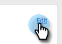

# Hyperlinktext hinzufügen {#add-hyperlinked-text}

Gehen Sie wie folgt vor, um zu erfahren, wie Sie Ihren E-Mail-Vorlagen Hyperlinks hinzufügen.

1. Wählen Sie auf der Seite Vorlagen die gewünschte Vorlage aus (oder erstellen Sie eine neue).

   

1. Klicks **Bearbeiten**.

   

1. Geben Sie den Text ein, den Sie per Hyperlink verknüpfen möchten (d. h. &quot;Click Here&quot;). Markieren Sie sie und klicken Sie im Editor auf die Schaltfläche Link .

   

1. Geben Sie die URL ein, mit der die Relation hergestellt werden soll (d. h. `https://experienceleague.adobe.com/docs/marketo/using/home.html`). Wählen Sie aus, ob die URL im selben oder neuen Fenster geöffnet werden soll, und klicken Sie auf **Speichern**.

   

1. Klicks **Speichern** erneut.

   

>[!NOTE]
>
>Wenn die von Ihnen bearbeitete Vorlage in Kampagnen derzeit als E-Mail-Schritt verwendet wird, haben Sie die Möglichkeit, den Wortlaut für bestimmte (oder alle) Kampagnen zu aktualisieren.
